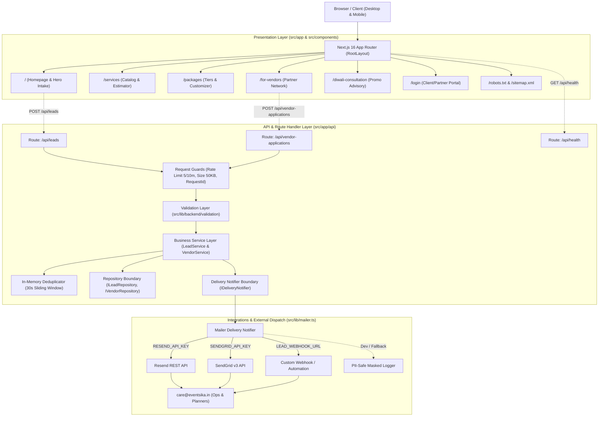
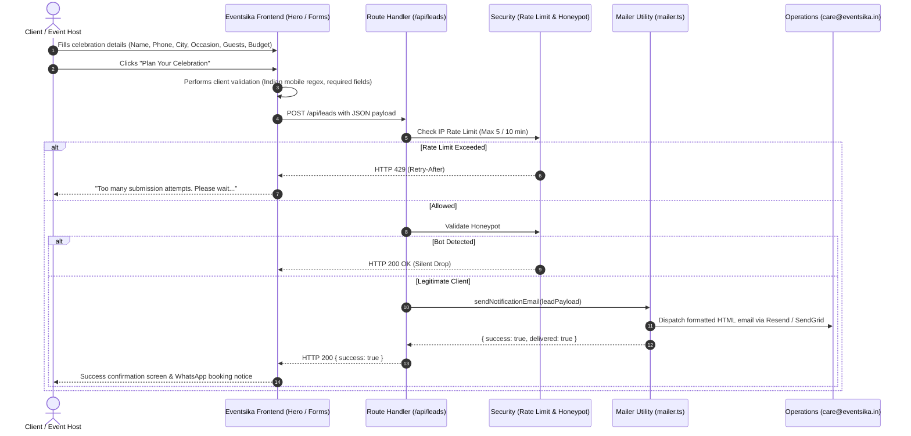

# EVENTSIKA — PROJECT BRAIN

> **GROUND TRUTH NOTICE**: The repository codebase is always the ultimate source of truth. If this document conflicts with the active code, inspect the repository, treat the code as truth, and update `Brain.md` to reflect the architectural change.

---

## 0. Document Control

| Attribute | Details |
| :--- | :--- |
| **Project Name** | Eventsika (`landing`) |
| **Document Path** | [`.agents/project-brain/Brain.md`](file:///d:/Persional-projects/landing/.agents/project-brain/Brain.md) |
| **Brain Version** | `1.0.0` |
| **Creation Date** | `2026-08-30` |
| **Last Verified** | `2026-08-30` |
| **Target Framework** | Next.js `16.3.0` (React `19.2.8`, App Router) |
| **Primary Domain** | `https://eventsika.in` |
| **Support Inbox** | `care@eventsika.in` |
| **Operational Rule** | **Brain-First**: Consult `Brain.md` before initiating any non-trivial architectural, feature, or refactoring task. |

---

## 1. Project Overview

**Eventsika** is a curated event planning, celebration design, and on-ground management platform specialized in Indian celebrations at home, terraces, banquets, and boutique venues across major metropolitan cities in India (Delhi, Gurgaon, Noida, Mumbai, Kolkata, etc.).

### Primary Capabilities & Core Value Proposition
1. **Curated Celebration Services**: Venue decor & floral styling, gourmet catering, live counters, ritual & puja arrangements, photography & cinematography, live entertainment, and bespoke invitations.
2. **Transparent Tiered Pricing**: Structured packages ranging from intimate terrace gatherings (₹35k+) to grand multi-day festive galas (₹1.25L+), with dynamic customizer and comparison tools.
3. **Interactive Lead Generation Engine**: High-conversion, validated celebration intake form (`#plan-event`) with server-side rate limiting, honeypot protection, and multi-channel notification dispatch.
4. **Curated Vendor Partner Network**: Transparent vendor acquisition and onboarding pipeline with verified milestone payouts and on-site event coordination.
5. **Seasonal Strategy Consultations**: High-intent 1-on-1 celebration planning advisory sessions (`/diwali-consultation`).
6. **Client & Partner Portal (Pre-launch)**: Dedicated portal entry point (`/login`) featuring client-side authentication validation and direct operational support routing.

---

## 2. Technology Stack

All dependencies and versions are verified directly from `package.json` and project lockfiles:

| Technology | Version | Category / Purpose | Key Architectural Notes |
| :--- | :--- | :--- | :--- |
| **Next.js** | `16.3.0` | Core Framework | App Router, Server Components default, Turbopack, standalone production build |
| **React** | `19.2.8` | UI Library | Concurrent rendering, React 19 Action & Component APIs |
| **React DOM** | `19.2.8` | DOM Renderer | Browser mounting & SSR hydration |
| **TypeScript** | `^5` | Language | Strict mode (`strict: true`), bundler module resolution, path alias `@/*` -> `./src/*` |
| **React Compiler** | `1.0.0` | Build Optimization | `babel-plugin-react-compiler` enabled via `reactCompiler: true` in `next.config.ts` |
| **Styling** | Vanilla CSS | Design System | Pure CSS Modules (`*.module.css`) + CSS Custom Properties. **Zero Tailwind**. |
| **Typography** | `next/font/google` | Font Management | `Playfair Display` (Serif) & `Inter` (Sans-serif) with CSS variable injection |
| **ESLint** | `^9` | Linting & Standards | Flat config format (`eslint.config.mjs`) using `eslint-config-next: 16.3.0` |
| **Mailer Engine** | Native Fetch | Backend Dispatch | Zero-dependency REST dispatchers for Resend, SendGrid, and Custom Webhooks |
| **Rate Limiter** | In-Memory | Security & Abuse | Sliding/fixed window IP rate limiter with automated stale entry cleanup |

---

## 3. High-Level Architecture

Eventsika follows a clean Next.js 16 App Router architecture with strict Server vs. Client component boundaries:



---

## 4. Repository / Filesystem Structure

```
landing/
├── .agents/                               # Agent configuration, memory & governance
│   ├── project-brain/
│   │   └── Brain.md                       # Central architectural source of truth
│   └── skills/                            # Specialized agent operational workflows
│       ├── code-quality-audit/SKILL.md    # Read-only code maintainability audit
│       ├── minimal-change/SKILL.md        # Surgical change discipline
│       ├── nextjs-architecture/SKILL.md   # Next.js 16 & React 19 guidelines
│       ├── pre-commit-review/SKILL.md     # Pre-commit type & lint validation
│       ├── project-memory/SKILL.md        # Memory MCP knowledge graph governance
│       └── security-audit/SKILL.md        # Evidence-based security audit
├── public/                                # Static public assets (Zero build bundling)
│   ├── images/                            # WebP/PNG photography, event types & services
│   │   ├── packages/                      # Tiered package imagery (jpg)
│   │   ├── services/                      # Original PNG & optimized WebP service card assets
│   │   └── eventsika-official-logo.png    # Official brand logo asset
│   ├── payment-logos/                     # UPI, GPay, PhonePe, Paytm, Cred vector icons
│   └── videos/                            # Consultation walkthrough videos (mp4)
├── src/
│   ├── app/                               # Next.js 16 App Router hierarchy
│   │   ├── api/                           # Serverless Route Handlers
│   │   │   ├── health/route.ts            # GET application liveness & health check
│   │   │   ├── leads/route.ts             # POST celebration lead capture
│   │   │   └── vendor-applications/route.ts # POST partner application capture
│   │   ├── diwali-consultation/           # Special 1-on-1 advisory promotion route
│   │   ├── for-vendors/                   # Vendor partner network route
│   │   ├── login/                         # Client & Partner portal login route
│   │   ├── packages/                      # Packages, comparison & customizer route
│   │   ├── services/                      # Services catalog & estimator route
│   │   ├── globals.css                    # Design tokens, CSS custom properties, resets
│   │   ├── layout.tsx                     # Root HTML shell, Google Fonts, JSON-LD Schema
│   │   ├── page.tsx                       # Homepage composition root
│   │   ├── page.module.css                # Legacy starter styles (superseded by components)
│   │   ├── robots.ts                      # Dynamic robots.txt generation
│   │   └── sitemap.ts                     # Dynamic sitemap.xml generation
│   ├── components/                        # Reusable modular UI components
│   │   ├── EventTypes.tsx / .module.css   # Interactive 2-column event showcase
│   │   ├── Footer.tsx / .module.css       # Global footer & navigation directory
│   │   ├── ForVendors.tsx / .module.css   # Homepage vendor partner section
│   │   ├── Hero.tsx / .module.css         # Hero banner & primary lead intake form
│   │   ├── HowItWorks.tsx / .module.css   # 3-step celebration process overview
│   │   ├── LoginForm.tsx / .module.css    # Portal login component & validation
│   │   ├── Navbar.tsx / .module.css       # Global header, navigation, & animated SVG logo
│   │   ├── PackageComparison.tsx / .module.css # Tier matrix comparison table
│   │   ├── PackageCustomizer.tsx / .module.css # Interactive tier customization widget
│   │   ├── Packages.tsx / .module.css     # Homepage package highlights
│   │   ├── ServiceEstimator.tsx / .module.css  # Interactive budget & guest cost estimator
│   │   ├── Services.tsx / .module.css     # Interactive 3D flip card service grid
│   │   ├── ServicesFAQ.tsx / .module.css  # Expandable service FAQ accordions
│   │   ├── VendorApplicationForm.tsx / .module.css # Partner application form
│   │   └── seasonal/                      # Isolated seasonal occasion decoration engine
│   │       ├── SeasonalDecoration.tsx     # Central occasion controller & switch
│   │       ├── DiwaliLights.tsx           # Festive draped festoon wire, golden dots & diyas
│   │       ├── DiwaliLights.module.css    # Zero-height overlay styles & organic desynchronized twinkle
│   │       ├── DiwaliCtaDiya.tsx          # Authentic terracotta diya above "Book a Consultation" CTA
│   │       └── DiwaliCtaDiya.module.css   # Diya positioning, warm glow & 3.8s flame sway animation
│   └── lib/                               # Shared server & backend infrastructure
│       ├── backend/                       # Layered backend architecture
│       │   ├── constants/allowlists.ts    # Authoritative canonical form allowlists
│       │   ├── deduplication/             # 15s sliding window in-memory deduplicator
│       │   ├── integrations/              # Delivery notifier interfaces & adapters
│       │   ├── logger/logger.ts           # PII-safe structured logger with phone/email masking
│       │   ├── repositories/              # Repository interfaces, in-memory & Supabase stores
│       │   │   ├── dashboard-repository.interface.ts # Dashboard aggregation contracts & metrics types
│       │   │   ├── in-memory-lead-repository.ts
│       │   │   ├── in-memory-vendor-repository.ts
│       │   │   ├── lead-repository.interface.ts
│       │   │   ├── supabase-dashboard-repository.ts # Real Supabase dashboard queries (No fake fallback)
│       │   │   ├── supabase-lead-repository.ts
│       │   │   ├── supabase-vendor-repository.ts
│       │   │   └── vendor-repository.interface.ts
│       │   ├── services/                  # Business domain services (Lead, Vendor, Dashboard)
│       │   │   ├── admin-dashboard-service.ts # Dashboard aggregation orchestration & date formatters
│       │   │   ├── lead-service.ts
│       │   │   └── vendor-service.ts
│       │   ├── supabase/client.ts         # Server-only Supabase admin client module
│       │   ├── utils/request-id.ts        # Correlation ID generator & header extractor
│       │   └── validation/                # Server-side validation schemas (phone, date, url)
│       ├── mailer.ts                      # Multi-provider zero-dependency email dispatcher
│       └── rate-limit.ts                  # In-memory IP rate limiter & header extractor
├── supabase/                              # Version-controlled Supabase migrations
│   └── migrations/                        # PostgreSQL DDL migrations (tables, RLS, indexes)
├── .env.example                           # Sanitized environment variable template
├── .gitignore                             # Git ignore rules (.env.local, node_modules, .next)
├── AGENTS.md                              # Next.js 16 agent environment notice
├── CLAUDE.md                              # Pointer linking Claude to AGENTS.md
├── eslint.config.mjs                      # ESLint 9 flat configuration
├── next.config.ts                         # Next.js config (headers, reactCompiler, poweredBy)
├── package.json                           # Dependency definitions and scripts
└── tsconfig.json                          # TypeScript configuration & path aliases
```

---

## 5. Application Routing

| Route | Type | Component / File | Purpose & Key Interactions |
| :--- | :--- | :--- | :--- |
| `/` | Page (Static) | [`src/app/page.tsx`](file:///d:/Persional-projects/landing/src/app/page.tsx) | Main landing page. Contains Hero intake form (`#plan-event`), How It Works, Services, Event Types, Packages, and Vendor preview. |
| `/services` | Page (Static) | [`src/app/services/page.tsx`](file:///d:/Persional-projects/landing/src/app/services/page.tsx) | Comprehensive celebration service directory with pricing, feature breakdowns, dynamic [`ServiceEstimator`](file:///d:/Persional-projects/landing/src/components/ServiceEstimator.tsx), and [`ServicesFAQ`](file:///d:/Persional-projects/landing/src/components/ServicesFAQ.tsx). |
| `/packages` | Page (Static) | [`src/app/packages/page.tsx`](file:///d:/Persional-projects/landing/src/app/packages/page.tsx) | Curated tiered package explorer with interactive [`PackageCustomizer`](file:///d:/Persional-projects/landing/src/components/PackageCustomizer.tsx) and side-by-side [`PackageComparison`](file:///d:/Persional-projects/landing/src/components/PackageComparison.tsx). |
| `/for-vendors` | Page (Static) | [`src/app/for-vendors/page.tsx`](file:///d:/Persional-projects/landing/src/app/for-vendors/page.tsx) | Partner acquisition landing page with value props and multi-category [`VendorApplicationForm`](file:///d:/Persional-projects/landing/src/components/VendorApplicationForm.tsx). |
| `/diwali-consultation` | Page (Static) | [`src/app/diwali-consultation/page.tsx`](file:///d:/Persional-projects/landing/src/app/diwali-consultation/page.tsx) | High-intent promotional landing page for 1-on-1 strategy consultations at ₹2,999 (regular ₹5,000). |
| `/login` | Page (Static) | [`src/app/login/page.tsx`](file:///d:/Persional-projects/landing/src/app/login/page.tsx) | Client and vendor portal authentication page. Features client-side validation and simulated staging status notices. |
| `/robots.txt` | Metadata | [`src/app/robots.ts`](file:///d:/Persional-projects/landing/src/app/robots.ts) | Dynamic SEO robot instructions allowing all crawling except `/api/` endpoints. |
| `/sitemap.xml` | Metadata | [`src/app/sitemap.ts`](file:///d:/Persional-projects/landing/src/app/sitemap.ts) | Dynamic XML sitemap indexing all canonical public routes with priority ratings. |
| `/api/health` | API (Dynamic) | [`src/app/api/health/route.ts`](file:///d:/Persional-projects/landing/src/app/api/health/route.ts) | GET endpoint for application health and uptime verification (`{ status: "healthy", timestamp, version }`). |
| `/api/leads` | API (Dynamic) | [`src/app/api/leads/route.ts`](file:///d:/Persional-projects/landing/src/app/api/leads/route.ts) | POST endpoint for celebration inquiries. Rate limited (5/10m), 50KB capped, deduplicated, validated, dispatches email/webhook. |
| `/api/vendor-applications` | API (Dynamic) | [`src/app/api/vendor-applications/route.ts`](file:///d:/Persional-projects/landing/src/app/api/vendor-applications/route.ts) | POST endpoint for vendor partner applications. Rate limited, deduplicated, validates portfolio URLs & category arrays. |

---

## 6. Frontend Architecture

### 1. Server vs. Client Component Boundaries
- **Server Components (RSC)**: All route entrypoints (`page.tsx`), `RootLayout`, `robots.ts`, `sitemap.ts`, `HowItWorks.tsx`, `Packages.tsx`, `ForVendors.tsx`, and `Footer.tsx` render as Server Components with zero hydration cost.
- **Client Components (`"use client"`)**:
  - [`Hero.tsx`](file:///d:/Persional-projects/landing/src/components/Hero.tsx): Multi-field form state, real-time Indian phone validation (`/^[6-9]\d{9}$/`), service multi-selection chips, submission spinner, and error banners.
  - [`Navbar.tsx`](file:///d:/Persional-projects/landing/src/components/Navbar.tsx): Mobile toggle menu state, active route highlighting via `usePathname()`.
  - [`Services.tsx`](file:///d:/Persional-projects/landing/src/components/Services.tsx): 3D CSS flip-card state (`transform-style: preserve-3d`) toggled via click or keyboard navigation (`Enter` / `Space`).
  - [`EventTypes.tsx`](file:///d:/Persional-projects/landing/src/components/EventTypes.tsx): Synchronized hover/click tab list updating active high-resolution editorial imagery on the left column.
  - [`PackageCustomizer.tsx`](file:///d:/Persional-projects/landing/src/components/PackageCustomizer.tsx) & [`ServiceEstimator.tsx`](file:///d:/Persional-projects/landing/src/components/ServiceEstimator.tsx): Dynamic arithmetic cost calculations based on guest counts, venue types, and add-on toggles.
  - [`VendorApplicationForm.tsx`](file:///d:/Persional-projects/landing/src/components/VendorApplicationForm.tsx) & [`LoginForm.tsx`](file:///d:/Persional-projects/landing/src/components/LoginForm.tsx): Controlled inputs, field-level error validation, and interactive feedback notices.

### 2. Styling Strategy
- **Vanilla CSS Modules**: Every component is paired with a strictly scoped `.module.css` stylesheet. Class names are hashed by Next.js to eliminate global namespace collisions.
- **Design Tokens**: Standardized CSS custom properties in `src/app/globals.css` provide uniform colors, borders, max widths, and font stacks across all components.

### 3. Seasonal Occasion Decoration Architecture

Eventsika incorporates an isolated, zero-layout-impact festive decoration engine for seasonal occasions (e.g., Diwali, Holi, Christmas, Wedding Season):

```
┌──────────────────────────────────────────────────────────┐
│ <header className={styles.header}>                       │
│   ├── <SeasonalDecoration /> (absolute overlay, z: 1)    │
│   └── <div className={styles.container}> (z: 2, locked)  │
└──────────────────────────────────────────────────────────┘
```

#### Key Architecture & Governance Rules:
1. **Isolated Component Location**: All seasonal code resides exclusively in `src/components/seasonal/`:
   - [`SeasonalDecoration.tsx`](file:///d:/Persional-projects/landing/src/components/seasonal/SeasonalDecoration.tsx): Central occasion controller and switch.
   - [`DiwaliLights.tsx`](file:///d:/Persional-projects/landing/src/components/seasonal/DiwaliLights.tsx): Festive draped festoon SVG wire with 45% enhanced visibility, warm golden brass dots, and 8 balanced traditional Indian diya lamps on desktop.
   - [`DiwaliLights.module.css`](file:///d:/Persional-projects/landing/src/components/seasonal/DiwaliLights.module.css): Scoped styles, responsive tiers (8 desktop, 5 tablet, 3 mobile), enhanced warm amber glow, and desynchronized organic flicker animations.
   - [`DiwaliCtaDiya.tsx`](file:///d:/Persional-projects/landing/src/components/seasonal/DiwaliCtaDiya.tsx): Dedicated authentic terracotta Indian clay diya (`mitti ka diya`) with deep oil pool, cotton wick, and stylized animated flame centered directly above the "Book a Consultation" button.
   - [`DiwaliCtaDiya.module.css`](file:///d:/Persional-projects/landing/src/components/seasonal/DiwaliCtaDiya.module.css): Non-interactive absolute positioning (`top: 4px–6px; pointer-events: none; z-index: 1;`) and gentle 3.8s flame sway animation (`@keyframes flameSway`).
2. **Single Integration Point**: In [`src/components/Navbar.tsx`](file:///d:/Persional-projects/landing/src/components/Navbar.tsx), `<SeasonalDecoration />` is mounted as a 1-line integration point immediately inside `<header className={styles.header}>`.
3. **Zero Layout Height Impact**: The seasonal overlay is styled with `position: absolute; top: 0; left: 0; width: 100%; height: 100%; pointer-events: none; overflow: hidden; z-index: 1;`. It contributes **0px** to header layout height, guaranteeing the original navbar dimensions and spacing remain 100% intact.
4. **Layer Priority & Content Protection**: `.container` in `Navbar.module.css` has `position: relative; z-index: 2;`. All interactive elements (logo, navigation links, social icons, CTA button, mobile controls) sit on top of the decoration. `pointer-events: none` guarantees zero click blockage.
5. **Disabling Seasonal Decorations Website-Wide**:
   - In [`SeasonalDecoration.tsx`](file:///d:/Persional-projects/landing/src/components/seasonal/SeasonalDecoration.tsx), set `export const ACTIVE_SEASONAL_OCCASION: SeasonalOccasion = null;`.
   - The component renders `null` and the navbar cleanly renders with zero leftover DOM nodes, zero orphaned CSS rules, and zero layout shifts.
6. **Replacing with Future Occasions (Holi, Christmas, Wedding Season)**:
   - Create a dedicated component under `src/components/seasonal/` (e.g. `HoliDecoration.tsx`, `ChristmasGarland.tsx`, `WeddingFloral.tsx`).
   - Add the key to `SeasonalOccasion` union type in `SeasonalDecoration.tsx`.
   - Add a `case` switch statement in `SeasonalDecoration.tsx`.
   - Set `ACTIVE_SEASONAL_OCCASION = "holi"`.
   - **Zero edits are needed inside `Navbar.tsx` or `Navbar.module.css`**.
   - When retiring Diwali features, update Brain.md to move Diwali from active to retired status without deleting historical changelog context.
7. **Organic Animation & Performance**:
   - Pure inline SVG vectors and Vanilla CSS keyframes; zero JS animation loops, zero image files.
   - Lights use desynchronized cycles (8.7s to 12.3s) and steady warm baseline states so only selective lights gently brighten at any moment while others remain calm.
   - CTA Diya features a gentle 3.8s ease-in-out flame sway anchor-based animation.
   - Full `@media (prefers-reduced-motion: reduce)` support: disables all animations/sway and maintains warm static illumination.

---

## 7. Backend Architecture

### 5-Layer Backend Architecture (Day 2 Hardened)
The backend is structured into a clean, database-agnostic layered architecture colocated within the Next.js App Router project:

```
HTTP Request
    ↓
Route Handler (src/app/api/.../route.ts)
    ↓
Validation & Sanitization Layer (src/lib/backend/validation/)
    ↓
Business Service Layer (src/lib/backend/services/)
    ↓
Repository Interface / Persistence Boundary (src/lib/backend/repositories/)
    ↓
Delivery / Integration Boundary (src/lib/backend/integrations/)
    ↓
Safe Standardized HTTP Response ({ success, message })
```

#### Layer Responsibilities:

1. **HTTP Routing & Protocol Layer (`src/app/api/`)**:
   - `src/app/api/health/route.ts`: Minimal liveness check returning `{ status: "healthy", timestamp, version }`.
   - `src/app/api/leads/route.ts` & `src/app/api/vendor-applications/route.ts`: Extracts request context, generates correlation ID (`X-Request-Id`), evaluates IP rate limiting (5 req / 10 min window), enforces 50 KB payload size limit, delegates validation and service execution, and returns standardized response contracts.
2. **Validation & Allowlist Layer (`src/lib/backend/validation/`)**:
   - Canonical option allowlists defined in `src/lib/backend/constants/allowlists.ts` (`CITY_OPTIONS`, `EVENT_TYPE_OPTIONS`, `GUEST_COUNT_OPTIONS`, `VENUE_TYPE_OPTIONS`, `SERVICE_OPTIONS`, `BUDGET_OPTIONS`, `VENDOR_CATEGORIES`, `VENDOR_EXPERIENCE_TIERS`).
   - `phone.ts`: Normalizes and validates Indian mobile phone formats (`/^[6-9]\d{9}$/` or `+91`/`0` prefixes).
   - `date.ts`: Validates `YYYY-MM-DD` calendar dates, enforces non-past dates, and caps forward planning dates at 24 months (730 days).
   - `url.ts`: Enforces valid URL/domain syntax and blocks unsafe protocols (`javascript:`, `data:`, `file:`).
   - `lead-schema.ts` & `vendor-schema.ts`: Comprehensive schema validation returning typed inputs or descriptive safe error messages.
3. **Business Service Layer (`src/lib/backend/services/`)**:
   - `LeadService` & `VendorService`: Own domain workflow orchestration.
   - Handles silent bot honeypot filtering (`isBot: true`).
   - Coordinates rapid duplicate submission suppression via `deduplicator.ts` (30-second sliding memory window).
   - Coordinates decoupled repository persistence.
   - Coordinates decoupled external delivery notifications.
4. **Repository / Persistence Boundary (`src/lib/backend/repositories/`)**:
   - `ILeadRepository` & `IVendorRepository`: Abstract TypeScript interface contracts.
   - `InMemoryLeadRepository` & `InMemoryVendorRepository`: Zero-dependency in-memory persistence boundaries for Day 2; database engine selection is deferred to Day 7.
5. **Delivery / Integration Boundary (`src/lib/backend/integrations/`)**:
   - `IDeliveryNotifier`: Abstract delivery interface.
   - `MailerDeliveryNotifier`: Adapts zero-dependency transactional dispatch in `src/lib/mailer.ts` (Resend, SendGrid, Webhooks).
6. **PII-Safe Structured Logging (`src/lib/backend/logger/logger.ts`)**:
   - Automatically masks phone numbers (`98****3210`), emails (`a***@domain.com`), and names.
   - Never logs full customer payloads in production.
   - Generates single-line JSON logs with correlation IDs (`X-Request-Id`).

---

## 8. Database Architecture

* **Current Status**: **Supabase PostgreSQL Production Architecture**.
* **Design Philosophy**: Business service workflows interact exclusively through abstract repository interfaces (`ILeadRepository`, `IVendorRepository`). `SupabaseLeadRepository` and `SupabaseVendorRepository` provide durable PostgreSQL persistence, with graceful in-memory fallbacks when unconfigured.
* **Tables**:
  - `public.leads`: Bounded intake records with UUIDv4 primary keys, `user_name`, `user_phone`, `city`, `event_type`, `event_date` (`DATE`), `guest_count`, `venue_type`, `selected_services` (`TEXT[]`), `budget_range`, `whatsapp_consent` (`BOOLEAN`), and `request_id`.
  - `public.vendor_applications`: Partner applications with `business_name`, `contact_name`, `phone`, `email`, `city`, `experience`, `portfolio_url`, `categories` (`TEXT[]`), and `request_id`.
* **Security & Row Level Security (RLS)**:
  - RLS is enabled on all tables by default.
  - Anonymous / public browser access is completely denied (`anon` role has 0 permissions).
  - Server-side backend accesses tables using `SUPABASE_SERVICE_ROLE_KEY` (strictly server-only, never exposed to client bundles).
* **Triggers & Indexes**:
  - `handle_updated_at()` trigger automatically maintains `updated_at` timestamps.
  - B-Tree indexes on `created_at DESC`, `user_phone`, `email`, and `event_date`.
* **Migration Location**: Version-controlled DDL located in `supabase/migrations/`.

---

## 9. Authentication & Authorization

* **Current Status**: **Presentation Simulation Portal**.
* **Route**: [`/login`](file:///d:/Persional-projects/landing/src/app/login/page.tsx) and component [`LoginForm.tsx`](file:///d:/Persional-projects/landing/src/components/LoginForm.tsx).
* **Behavior**: 
  - Validates client-side input formats (email/phone structure, minimum 6-character password).
  - Simulates a 400ms verification delay.
  - Displays an informative status notice: *"Login functionality will be available soon. The Eventsika client & vendor portal is currently undergoing final staging."*
  - Provides direct operational routing to `care@eventsika.in` and `+91 78766 66056`.
  - Includes interactive info banners for "Forgot Password?" and "Sign Up".
* **Security Note**: No actual passwords, tokens, cookies, or user credentials are transmitted or persisted over the network.

---

## 10. Security Architecture

### 1. HTTP Security Headers
Configured globally in [`next.config.ts`](file:///d:/Persional-projects/landing/next.config.ts) for all routes `/(.*)`:
- `X-Frame-Options: SAMEORIGIN` (Defends against clickjacking attacks)
- `X-Content-Type-Options: nosniff` (Prevents MIME-type sniffing vulnerabilities)
- `Referrer-Policy: strict-origin-when-cross-origin` (Protects user privacy on cross-origin requests)
- `Permissions-Policy: camera=(), microphone=(), geolocation=()` (Restricts unauthorized browser hardware access)
- `poweredByHeader: false` (Suppresses `X-Powered-By: Next.js` fingerprinting)

### 2. XSS & Injection Defenses
- All dynamic fields interpolated into HTML emails in [`mailer.ts`](file:///d:/Persional-projects/landing/src/lib/mailer.ts) pass through `escapeHtml()` replacing `&`, `<`, `>`, `"`, and `'`.
- Schema.org JSON-LD scripts in [`layout.tsx`](file:///d:/Persional-projects/landing/src/app/layout.tsx) use native `JSON.stringify` serialization with static object constants.

### 3. Secrets Management
- **Zero Secrets in Source Code**: No private API keys or credentials exist in git.
- **Server Scoping**: All API keys (`RESEND_API_KEY`, `SENDGRID_API_KEY`, `LEAD_WEBHOOK_URL`) are read exclusively in server execution contexts (`mailer.ts`) and never prefixed with `NEXT_PUBLIC_`.
- **Git Ignore**: `.env.local` is strictly excluded in `.gitignore`.

---

## 11. Design System & Brand Guidelines

### 1. Color Palette (Verified Tokens from `globals.css`)

| Variable Name | Hex Code | Purpose / Application |
| :--- | :--- | :--- |
| `--primary` | `#7F1010` | **Eventsika Crimson / Royal Maroon**. Primary CTA buttons, focus rings, brand badges. |
| `--primary-dark` | `#5F0808` | Dark Crimson. Active hover states, deep contrast buttons. |
| `--background` / `--cream` | `#F8F3EC` | **Eventsika Cream**. Primary page background, card surfaces. |
| `--cream-light` | `#FFFAF4` | **Warm Ivory**. Navbar background, elevated card containers, form backgrounds. |
| `--foreground` | `#2B211D` | **Deep Charcoal / Espresso**. Primary typography, deep header backgrounds. |
| `--gold` | `#B99A67` | **Festive Gold**. Subheadings, eyebrow badges, logo accents, pricing highlights. |
| `--border` | `#DFD2C3` | **Neutral Sand Border**. Dividers, card borders, form input outlines. |

### 2. Typography
- **Headings & Editorial Display**: `Playfair Display` serif font loaded via `var(--font-playfair)` with high typographic hierarchy (`clamp(2rem, 5vw, 3.5rem)`).
- **Body & Interface**: `Inter` sans-serif font loaded via `var(--font-inter)` (`font-weight: 400, 500, 600, 700`).

### 3. Logo Animation & Brand Rules
- **Direct SVG Fill Transitions**: Defined in [`Navbar.module.css`](file:///d:/Persional-projects/landing/src/components/Navbar.module.css). The logo uses vector paths with `transition: fill 0.3s cubic-bezier(0.25, 1, 0.5, 1)` transitioning from Festive Gold to Crimson on hover.
- **Emblem Rotation**: The circular emblem (`.logoSymbol`) rotates 180° on brand hover around its verified coordinate origin (`transform-origin: 152.13px 253.98px`).
- **Stationary Wordmark**: The text portion (`.logoWordmark`) remains completely stationary.
- **Rejected Pattern**: Filter-based hue rotation (`filter: hue-rotate(...)`) is permanently rejected due to rainbow color interpolation artifacts.

---

## 12. Public Assets Map

All static assets reside in `public/` and are referenced using root-relative paths:

### 1. Brand, Event Types & Packages
| Asset Path | Category | Usage / Location in Application |
| :--- | :--- | :--- |
| `/images/eventsika-official-logo.png` | Brand | High-resolution brand logo used in `LoginForm.tsx` and JSON-LD schema |
| `/images/eventsika-official-logo.svg` | Brand | Scalable vector logo asset |
| `/images/service-venue-decor.webp` | Services | Service 01 (Venue Decor) in `services/page.tsx` |
| `/images/service-catering.webp` | Services | Service 02 (Gourmet Catering) in `services/page.tsx` |
| `/images/service-photography.webp` | Services | Service 03 (Photography & Films) in `services/page.tsx` |
| `/images/service-entertainment.webp` | Services | Service 04 (Entertainment & Performers) in `services/page.tsx` |
| `/images/service-event-management.webp` | Services | Service 05 (Event Coordination) in `services/page.tsx` |
| `/images/service-invitations-details.webp`| Services | Service 06 (Invitations & Stationery) in `services/page.tsx` |
| `/images/event-diwali.webp` | Event Types | Event showcase 01 (Diwali Celebrations) in `EventTypes.tsx` |
| `/images/event-birthday.webp.png` | Event Types | Event showcase 02 (Birthdays) |
| `/images/event-anniversary.webp.png` | Event Types | Event showcase 03 (Anniversaries) |
| `/images/event-housewarming.webp` | Event Types | Event showcase 04 (Housewarming / Griha Pravesh) |
| `/images/event-baby-shower.webp` | Event Types | Event showcase 05 (Baby Showers / Godh Bharai) |
| `/images/event-satsang-puja.webp` | Event Types | Event showcase 06 (Satsang & Puja Ceremonies) |
| `/images/event-festive-party.webp` | Event Types | Event showcase 07 (Festive Galas) |
| `/images/event-family-dinner.webp` | Event Types | Event showcase 08 (Intimate Family Dinners) |
| `/images/packages/balcony-terrace.jpg` | Packages | Balcony / Terrace package card in `packages/page.tsx` |
| `/images/packages/driveway-lawns.jpg` | Packages | Driveway / Lawns package card |
| `/images/packages/grand-celebration.jpg` | Packages | Grand Celebration package card |
| `/images/packages/living-room-dinner.jpg` | Packages | Living Room Dinner package card |
| `/images/packages/showroom-office.jpg` | Packages | Showroom & Office Launch package card |
| `/images/packages/small-budget-wedding.jpg`| Packages | Small Budget Wedding package card |
| `/images/vendor-network-final.webp` | Vendors | Editorial photography for `ForVendors.tsx` & `/for-vendors` |
| `/payment-logos/*.svg` | Payment | UPI, GPay, PhonePe, Paytm, Amazon Pay, Cred icons |
| `/videos/eventsika-consultation-process.mp4` | Video | Consultation process video demonstration |

### 2. Service Card Assets (`public/images/services/`)
The interactive 3D flip service cards (`src/components/Services.tsx`) use dedicated assets stored in `public/images/services/`. Source PNG originals are preserved alongside optimized WebP assets.

| Card # | Service Heading | Original PNG Source | Optimized WebP File | Native Dimensions | Original PNG Size | Optimized WebP Size | Reduction |
| :--- | :--- | :--- | :--- | :--- | :--- | :--- | :--- |
| **01** | DECOR & STYLING | `decor-styling.png` | `decor-styling.webp` | 1122 × 1402 px (4:5) | 3.41 MB (3,576,147 B) | 208.44 KB (213,440 B) | 94.03% |
| **02** | CATERING & CUISINE | `catering-cuisine.png` | `catering-cuisine.webp` | 1089 × 1361 px (4:5) | 3.57 MB (3,744,736 B) | 237.11 KB (242,796 B) | 93.52% |
| **03** | RITUALS & BLESSINGS | `rituals-blessings.png` | `rituals-blessings.webp` | 1080 × 1350 px (4:5) | 3.15 MB (3,300,652 B) | 124.36 KB (127,348 B) | 96.14% |
| **04** | ENTERTAINMENT & PERFORMERS | `entertainment-performers.png` | `entertainment-performers.webp` | 1120 × 1400 px (4:5) | 3.23 MB (3,386,116 B) | 149.16 KB (152,738 B) | 95.49% |
| **05** | PHOTOGRAPHY & FILMS | `photography-films.png` | `photography-films.webp` | 1094 × 1367 px (4:5) | 3.46 MB (3,624,981 B) | 139.93 KB (143,288 B) | 96.05% |
| **06** | INVITATIONS & FAVOURS | `invitations-favours.png` | `invitations-favours.webp` | 1104 × 1370 px (4:5) | 3.38 MB (3,545,619 B) | 154.28 KB (157,986 B) | 95.54% |
| **TOTAL** | — | — | — | — | **20.20 MB** (21,178,251 B) | **0.99 MB** (1,037,596 B) | **95.10%** |

#### Asset Optimization, Responsive & Cropping Notes:
- **Optimization Rationale**: Source PNG photographs totaled 20.20 MB, creating unacceptable bandwidth overhead for landing page visitors. Converting to WebP (quality 85, effort 6) preserved crisp editorial fidelity while reducing total payload to 0.99 MB (95.10% total size reduction, saving 19.21 MB).
- **Responsive Cropping & Presentation**: Cards maintain fixed CSS heights per breakpoint—Desktop: 350px, Tablet: 340px, Mobile: 330px. Images apply `object-fit: cover` with `object-position: center` ensuring seamless vertical cropping without distortion across varying aspect ratios.
- **Next.js `<Image>` Implementation**: Uses `fill` layout with dynamic breakpoint sizes `(max-width: 640px) 100vw, (max-width: 1024px) 50vw, 33vw`.
- **Lazy-Loading Behavior**: The `<Services />` component is located below `<Hero />` and `<HowItWorks />` on the homepage (below the initial viewport fold). In accordance with Next.js best practices, all six service card images use default lazy loading (`loading="lazy"`, no priority flag) to protect Largest Contentful Paint (LCP).

---

## 13. Major User Flows



---

## 14. External Services & Integrations

* **Email Provider Dispatchers**:
  * **Resend API**: Triggered when `RESEND_API_KEY` is present. Posts to `https://api.resend.com/emails`.
  * **SendGrid v3 API**: Triggered when `SENDGRID_API_KEY` is present. Posts to `https://api.sendgrid.com/v3/mail/send`.
  * **Custom Automation Webhooks**: Triggered when `LEAD_WEBHOOK_URL` is set (Make, Zapier, Telegram bot, Hostinger webhook).
* **Schema.org Structured Data**:
  * JSON-LD Organization, WebSite, and BreadcrumbList schemas injected on public routes for rich Google search cards.
* **Operational Inboxes**: All customer leads and vendor applications route to `care@eventsika.in`.

---

## 15. Deployment & Infrastructure

* **Deployment Options**:
  * **Hostinger / Node.js VPS / Standalone Server**: Built via `npm run build` using Next.js standalone output. Pre-packaged production deployment archives (`eventsika-hostinger-production.zip`, `eventsika-standalone-production.zip`) exist in project root.
  * **Vercel / Edge Serverless**: Native zero-configuration deployment.
* **Environment Variables Configuration**:
  ```env
  # Target recipient for leads & applications
  NOTIFICATION_EMAIL=care@eventsika.in

  # Verified sender email address
  EMAIL_FROM="Eventsika Leads <care@eventsika.in>"

  # Option 1: Resend API Key (Recommended)
  RESEND_API_KEY=re_...

  # Option 2: SendGrid API Key
  SENDGRID_API_KEY=SG....

  # Option 3: Custom Webhook URL
  LEAD_WEBHOOK_URL=https://...
  ```

---

## 16. Git & Development Workflow

* **Primary Branch**: `main`
* **Development Scripts**:
  - `npm run dev`: Starts local Next.js development server with Turbopack on `http://localhost:3000`.
  - `npm run build`: Executes production build and type-checking.
  - `npm run start`: Starts production standalone server.
  - `npm run lint`: Runs ESLint 9 checks (`eslint-config-next`).
* **Pre-Commit Verification**: Always run `npx tsc --noEmit` and `npm run lint` before committing any code changes.

---

## 17. Existing Agent & AI Tooling

The Eventsika development environment is integrated with specialized Model Context Protocol (MCP) servers and IDE tools:

| MCP / Tool | Configuration / Endpoint | Purpose in Eventsika Workflow |
| :--- | :--- | :--- |
| **Memory MCP** | `@modelcontextprotocol/server-memory` | Local, persistent knowledge graph (`memory.jsonl`) storing durable decisions and architecture facts. |
| **Context7 MCP** | `https://mcp.context7.com/mcp` | Real-time official documentation lookup for Next.js 16, React 19, and modern web standards. |
| **Google Stitch MCP** | `@_davideast/stitch-mcp` | Design system exploration, UI mockup generation, and layout variant synthesis. |
| **GitHub MCP** | `@modelcontextprotocol/server-github` | Read-only repository inspection, commit history analysis, issue and PR tracking. |
| **Chrome DevTools Plugin**| `@ChromeDevTools/chrome-devtools-mcp`| Deep DOM inspection, Lighthouse audit, and Puppeteer-based performance evaluation. |
| **Native Browser Agent** | `browser_subagent` (Built-in) | Interactive browser automation, screenshot capture, and automatic WebP recording. |

---

## 18. Project Skills

The repository includes 6 purpose-built skills located in [`.agents/skills/`](file:///d:/Persional-projects/landing/.agents/skills):

1. **[`minimal-change`](file:///d:/Persional-projects/landing/.agents/skills/minimal-change/SKILL.md)**: Enforces surgical precision, root-cause diagnosis first, smallest possible diffs, and zero collateral refactoring.
2. **[`pre-commit-review`](file:///d:/Persional-projects/landing/.agents/skills/pre-commit-review/SKILL.md)**: Governs structured read-only working tree audits, diff checks, `tsc --noEmit` validation, and ESLint verification before committing.
3. **[`code-quality-audit`](file:///d:/Persional-projects/landing/.agents/skills/code-quality-audit/SKILL.md)**: Read-only maintainability, complexity, dead-code, and technical debt assessment.
4. **[`security-audit`](file:///d:/Persional-projects/landing/.agents/skills/security-audit/SKILL.md)**: Evidence-based security audits of Route Handlers, input bounds, rate limiting, and secret leakage vectors.
5. **[`nextjs-architecture`](file:///d:/Persional-projects/landing/.agents/skills/nextjs-architecture/SKILL.md)**: Authoritative guidelines on Server vs. Client component boundaries, App Router patterns, and asset optimization.
6. **[`project-memory`](file:///d:/Persional-projects/landing/.agents/skills/project-memory/SKILL.md)**: Governs how the agent interacts with Memory MCP graph nodes and reconciles durable decisions with source code.

---

## 19. Key Architectural Decisions (ADRs)

| ADR ID | Decision | Reason & Context | Consequence / Standard |
| :--- | :--- | :--- | :--- |
| **ADR-01** | **Pure CSS Modules over Tailwind CSS** | Provides complete typographic control, exact bespoke color rendering, zero utility bloat, and clean component colocation. | All styling must be written in scoped `*.module.css` files using CSS custom properties. |
| **ADR-02** | **Zero-Dependency Native Email Dispatch** | External SDKs (Nodemailer, heavy client wrappers) add unnecessary bundle weight and maintenance overhead in serverless. | `mailer.ts` uses native `fetch` against Resend / SendGrid REST APIs. |
| **ADR-03** | **In-Memory Rate Limiting** | Avoids requiring external Redis/Upstash infrastructure during early production launch while mitigating brute-force abuse. | `rate-limit.ts` provides sliding window throttling with automated 5-minute cleanup cycles. |
| **ADR-04** | **Direct SVG Fill Transitions for Logo** | CSS `filter: hue-rotate()` interpolates through intermediate rainbow hues (green/blue) when transitioning gold to crimson. | Logo vector paths use explicit `transition: fill` with 180° emblem rotation and stationary wordmark. |
| **ADR-05** | **React Compiler Enabled** | Automates memoization and re-render optimizations in React 19 without manual `useMemo`/`useCallback` clutter. | Enabled via `reactCompiler: true` in `next.config.ts`. |
| **ADR-06** | **Presentation Login Portal** | Client portal dashboard is undergoing staging; users need clear guidance and immediate direct assistance rather than dead ends. | `/login` validates input and provides explicit support links to `care@eventsika.in`. |
| **ADR-07** | **Canonical WebP Asset Optimization & Lazy-Loading** | High-resolution raster images (PNGs/JPEGs) bloat initial page load. Next.js `<Image>` provides default viewport lazy-loading. | All photographic assets use high-fidelity WebP (quality ~85). Below-the-fold media uses deferred loading with poster preview frames. |

---

## 20. Protected Areas (Handle With Caution)

Do NOT modify these components or systems without explicit user approval and a detailed verification plan:
1. **[`src/lib/mailer.ts`](file:///d:/Persional-projects/landing/src/lib/mailer.ts) & [`src/lib/rate-limit.ts`](file:///d:/Persional-projects/landing/src/lib/rate-limit.ts)**: Core notification dispatch and abuse prevention infrastructure.
2. **[`next.config.ts`](file:///d:/Persional-projects/landing/next.config.ts)**: Global security headers, compiler flags, and server configurations.
3. **[`src/app/globals.css`](file:///d:/Persional-projects/landing/src/app/globals.css)**: Core brand color tokens (`--primary`, `--gold`, `--cream`, etc.) and CSS variables.
4. **SVG Logo Coordinates & Keyframes in [`Navbar.tsx`](file:///d:/Persional-projects/landing/src/components/Navbar.tsx) and [`Footer.tsx`](file:///d:/Persional-projects/landing/src/components/Footer.tsx)**: Vector geometry and rotation origins.
5. **Route Handler Input Boundaries**: Strict phone regex (`/^[6-9]\d{9}$/`), size ceilings (50 KB), and honeypot structures.

---

## 21. Safe-to-Modify Areas

These areas can be iterated on and refined with standard pre-commit verification:
1. **Marketing Copy & Headings**: Text, feature descriptions, testimonials, and FAQs across landing sections.
2. **Component-Specific Visual Styles**: Padding, margins, typography sizes, and layouts within localized `*.module.css` files.
3. **Package & Pricing Tiers**: Pricing numbers, guest ranges, and feature bullet points in `PACKAGE_TIERS` (`packages/page.tsx`).
4. **New Service Categories**: Additional items in `SERVICES_DATA` (`services/page.tsx`).
5. **New Unit or E2E Tests**: Adding test suites without touching production logic.

---

## 22. Known Issues & Technical Debt

1. **Resolved: Next.js 16 Scroll Behavior**: Added `data-scroll-behavior="smooth"` to `<html>` in `src/app/layout.tsx` to align with App Router smooth scroll transition standards.
2. **Legacy `page.module.css`**: Contains default boilerplate CSS from initial `create-next-app` initialization. Unused by current components but retained to avoid unnecessary breaking diffs.
3. **In-Memory Rate Limiting Scope**: Memory state is per Node process. When deployed across multiple distributed serverless instances, rate limits are enforced on a per-instance basis rather than globally (sufficient for current traffic; upgrade to Redis when scaling).

---

## 23. Completed Major Features

- [x] Full-stack Next.js 16 App Router celebration landing platform.
- [x] High-conversion interactive Hero celebration inquiry form with real-time validation.
- [x] Interactive 3D flip-card services showcase with responsive touch and keyboard support.
- [x] Dynamic 2-column interactive event occasions showcase (`EventTypes.tsx`).
- [x] Interactive Package Customizer and side-by-side Package Comparison matrix (`/packages`).
- [x] Interactive Celebration Service Cost Estimator & Accordion FAQ (`/services`).
- [x] Vendor Partner Network application form & acquisition portal (`/for-vendors`).
- [x] Seasonal 1-on-1 Strategy Session promotion landing page (`/diwali-consultation`).
- [x] Client & Partner presentation login portal (`/login`).
- [x] Zero-dependency multi-adapter notification mailer (`mailer.ts`).
- [x] In-memory sliding window IP rate limiting & honeypot anti-spam protection (`rate-limit.ts`).
- [x] Hardened HTTP security headers (`X-Frame-Options`, `X-Content-Type-Options`, `Permissions-Policy`).
- [x] Dynamic SEO generation (`robots.ts`, `sitemap.ts`, Schema.org JSON-LD).

---

## 24. Current Project State

* **Build Health**: Clean TypeScript compilation (`0 errors`), valid ESLint 9 checks.
* **Development Server**: Fully operational and active on `http://localhost:3000`.
* **Current Operational Priority**: Maintaining rock-solid landing page performance, zero-regression changes, and pristine architectural documentation.

---

## 25. Important Constraints & Rules

1. **Minimal Change Principle**: Make the smallest safe change that completely satisfies the task. Never refactor working code outside the immediate scope.
2. **Preserve Established Patterns**: Adhere strictly to CSS Modules and CSS Custom Properties. Never introduce Tailwind CSS or heavy UI frameworks unless explicitly directed.
3. **Strict Secrets Hygiene**: Never commit or log API keys, webhook secrets, or private credentials.
4. **Code is Ground Truth**: If any documentation, memory entry, or previous prompt disagrees with the active source code, the code is always right.

---

## 26. AI Agent Operating Rules

Every AI agent working in the Eventsika repository must adhere to the following 10 Commandments:

1. **Read Brain.md First**: Consult `Brain.md` before performing any non-trivial architectural, backend, or styling task.
2. **Inspect Before Editing**: Always read the target file and understand surrounding imports and types before proposing or making an edit.
3. **Never Trust Assumptions Over Code**: Verify reality directly against repository files.
4. **Make Surgical Edits**: Modify only the exact lines necessary. Avoid touching unrelated files or reformatting working code.
5. **Do Not Invent Architecture**: Only document and utilize systems, routes, and services that actually exist.
6. **Zero Unnecessary Packages**: Never add npm dependencies if native Next.js, React, or standard Web APIs solve the problem.
7. **Protect Secrets**: Never output or commit real credentials, tokens, or environment variable values.
8. **Run Pre-Commit Checks**: Always verify TypeScript compilation (`npx tsc --noEmit`) and linting (`npm run lint`) after modifications.
9. **Update Brain.md on Major Changes**: When an architectural decision, route, or core feature is modified, update `Brain.md` immediately.
10. **Explain Before Expanding Scope**: If a broader refactor appears necessary, stop and ask the user for confirmation before proceeding.

---

## 27. Brain Maintenance Rules

`Brain.md` must be updated whenever meaningful changes occur in the project:

### MUST Update Brain.md For:
- Adding, removing, or renaming routes or pages.
- Introducing or altering backend APIs, Route Handlers, or validation rules.
- Modifying security headers, rate limiting, or mailer infrastructure.
- Adding or updating major UI components or design system color tokens.
- Making architectural decisions (ADRs) or changing third-party integrations.
- Adding or altering project skills or MCP tooling.

### Should NOT Update Brain.md For:
- Minor typo fixes or copy tweaks.
- Minor 1-line CSS spacing adjustments.
- Routine bug fixes that do not change system architecture.
- Transient local debugging experiments.

### Maintenance Workflow:
1. Make and verify the code change.
2. Update the relevant sections in `Brain.md`.
3. Add a dated entry to the Change Log in Section 28.
4. Confirm `Brain.md` matches the actual repository state.

---

## 28. Change Log

### 2026-09-03
- **Admin Dashboard Refinements & Official Branding**:
  - Removed "Diwali Advisory" quick-action button from the `/admin` dashboard header.
  - Reused the official vector `<EventsikaLogo>` component in `AdminSidebar.tsx` matching the website standard.
  - Confirmed and eliminated unused legacy admin placeholder CSS classes in `admin.module.css` and `admin-shell.module.css`.

- **Admin Dashboard Luxury UI Implementation (Step 2)**:
  - Transformed `/admin` (`src/app/admin/page.tsx`) from a temporary placeholder into the luxury concierge operations dashboard adapting the approved Stitch visual reference.
  - Implemented 4 key metric cards: Total Leads, New Inquiries (Last 7 Days in Crimson `#7F1010`), Operational Follow-ups, and Vendor Partners.
  - Implemented 5-stage horizontal Lead Pipeline: accurately reporting real counts for Total Intake and New Inquiries, with transparent Phase 2 indicators for Follow-up, In Progress, and Converted (strictly adhering to no-fabricated-data policy).
  - Implemented Recent Activity feed displaying real chronologically merged inquiries with relative timestamps and distinct vector icons.
  - Implemented Upcoming Celebrations table displaying scheduled events from real `public.leads` records (`event_date >= CURRENT_DATE`).
  - Added comprehensive scoped CSS Modules (`src/app/admin/admin.module.css`) with hairline Sand borders (`#DFD2C3`), Warm Ivory surfaces (`#FFFAF4`), Playfair Display & Inter typography, and responsive breakpoints (12-col desktop, 2-col tablet, single-stack mobile).
  - Preserved existing logout button styles (`.logoutBtn`, `.sidebarLogoutBtn`) and protected admin layout boundaries.

- **Admin Dashboard Backend Foundation (Step 1)**:
  - Created `IDashboardRepository` contract (`src/lib/backend/repositories/dashboard-repository.interface.ts`) defining operational metrics, activity items, and celebration interfaces.
  - Implemented `SupabaseDashboardRepository` (`src/lib/backend/repositories/supabase-dashboard-repository.ts`) directly querying real records from `public.leads` and `public.vendor_applications`.
  - Enforced strict no-fake-fallback policy: if Supabase is unavailable, errors are thrown and caught by the business service to display a safe user-facing error state rather than fabricating counts.
  - Implemented `AdminDashboardService` (`src/lib/backend/services/admin-dashboard-service.ts`) returning `{ success: true, data } | { success: false, error }` with relative time and calendar date formatting utilities.
  - Verified 11/11 test files (85 tests) passing and 0 TypeScript compilation errors.

### 2026-09-01
- **Supabase Database Integration (Production Intake Architecture)**:
  - Created version-controlled PostgreSQL migration `supabase/migrations/20260901160000_create_intake_tables.sql` defining `public.leads` and `public.vendor_applications` tables.
  - Implemented data integrity CHECK constraints (lengths, non-empty arrays, `whatsapp_consent = true`), B-Tree performance indexes, and automatic `updated_at` trigger functions.
  - Enabled Row Level Security (RLS) on all tables; anonymous public access is completely denied by default while the trusted backend connects via server-only `SUPABASE_SERVICE_ROLE_KEY`.
  - Implemented `SupabaseLeadRepository` and `SupabaseVendorRepository` behind `ILeadRepository` and `IVendorRepository`.
  - Created server-only Supabase client module (`src/lib/backend/supabase/client.ts`) with safe configuration detection.
  - Updated `LeadService` and `VendorService` to persist records in Supabase before attempting external notification dispatch, eliminating data loss during email provider outages.
  - Verified 16/16 Supabase integration tests and 46/46 live endpoint tests passing with zero errors.

- **Eventsika Backend — Day 2: API Endpoints + Request Workflows**:
  - Implemented 5-layer backend architecture under `src/lib/backend/` (Constants, Validation, Services, Repositories, Integrations, Logger, Utils).
  - Hardened `POST /api/leads` and `POST /api/vendor-applications` with strict allowlist validation, Indian phone validation (`/^[6-9]\d{9}$/`), date sanity checking (non-past, 2-year cap), URL validation, 50 KB payload ceilings, and correlation ID tracking (`X-Request-Id`).
  - Added new health check endpoint `GET /api/health` returning `{ status: "healthy", timestamp, version }`.
  - Added 30-second sliding memory window request deduplication (`deduplicator.ts`) preventing duplicate external work on rapid submissions while returning graceful success responses.
  - Implemented abstract repository boundaries (`ILeadRepository`, `IVendorRepository`) with lightweight in-memory implementations (`InMemoryLeadRepository`, `InMemoryVendorRepository`), preserving database-agnostic design until Day 7.
  - Fixed high-risk PII logging vulnerability in `src/lib/mailer.ts` and introduced structured PII-masked logger (`logger.ts`) with phone/email masking.
  - Verified 100% frontend compatibility with zero UI/styling modifications.
  - Automated test suite passed: 46 of 46 endpoint tests verified. `tsc --noEmit`, `npm run lint`, and `npm run build` passed with zero errors.

### 2026-08-31
- **Development Warning Diagnostics & Refinement**: Added `data-scroll-behavior="smooth"` attribute to `RootLayout` (`src/app/layout.tsx`) resolving Next.js App Router smooth scrolling warnings. Corrected Next.js `<Image>` width/height props and matching CSS in `src/app/diwali-consultation` (`upi-icon.svg` 37x22, `paytm-icon.svg` 64x20) matching native SVG aspect ratios. Diagnosed Node.js Turbopack Gzip MaxListeners warning as an internal development streaming artifact.
- **Service Card Image Integration & Optimization**: Integrated six original Eventsika service card PNG photographs into `public/images/services/` for `Services.tsx`. Converted to high-fidelity WebP (quality 85), reducing total image payload from 20.20 MB to 0.99 MB (95.10% reduction) while preserving all original PNG source files. Below-the-fold Next.js Image lazy-loading maintained.
- **Resource Optimization & Cleanup**: Converted package photography and duplicate homepage assets to high-fidelity WebP (quality 85), saving 11.57 MB (84.1% directory reduction). Added video poster preview and documented ADR-07.

### 2026-08-30
- **Created**: Initial establishment of the central Eventsika Project Brain (`Brain.md`).
- **Scope**: Comprehensive inspection and documentation of Next.js 16 App Router architecture, component hierarchy, backend Route Handlers, rate limiting, mailer dispatcher, design tokens, asset maps, security posture, and agent operating rules.
- **Sections Initialized**: Sections 0 through 29 complete.

---

## 29. Final Verification

- **Repository Inspected**: YES (All files, routes, components, and configs verified from source)
- **Architecture Verified**: YES (5-layer backend flow, Supabase PostgreSQL persistence, RSC boundaries, Mailer & Rate Limiter confirmed)
- **Secrets Excluded**: YES (Zero API keys, credentials, or private values included)
- **Existing Agent Tooling Preserved**: YES (All 6 skills in `.agents/skills/` and MCP configurations intact)
- **Application Code Modified**: YES (Supabase database integration & intake migration)
- **Brain.md Generated From Actual Codebase**: YES
- **Verification Timestamp**: `2026-09-01T15:55:00+05:30`

