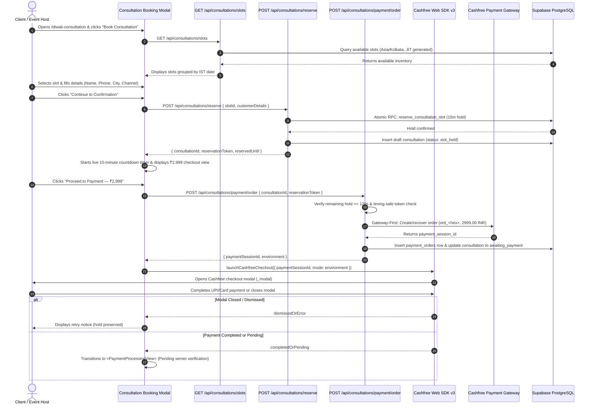

# EVENTSIKA — PROJECT BRAIN

> **GROUND TRUTH NOTICE**: The repository codebase is always the ultimate source of truth. If this document conflicts with the active code, inspect the repository, treat the code as truth, and update `Brain.md` to reflect the architectural change.

---

## 0. Document Control

| Attribute | Details |
| :--- | :--- |
| **Project Name** | Eventsika (`landing`) |
| **Document Path** | [`.agents/project-brain/Brain.md`](file:///c:/Users/gcad1/Documents/eventsika-landing/.agents/project-brain/Brain.md) |
| **Brain Version** | `1.6.0` |
| **Creation Date** | `2026-08-30` |
| **Last Verified** | `2026-09-21` |
| **Target Framework** | Next.js `16.3.0` (React `19.2.8`, App Router) |
| **Primary Domain** | `https://eventsika.in` |
| **Support Inbox** | `care@eventsika.in` |
| **Operational Rule** | **Brain-First**: Consult `Brain.md` before initiating any non-trivial architectural, feature, or refactoring task. |

---


## 1. Project Overview

**Eventsika** is a curated event planning, celebration design, and on-ground management platform specialized in Indian celebrations at home, terraces, banquets, and boutique venues across major metropolitan cities in India (Delhi, Gurgaon, Noida, Mumbai, Kolkata, etc.).

### Primary Capabilities & Core Value Proposition
1. **Curated Celebration Services**: Venue decor & floral styling, gourmet catering, live counters, ritual & puja arrangements, photography & cinematography, live entertainment, and bespoke invitations.
2. **Transparent Tiered Pricing**: Structured packages ranging from intimate terrace gatherings (₹35k+) to grand multi-day festive galas (₹1.25L+), with dynamic customizer and comparison tools.
3. **Interactive Lead Generation Engine**: High-conversion, validated celebration intake form (`#plan-event`) with server-side rate limiting, honeypot protection, and multi-channel notification dispatch.
4. **Curated Vendor Partner Network**: Transparent vendor partner application and onboarding registry (`/for-vendors`, `/admin/vendors`) capturing business profiles, portfolio links, and specialized categories.
5. **Seasonal Strategy Consultations**: High-intent 1-on-1 celebration planning advisory sessions (`/diwali-consultation`).
6. **Client & Partner Authentication Portal**: Dedicated portal entry point (`/login`) featuring client-side validation, secure Supabase SSR session handshake, and direct operational support routing.
7. **Concierge Operations Suite**: Protected operational command center (`/admin`) for inquiries management (`/admin/leads`), partner application registry (`/admin/vendors`), and intake metrics.
8. **Consultation Booking & Slot Reservation Engine**: High-concurrency booking engine featuring JIT slot materialization, server-authoritative Asia/Kolkata scheduling (6 daily slots, Mon–Sat, 24h lead time, 30d window), 15-minute temporary hold with 256-bit cryptographically secure tokens, atomic database concurrency controls, lazy expiry, and automatic compensation release.
9. **Cashfree Payment Gateway Integration Subsystem**: Provider-agnostic payment gateway contract with zero-dependency native fetch adapter targeting Cashfree PG API (2023-08-01), 10s timeout protection, automatic 409 duplicate recovery, paise-to-rupee conversion, and server-only credential security.
10. **Secure Consultation Payment Order Creation Subsystem**: Gateway-First order creation engine enforcing locked ₹2,999 pricing, 120s reservation safety threshold, deterministic provider order ID generation (`ord_<hex>`), PostgreSQL 23505 unique conflict reconciliation, and atomic consultation status transition (`slot_held` → `awaiting_payment`).
11. **Customer-Facing Consultation Booking & Cashfree Web Checkout Experience**: Client-side interactive booking modal on `/diwali-consultation` orchestrated by a 9-state machine (`BookingExperience.tsx`, `ConsultationBookingModal.tsx`), live slot picker querying `GET /api/consultations/slots`, client-validated customer intake form (`ConsultationIntakeForm.tsx`), atomic reservation hold (`POST /api/consultations/reserve`), server-anchored live 15-minute countdown timer with tiered urgency states (`ReservationCountdownTimer.tsx`), authoritative ₹2,999 pricing checkout view (`ConsultationCheckoutView.tsx`), dynamic Cashfree Web SDK v3 modal checkout invocation (`_modal`), and presentation-only pending state (`PaymentProcessingView.tsx`).

---


## 2. Technology Stack

All dependencies and versions are verified directly from `package.json` and project lockfiles:

| Technology | Version | Category / Purpose | Key Architectural Notes |
| :--- | :--- | :--- | :--- |
| **Next.js** | `16.3.0` | Core Framework | App Router, Server Components default, Turbopack, standalone production build |
| **React** | `19.2.8` | UI Library | Concurrent rendering, React 19 Action & Component APIs |
| **React DOM** | `19.2.8` | DOM Renderer | Browser mounting & SSR hydration |
| **TypeScript** | `^5` | Language | Strict mode (`strict: true`), bundler module resolution, path alias `@/*` -> `./src/*` |
| **React Compiler** | `1.0.0` | Build Optimization | `babel-plugin-react-compiler` enabled via `reactCompiler: true` in `next.config.ts` |
| **Styling** | Vanilla CSS | Design System | Pure CSS Modules (`*.module.css`) + CSS Custom Properties. **Zero Tailwind**. |
| **Typography** | `next/font/google` | Font Management | `Playfair Display` (Serif) & `Inter` (Sans-serif) with CSS variable injection |
| **Animation Runtime** | `@lottiefiles/dotlottie-web: 0.80.0` | Vector Celebration Animation | Canvas-based rendering, local WASM player (`/animation/dotlottie-player.wasm`), local `.lottie` container, reduced-motion listener, zero external CDN calls |
| **Database & Auth** | `@supabase/supabase-js: ^2.112.4`<br>`@supabase/ssr: ^0.12.5` | Persistence, Sessions & RPC | PostgreSQL database persistence (8 tables in schema design), server-side session cookies, RLS policies, and atomic stored procedures (`reserve_consultation_slot`, `release_consultation_slot`, `confirm_consultation_slot`) executed via service-role |
| **Distributed Cache / Rate Limiter** | `@upstash/redis: ^1.38.3` | Distributed Abuse Prevention | Atomic Redis Lua scripts for multi-layer admin auth rate limiting; fails closed in prod |
| **Rate Limiter (Public)** | In-Memory Map | Public Intake Defense | Sliding window IP rate limiter with automated 5-minute cleanup cycles (`rate-limit.ts`) |
| **Cryptography** | Native `node:crypto` | Secure Token Generation & Timing Safety | 256-bit secure reservation tokens (`crypto.randomBytes(32)`) and timing-safe token verification (`crypto.timingSafeEqual`) |
| **ESLint** | `^9` | Linting & Standards | Flat config format (`eslint.config.mjs`) using `eslint-config-next: 16.3.0` |
| **Test Framework** | `vitest: ^4.1.11` | Automated Testing | Unit & integration test suites (33 test files, 342 tests passing) |
| **Mailer Engine** | Native Fetch | Backend Dispatch | Zero-dependency REST dispatchers for Resend, SendGrid, and Custom Webhooks |
| **Payment Gateway** | Native Fetch | Backend Adapter | Zero-dependency REST adapter for Cashfree PG API (2023-08-01) with 10s AbortController |
| **Checkout SDK** | Dynamic Web SDK v3 | Client Modal Checkout | Dynamically loaded Cashfree JS SDK (`https://sdk.cashfree.com/js/v3/cashfree.js`) initializing `_modal` checkout without adding npm dependencies |

---


## 3. High-Level Architecture

Eventsika follows a clean Next.js 16 App Router architecture with strict Server vs. Client component boundaries, edge-to-server middleware authentication, and database-persisted concierge operations:

```mermaid
graph TD
    Client["Browser / Client (Desktop & Mobile)"] --> NextRouter["Next.js 16 App Router (RootLayout)"]
    
    subgraph FrontendPublic ["Public Presentation Layer (src/app & src/components)"]
        NextRouter --> HomeRoute["/ (Homepage, Hero Intake & Decorative Fireworks)"]
        NextRouter --> ServicesRoute["/services (Catalog, Estimator & FAQs)"]
        NextRouter --> PackagesRoute["/packages (Tiers & Customizer)"]
        NextRouter --> VendorRoute["/for-vendors (Partner Application)"]
        NextRouter --> DiwaliRoute["/diwali-consultation (Promo Advisory & Booking Modal)"]
        NextRouter --> LoginRoute["/login (Admin & Partner Authentication)"]
        NextRouter --> MetadataRoutes["/robots.txt & /sitemap.xml"]
        ServicesRoute -.->|"Consultation CTA"| DiwaliRoute

        DiwaliRoute --> BookingExp["BookingExperience (Trigger & Dialog Container)"]
        BookingExp --> BookingModal["ConsultationBookingModal (9-State Orchestrator)"]
        BookingModal --> SlotPicker["ConsultationSlotPicker (Live Slots via GET /api/consultations/slots)"]
        BookingModal --> IntakeForm["ConsultationIntakeForm (Client Validation)"]
        BookingModal --> CountdownTimer["ReservationCountdownTimer (Live 15m Hold)"]
        BookingModal --> CheckoutView["ConsultationCheckoutView (Authoritative ₹2,999)"]
        CheckoutView --> CashfreeSDK["Cashfree Web SDK v3 (Modal Checkout)"]
        CheckoutView --> ProcessingView["PaymentProcessingView (Pending State)"]
    end

    subgraph MiddlewareLayer ["Edge/Server Request Boundary (src/middleware.ts)"]
        NextRouter -->|"Protected Routes: /admin/*, /api/admin/*"| MiddlewareGuard["Middleware Session & Role Guard"]
        MiddlewareGuard -->|"Public Exemption: /api/admin/auth/login"| AdminAuthRoute["Auth API Route"]
        MiddlewareGuard -->|"Unauthenticated / Non-Admin API"| Reject401["HTTP 401 / 503 JSON"]
        MiddlewareGuard -->|"Unauthenticated Page Request"| RedirectLogin["Redirect -> /login"]
        MiddlewareGuard -->|"Verified app_metadata.role == 'admin'"| AdminLayoutRSC["Admin Layout Shell (RSC)"]
    end

    subgraph FrontendAdmin ["Concierge Operations Suite (src/app/admin)"]
        AdminLayoutRSC --> AdminDash["/admin (Operations Dashboard)"]
        AdminLayoutRSC --> AdminLeads["/admin/leads (Inquiries Queue & Dossier)"]
        AdminLayoutRSC --> AdminVendors["/admin/vendors (Partner Register & CSV)"]
        AdminLayoutRSC --> AdminAnalytics["/admin/analytics (Celebration Analytics & Insights)"]
    end

    subgraph BackendAPI ["API & Route Handler Layer (src/app/api)"]
        HomeRoute -.->|"POST /api/leads"| LeadRoute["Route: /api/leads"]
        VendorRoute -.->|"POST /api/vendor-applications"| VendorRouteAPI["Route: /api/vendor-applications"]
        NextRouter -.->|"GET /api/health"| HealthRoute["Route: /api/health"]
        LoginRoute -.->|"POST /api/admin/auth/login"| AdminLoginAPI["Route: /api/admin/auth/login"]
        AdminDash -.->|"POST /api/admin/auth/logout"| AdminLogoutAPI["Route: /api/admin/auth/logout"]
        
        SlotPicker -.->|"GET /api/consultations/slots"| SlotRoute["Route: /api/consultations/slots"]
        BookingModal -.->|"POST /api/consultations/reserve"| ReserveRoute["Route: /api/consultations/reserve"]
        CheckoutView -.->|"POST /api/consultations/payment/order"| OrderRoute["Route: /api/consultations/payment/order"]
        
        LeadRoute --> PublicGuards["Public Guards (In-Memory Rate Limit 5/10m, Size 50KB, RequestId)"]
        VendorRouteAPI --> PublicGuards
        SlotRoute --> SlotGuards["Slot Guards (Rate Limit 30/min, Cache-Control: no-store, private)"]
        ReserveRoute --> ReserveGuards["Reserve Guards (Rate Limit 5/10m, Size 50KB, Origin Check)"]
        OrderRoute --> OrderGuards["Order Guards (Rate Limit 5/10m, Size 16KB, Origin Check, 120s Rule)"]
        AdminLoginAPI --> AdminGuards["Admin Security Guards (CSRF/Origin, 8KB Size, Upstash Redis Rate Limit)"]
        
        PublicGuards --> ValidationLayer["Validation Layer (src/lib/backend/validation)"]
        SlotGuards --> SlotService["ConsultationBookingService (JIT Generation & Slot Logic)"]
        ReserveGuards --> SlotService
        OrderGuards --> PaymentService["ConsultationPaymentService (Gateway-First, 120s Check)"]
        AdminGuards --> AuthLogic["Supabase Auth Verification & Anti-Enumeration Defense"]
        ValidationLayer --> ServiceLayer["Business Service Layer (Lead, Vendor, Admin Services)"]
        
        ServiceLayer --> Deduplicator["In-Memory Deduplicator (30s Sliding Window)"]
        ServiceLayer --> RepoBoundary["Repository Boundary (ILeadRepository, IVendorRepository, IDashboardRepository)"]
        SlotService --> SlotRepoBoundary["Slot & Consultation Repositories"]
        PaymentService --> PaymentRepoBoundary["Payment Order Repository & Gateway Adapter"]
    end

    subgraph Persistence ["Persistence & Caching Infrastructure"]
        RepoBoundary -->|"Production: Service Role Key"| SupabaseStore["Supabase PostgreSQL (leads, vendor_applications)"]
        SlotRepoBoundary --> SupabaseStore
        PaymentRepoBoundary --> SupabaseStore
        RepoBoundary -.->|"Dev / Test Fallback"| InMemoryStore["In-Memory Store Singletons"]
        AdminGuards -->|"Atomic Lua Scripting"| UpstashRedis["Upstash Redis (Multi-Layer IP/Account Lockouts)"]
    end

    subgraph Integrations ["Integrations & External Dispatch"]
        ServiceLayer --> MailerAdapter["Mailer Delivery Notifier (Resend / SendGrid / Webhook)"]
        PaymentService --> CashfreeAdapter["CashfreePaymentGatewayAdapter (REST API 2023-08-01)"]
        CashfreeAdapter --> CashfreeAPI["Cashfree PG API (Sandbox / Production)"]
    end
```



---


## 4. Repository / Filesystem Structure

```
landing/
├── .agents/                               # Agent configuration, memory & governance
│   ├── project-brain/
│   │   └── Brain.md                       # Central architectural source of truth
│   └── skills/                            # Specialized agent operational workflows
│       ├── code-quality-audit/SKILL.md    # Read-only code maintainability audit
│       ├── minimal-change/SKILL.md        # Surgical change discipline
│       ├── nextjs-architecture/SKILL.md   # Next.js 16 & React 19 guidelines
│       ├── pre-commit-review/SKILL.md     # Pre-commit type & lint validation
│       ├── project-memory/SKILL.md        # Memory MCP knowledge graph governance
│       └── security-audit/SKILL.md        # Evidence-based security audit
├── public/                                # Static public assets (Zero build bundling)
│   ├── animation/                         # Lottie animation assets & local WebAssembly player
│   │   ├── Fireworks.lottie               # Compact dotLottie vector celebration archive (2 KB)
│   │   └── dotlottie-player.wasm          # Local WebAssembly player runtime (1.2 MB, zero CDN)
│   ├── images/                            # WebP/PNG photography, event types & services
│   │   ├── packages/                      # Tiered package imagery (jpg)
│   │   ├── services/                      # Original PNG & optimized WebP service card assets
│   │   ├── service-decor-styling.png      # Service 01 photography (Decor & Styling)
│   │   ├── service-catering-cuisine.png   # Service 02 photography (Catering & Cuisine)
│   │   ├── service-rituals-blessings.png  # Service 03 photography (Rituals & Blessings)
│   │   ├── service-entertainment-performers.png # Service 04 photography (Entertainment & Performers)
│   │   ├── service-photography-films.png  # Service 05 photography (Photography & Films)
│   │   ├── service-invitations-details.webp # Service 06 photography (Invitations & Favours)
│   │   └── eventsika-official-logo.png    # Official brand logo asset
│   ├── payment-logos/                     # UPI, GPay, PhonePe, Paytm, Cred vector icons (Trust display)
│   └── videos/                            # Consultation walkthrough videos (mp4)
├── src/
│   ├── middleware.ts                      # Edge/Node middleware protecting /admin & /api/admin
│   ├── app/                               # Next.js 16 App Router hierarchy
│   │   ├── admin/                         # Protected Concierge Operations Suite
│   │   │   ├── AdminHeader.tsx            # Header with breadcrumbs & mobile drawer toggle
│   │   │   ├── AdminShell.tsx             # Responsive layout & sidebar wrapper
│   │   │   ├── AdminSidebar.tsx           # Official logo navigation sidebar (Dashboard, Leads, Vendors, Analytics)
│   │   │   ├── LogoutButton.tsx           # CSRF-safe admin session termination button
│   │   │   ├── admin.module.css           # Dashboard metrics & activity styling
│   │   │   ├── admin-shell.module.css     # Shell, drawer, and sidebar styles
│   │   │   ├── layout.tsx                 # Protected admin RSC boundary with requireAdminSession
│   │   │   ├── page.tsx                   # Operations Dashboard executive summary
│   │   │   ├── analytics/                 # Executive Celebration Analytics & Insights
│   │   │   │   ├── AnalyticsWorkspace.tsx # Interactive dashboard, tabs & date filter
│   │   │   │   ├── IndiaDemandMap.tsx     # Realistic geographic India demand map with states
│   │   │   │   ├── LeadSourcesDonut.tsx   # SVG attribution ring & transparent notes
│   │   │   │   ├── analytics.module.css   # Scoped luxury analytics styles
│   │   │   │   ├── indiaMapData.ts        # Static geographic vector data for 36 states/UTs
│   │   │   │   └── page.tsx               # Server page fetching via adminAnalyticsService
│   │   │   ├── leads/                     # Celebration Inquiries queue
│   │   │   │   ├── LeadsWorkspace.tsx     # 2-pane inquiry list & client dossier
│   │   │   │   ├── leads.module.css       # Scoped leads workspace styles
│   │   │   │   └── page.tsx               # Server page fetching via adminLeadService
│   │   │   └── vendors/                   # Partner Applications Register
│   │   │       ├── VendorsWorkspace.tsx   # Paginated register & slide-over drawer
│   │   │       ├── vendor-helpers.ts      # CSV builder, formula sanitize, URL sanitizers
│   │   │       ├── vendors.module.css     # Scoped vendor register styles
│   │   │       ├── __tests__/
│   │   │       │   └── vendor-helpers.test.ts # Tests for sanitizers and CSV generator
│   │   │       └── page.tsx               # Server page fetching via adminVendorService
│   │   ├── api/                           # Serverless Route Handlers
│   │   │   ├── admin/
│   │   │   │   └── auth/
│   │   │   │       ├── login/route.ts     # POST rate-limited admin authentication
│   │   │   │       ├── logout/route.ts    # POST admin session sign-out
│   │   │   │       └── __tests__/
│   │   │   │           ├── login-route.test.ts  # Security & rate-limiting tests
│   │   │   │           ├── logout-route.test.ts # Session revocation tests
│   │   │   │           └── middleware.test.ts   # Route protection tests
│   │   │   ├── consultations/             # Consultation booking & slot engine endpoints
│   │   │   │   ├── payment/               # Consultation payment order creation
│   │   │   │   │   ├── order/route.ts     # POST create/recover Cashfree payment order (120s check, deterministic ord_<hex>)
│   │   │   │   │   └── __tests__/         # Payment order route integration tests
│   │   │   │   ├── reserve/route.ts       # POST atomic 15m slot hold & consultation creation
│   │   │   │   ├── slots/route.ts         # GET dynamic slot availability (JIT generated, no-store)
│   │   │   │   └── __tests__/
│   │   │   │       └── consultation-routes.test.ts # Route integration, rate limit & security tests
│   │   │   ├── health/route.ts            # GET application liveness & health check
│   │   │   ├── leads/
│   │   │   │   ├── route.ts               # POST celebration lead capture
│   │   │   │   └── __tests__/             # Lead API integration tests
│   │   │   └── vendor-applications/
│   │   │       ├── route.ts               # POST partner application capture
│   │   │       └── __tests__/             # Vendor API integration tests
│   │   ├── diwali-consultation/           # Special 1-on-1 advisory promotion route
│   │   ├── for-vendors/                   # Vendor partner network route
│   │   ├── login/                         # Client & Partner portal login route
│   │   ├── packages/                      # Packages, comparison & customizer route
│   │   ├── services/                      # Services catalog & estimator route
│   │   ├── globals.css                    # Design tokens, CSS custom properties, resets
│   │   ├── layout.tsx                     # Root HTML shell, Google Fonts, JSON-LD Schema
│   │   ├── page.tsx                       # Homepage composition root
│   │   ├── page.module.css                # Legacy starter styles (superseded by components)
│   │   ├── robots.ts                      # Dynamic robots.txt generation
│   │   └── sitemap.ts                     # Dynamic sitemap.xml generation
│   ├── components/                        # Reusable modular UI components
│   │   ├── consultation/                  # Customer Consultation Booking & Checkout Experience (Step 5)
│   │   │   ├── BookingExperience.tsx      # Modal trigger button and dialog mount container
│   │   │   ├── ConsultationBookingModal.tsx # Central 9-state machine dialog orchestrator
│   │   │   ├── ConsultationSlotPicker.tsx # Dynamic slot inventory picker & date tabs
│   │   │   ├── ConsultationIntakeForm.tsx # Client-validated customer details form
│   │   │   ├── ReservationCountdownTimer.tsx # 15-minute live hold timer with tiered urgency
│   │   │   ├── ConsultationCheckoutView.tsx # Authoritative ₹2,999 summary & Cashfree checkout trigger
│   │   │   ├── PaymentProcessingView.tsx  # Presentation-only gateway pending state
│   │   │   ├── consultation.module.css    # Scoped luxury styling matching Sand/Ivory/Crimson tokens
│   │   │   └── utils/
│   │   │       ├── booking-types.ts       # Frontend view models, state unions & sessions
│   │   │       ├── cashfree-loader.ts     # Cashfree Web SDK v3 dynamic CDN loader & modal launcher
│   │   │       ├── countdown-utils.ts     # Pure IST date/time formatting & timer calculators
│   │   │       ├── error-mapping.ts       # Backend RFC error code to user-friendly error mapper
│   │   │       └── __tests__/
│   │   │           ├── countdown-utils.test.ts # Timer calculation and formatting tests
│   │   │           └── error-mapping.test.ts   # Error code mapping tests
│   │   ├── EventTypes.tsx / .module.css   # Interactive 2-column event showcase
│   │   ├── Footer.tsx / .module.css       # Global footer & navigation directory
│   │   ├── ForVendors.tsx / .module.css   # Homepage vendor partner section
│   │   ├── Hero.tsx / .module.css         # Hero banner & primary lead intake form
│   │   ├── HeroFireworks.tsx / .module.css # Decorative fireworks canvas with dotLottie WASM runtime
│   │   ├── HowItWorks.tsx / .module.css   # 3-step celebration process overview
│   │   ├── LoginForm.tsx / .module.css    # Portal login component & validation
│   │   ├── Navbar.tsx / .module.css       # Global header, navigation, & animated SVG logo
│   │   ├── PackageComparison.tsx / .module.css # Tier matrix comparison table
│   │   ├── PackageCustomizer.tsx / .module.css # Interactive tier customization widget
│   │   ├── Packages.tsx / .module.css     # Homepage package highlights
│   │   ├── ServiceEstimator.tsx / .module.css  # Interactive budget & guest cost estimator
│   │   ├── Services.tsx / .module.css     # Interactive 3D flip card service grid
│   │   ├── ServicesFAQ.tsx / .module.css  # Expandable service FAQ accordions
│   │   ├── VendorApplicationForm.tsx / .module.css # Partner application form
│   │   └── seasonal/                      # Isolated seasonal occasion decoration engine
│   │       ├── SeasonalDecoration.tsx     # Central occasion controller & switch
│   │       ├── DiwaliLights.tsx           # Festive draped festoon wire, golden dots & diyas
│   │       ├── DiwaliLights.module.css    # Zero-height overlay styles & organic desynchronized twinkle
│   │       ├── DiwaliCtaDiya.tsx          # Authentic terracotta diya above "Book a Consultation" CTA
│   │       └── DiwaliCtaDiya.module.css   # Diya positioning, warm glow & 3.8s flame sway animation
│   └── lib/                               # Shared server & backend infrastructure
│       ├── backend/                       # Layered backend architecture
│       │   ├── auth/
│       │   │   ├── require-admin.ts       # Server authorization checking app_metadata.role
│       │   │   └── __tests__/             # Role boundary tests
│       │   ├── config/
│       │   │   ├── env.ts                 # Runtime environment variable validation
│       │   │   └── __tests__/             # Environment validation tests
│       │   ├── constants/allowlists.ts    # Authoritative canonical form allowlists
│       │   ├── deduplication/
│       │   │   ├── deduplicator.ts        # 30s sliding window in-memory deduplicator
│       │   │   └── __tests__/             # Deduplication tests
│       │   ├── http/
│       │   │   ├── origin.ts              # CSRF / Origin / Sec-Fetch-Site validation
│       │   │   └── __tests__/             # Origin validation tests
│       │   ├── integrations/              # Delivery notifiers & payment gateway adapters
│       │   │   ├── cashfree-payment-gateway-adapter.ts # Cashfree PG adapter (API 2023-08-01, fetch, 10s timeout, 409 recovery)
│       │   │   ├── payment-gateway.interface.ts # Provider-agnostic gateway interface
│       │   │   └── __tests__/
│       │   │       └── cashfree-payment-gateway-adapter.test.ts # Cashfree adapter unit tests
│       │   ├── logger/logger.ts           # PII-safe structured logger with phone/email masking
│       │   ├── repositories/              # Repository interfaces, in-memory & Supabase stores
│       │   │   ├── analytics-repository.interface.ts # Analytics data contracts & DTOs
│       │   │   ├── consultation-repository.interface.ts # Consultation persistence contracts
│       │   │   ├── consultation-slot-repository.interface.ts # Slot query & atomic RPC contracts
│       │   │   ├── dashboard-repository.interface.ts # Dashboard aggregation contracts
│       │   │   ├── in-memory-lead-repository.ts
│       │   │   ├── in-memory-vendor-repository.ts
│       │   │   ├── lead-repository.interface.ts
│       │   │   ├── payment-order-repository.interface.ts # Order persistence contracts
│       │   │   ├── payment-refund-repository.interface.ts # Refund ledger contracts
│       │   │   ├── payment-transaction-repository.interface.ts # Transaction attempt contracts
│       │   │   ├── supabase-analytics-repository.ts  # Analytics queries via Promise.all()
│       │   │   ├── supabase-consultation-repository.ts # Consultation Supabase store
│       │   │   ├── supabase-consultation-slot-repository.ts # Slot Supabase store + RPC calls
│       │   │   ├── supabase-dashboard-repository.ts  # Supabase dashboard queries (No fake fallback)
│       │   │   ├── supabase-lead-repository.ts
│       │   │   ├── supabase-payment-order-repository.ts # Payment order Supabase store
│       │   │   ├── supabase-payment-refund-repository.ts # Refund Supabase store
│       │   │   ├── supabase-payment-transaction-repository.ts # Transaction attempt ledger
│       │   │   ├── supabase-vendor-repository.ts
│       │   │   ├── supabase-webhook-event-repository.ts # Webhook event idempotency store
│       │   │   ├── vendor-repository.interface.ts
│       │   │   ├── webhook-event-repository.interface.ts # Webhook event contracts
│       │   │   └── __tests__/             # Repository unit & integration tests
│       │   │       ├── payment-foundation-repositories.test.ts # Payment repositories tests
│       │   │       └── vendor-repository.test.ts
│       │   ├── services/                  # Business domain services
│       │   │   ├── admin-analytics-service.ts # Analytics derivations & error boundary
│       │   │   ├── admin-dashboard-service.ts # Dashboard aggregation orchestration
│       │   │   ├── admin-lead-service.ts      # Leads queue data orchestration
│       │   │   ├── admin-vendor-service.ts    # Vendor register data orchestration
│       │   │   ├── consultation-booking-service.ts # Availability, JIT generation, atomic hold, compensation
│       │   │   ├── consultation-payment-service.ts # Gateway-first payment order orchestration (120s safety, 23505 conflict recovery)
│       │   │   ├── lead-service.ts
│       │   │   ├── vendor-service.ts
│       │   │   └── __tests__/             # Service unit tests
│       │   │       ├── consultation-booking-service.test.ts # Slot reservation & compensation tests
│       │   │       ├── consultation-payment-service.test.ts # Payment order orchestration & concurrency tests
│       │   │       └── ...
│       │   ├── supabase/
│       │   │   ├── client.ts              # Server-only Supabase admin client (Service Role)
│       │   │   └── server.ts              # Server Supabase client using @supabase/ssr
│       │   ├── types/                     # Shared domain contracts & types
│       │   │   └── payment-and-consultation.ts # Domain types, integer paise, state unions, DTOs
│       │   ├── utils/
│       │   │   ├── consultation-time.ts   # Pure scheduling engine (Asia/Kolkata, 6 slots, lead time)
│       │   │   ├── request-id.ts          # Correlation ID generator & header extractor
│       │   │   └── __tests__/
│       │   │       └── consultation-time.test.ts # Scheduling calculation tests
│       │   └── validation/                # Server-side validation schemas
│       │       ├── consultation-schema.ts # Consultation booking input validation
│       │       ├── lead-schema.ts
│       │       ├── payment-order-schema.ts # ConsultationId UUID & 64-hex token validation
│       │       ├── vendor-schema.ts
│       │       └── __tests__/             # Validation schemas unit tests
│       ├── mailer.ts                      # Multi-provider zero-dependency email dispatcher
│       └── rate-limit.ts                  # Hybrid rate limiter (In-memory public + Upstash Redis admin)
├── supabase/                              # Version-controlled Supabase migrations
│   └── migrations/                        # PostgreSQL DDL migrations (tables, RLS, indexes)
│       ├── 20260901160000_create_intake_tables.sql # Baseline leads & vendor_applications
│       ├── 20260914180000_create_payment_and_consultation_foundation.sql # Step 1 foundation tables
│       └── 20260915120000_add_slot_concurrency_and_constraints.sql # Step 2 concurrency & RPCs
├── .env.example                           # Sanitized environment variable template
├── .gitignore                             # Git ignore rules (.env.local, node_modules, .next)
├── AGENTS.md                              # Next.js 16 agent environment notice
├── CLAUDE.md                              # Pointer linking Claude to AGENTS.md
├── eslint.config.mjs                      # ESLint 9 flat configuration
├── next.config.ts                         # Next.js config (headers, CSP, reactCompiler, poweredBy)
├── package.json                           # Dependency definitions and scripts
└── tsconfig.json                          # TypeScript configuration & path aliases
```

---


## 5. Application Routing

| Route | Type | Component / File | Purpose & Key Interactions |
| :--- | :--- | :--- | :--- |
| `/` | Page (Static) | [`src/app/page.tsx`](file:///c:/Users/gcad1/Documents/eventsika-landing/src/app/page.tsx) | Main landing page. Contains Hero intake form (`#plan-event`), How It Works, Services, Event Types, Packages, and Vendor preview. |
| `/services` | Page (Static) | [`src/app/services/page.tsx`](file:///c:/Users/gcad1/Documents/eventsika-landing/src/app/services/page.tsx) | Comprehensive celebration service directory with 6 curated service categories (01 Decor & Styling, 02 Catering & Cuisine, 03 Rituals & Blessings, 04 Entertainment & Performers, 05 Photography & Films, 06 Invitations & Favours), dynamic [`ServiceEstimator`](file:///c:/Users/gcad1/Documents/eventsika-landing/src/components/ServiceEstimator.tsx), [`ServicesFAQ`](file:///c:/Users/gcad1/Documents/eventsika-landing/src/components/ServicesFAQ.tsx), and consultation CTA routing to `/diwali-consultation`. |
| `/packages` | Page (Static) | [`src/app/packages/page.tsx`](file:///c:/Users/gcad1/Documents/eventsika-landing/src/app/packages/page.tsx) | Curated tiered package explorer with interactive [`PackageCustomizer`](file:///c:/Users/gcad1/Documents/eventsika-landing/src/components/PackageCustomizer.tsx) and side-by-side [`PackageComparison`](file:///c:/Users/gcad1/Documents/eventsika-landing/src/components/PackageComparison.tsx). |
| `/for-vendors` | Page (Static) | [`src/app/for-vendors/page.tsx`](file:///c:/Users/gcad1/Documents/eventsika-landing/src/app/for-vendors/page.tsx) | Partner acquisition landing page with value props and multi-category [`VendorApplicationForm`](file:///c:/Users/gcad1/Documents/eventsika-landing/src/components/VendorApplicationForm.tsx). |
| `/diwali-consultation` | Page (Static) | [`src/app/diwali-consultation/page.tsx`](file:///c:/Users/gcad1/Documents/eventsika-landing/src/app/diwali-consultation/page.tsx) | High-intent promotional landing page for 1-on-1 strategy consultations at authoritative ₹2,999. Hosts the interactive customer booking modal (`BookingExperience.tsx`, `ConsultationBookingModal.tsx`), slot inventory picker, intake form, 15-minute reservation timer, and Cashfree Web SDK checkout. |
| `/login` | Page (Static) | [`src/app/login/page.tsx`](file:///c:/Users/gcad1/Documents/eventsika-landing/src/app/login/page.tsx) | Client & Partner portal authentication page. Features client-side validation and authenticates directly against `/api/admin/auth/login`. |
| `/admin` | Page (RSC) | [`src/app/admin/page.tsx`](file:///c:/Users/gcad1/Documents/eventsika-landing/src/app/admin/page.tsx) | Executive concierge operations dashboard. Displays 4 key metric cards, 5-stage intake pipeline, chronological activity feed, and upcoming celebrations table. |
| `/admin/analytics` | Page (RSC) | [`src/app/admin/analytics/page.tsx`](file:///c:/Users/gcad1/Documents/eventsika-landing/src/app/admin/analytics/page.tsx) | Executive celebration analytics ("Celebrations in Focus"). Features date filtering (`7d`, `30d`, `year`, `all`), India demand heatmap, top cities ranking, celebration trends, lead journey funnel, lead sources donut, and operational signals. |
| `/admin/leads` | Page (RSC) | [`src/app/admin/leads/page.tsx`](file:///c:/Users/gcad1/Documents/eventsika-landing/src/app/admin/leads/page.tsx) | Operational celebration inquiries queue. Features 2-pane master-detail view, search, city/occasion filtering, sorting, deep client dossier, and WhatsApp/Call actions. |
| `/admin/vendors` | Page (RSC) | [`src/app/admin/vendors/page.tsx`](file:///c:/Users/gcad1/Documents/eventsika-landing/src/app/admin/vendors/page.tsx) | Operational vendor partner application register. Features category/city/experience filtering, slide-over detail drawer, and formula-injection-safe CSV export. |
| `/robots.txt` | Metadata | [`src/app/robots.ts`](file:///c:/Users/gcad1/Documents/eventsika-landing/src/app/robots.ts) | Dynamic SEO robot instructions allowing all crawling except `/api/` and `/admin/` endpoints. |
| `/sitemap.xml` | Metadata | [`src/app/sitemap.ts`](file:///c:/Users/gcad1/Documents/eventsika-landing/src/app/sitemap.ts) | Dynamic XML sitemap indexing all canonical public routes with priority ratings. |
| `/api/health` | API (Dynamic) | [`src/app/api/health/route.ts`](file:///c:/Users/gcad1/Documents/eventsika-landing/src/app/api/health/route.ts) | GET endpoint for application health and uptime verification (`{ status: "healthy", timestamp, version }`). |
| `/api/leads` | API (Dynamic) | [`src/app/api/leads/route.ts`](file:///c:/Users/gcad1/Documents/eventsika-landing/src/app/api/leads/route.ts) | POST endpoint for celebration inquiries. Rate limited (5/10m), 50KB capped, deduplicated, validated, dispatches email/webhook. |
| `/api/vendor-applications` | API (Dynamic) | [`src/app/api/vendor-applications/route.ts`](file:///c:/Users/gcad1/Documents/eventsika-landing/src/app/api/vendor-applications/route.ts) | POST endpoint for vendor partner applications. Rate limited, deduplicated, validates portfolio URLs & category arrays. |
| `/api/consultations/slots` | API (Dynamic) | [`src/app/api/consultations/slots/route.ts`](file:///c:/Users/gcad1/Documents/eventsika-landing/src/app/api/consultations/slots/route.ts) | GET dynamic slot availability. Evaluated in `Asia/Kolkata` with JIT slot materialization, 30-day window, Mon–Sat schedule, 30 req/min rate limit, `Cache-Control: no-store, private`. |
| `/api/consultations/reserve` | API (Dynamic) | [`src/app/api/consultations/reserve/route.ts`](file:///c:/Users/gcad1/Documents/eventsika-landing/src/app/api/consultations/reserve/route.ts) | POST atomic 15-minute slot hold and draft consultation creation. Rate limited (5/10m), 50KB ceiling, returns 256-bit cryptographically secure reservation token. |
| `/api/consultations/payment/order` | API (Dynamic) | [`src/app/api/consultations/payment/order/route.ts`](file:///c:/Users/gcad1/Documents/eventsika-landing/src/app/api/consultations/payment/order/route.ts) | POST create or recover Cashfree payment order. Server-authoritative ₹2,999 pricing, 120s reservation safety threshold, deterministic order ID (`ord_<hex>`), PostgreSQL 23505 conflict reconciliation, transitions `slot_held` → `awaiting_payment`, returns `{ paymentSessionId, environment }`. Rate limited (5/10m), 16KB ceiling, origin guard. |
| `/api/admin/auth/login` | API (Dynamic) | [`src/app/api/admin/auth/login/route.ts`](file:///c:/Users/gcad1/Documents/eventsika-landing/src/app/api/admin/auth/login/route.ts) | POST endpoint for admin authentication. Origin/CSRF guard, 8KB size ceiling, multi-layer Upstash Redis rate limiting with progressive cooldown, Supabase auth verification, strict `app_metadata.role === 'admin'` check, anti-enumeration response, and session cookie setting. |
| `/api/admin/auth/logout` | API (Dynamic) | [`src/app/api/admin/auth/logout/route.ts`](file:///c:/Users/gcad1/Documents/eventsika-landing/src/app/api/admin/auth/logout/route.ts) | POST endpoint for admin session revocation. Origin guard, terminates Supabase session, clears cookies. |

---


## 6. Frontend Architecture

### 1. Server vs. Client Component Boundaries
- **Server Components (RSC)**:
  - All public route entrypoints (`page.tsx`), `RootLayout`, `robots.ts`, `sitemap.ts`, `HowItWorks.tsx`, `Packages.tsx`, `ForVendors.tsx`, and `Footer.tsx`.
  - **Admin Suite RSCs**: `src/app/admin/layout.tsx` (enforces `requireAdminSession`), `src/app/admin/page.tsx` (fetches dashboard summary), `src/app/admin/analytics/page.tsx` (fetches operational analytics), `src/app/admin/leads/page.tsx` (fetches inquiries queue), and `src/app/admin/vendors/page.tsx` (fetches partner applications).
- **Client Components (`"use client"`)**:
  - [`Hero.tsx`](file:///c:/Users/gcad1/Documents/eventsika-landing/src/components/Hero.tsx): Multi-field form state, real-time Indian phone validation (`/^[6-9]\d{9}$/`), service multi-selection chips, submission spinner, and error banners.
  - [`HeroFireworks.tsx`](file:///c:/Users/gcad1/Documents/eventsika-landing/src/components/HeroFireworks.tsx): Canvas-based dotLottie animation player, local WASM runtime, responsive opacity (0.5 desktop, 0.75 mobile), non-blocking pointer events, and reduced-motion listener.
  - [`Navbar.tsx`](file:///c:/Users/gcad1/Documents/eventsika-landing/src/components/Navbar.tsx): Mobile toggle menu state, active route highlighting via `usePathname()`.
  - [`Services.tsx`](file:///c:/Users/gcad1/Documents/eventsika-landing/src/components/Services.tsx): 3D CSS flip-card state (`transform-style: preserve-3d`) toggled via click or keyboard navigation (`Enter` / `Space`).
  - [`EventTypes.tsx`](file:///c:/Users/gcad1/Documents/eventsika-landing/src/components/EventTypes.tsx): Synchronized hover/click tab list updating active high-resolution editorial imagery on the left column.
  - [`PackageCustomizer.tsx`](file:///c:/Users/gcad1/Documents/eventsika-landing/src/components/PackageCustomizer.tsx) & [`ServiceEstimator.tsx`](file:///c:/Users/gcad1/Documents/eventsika-landing/src/components/ServiceEstimator.tsx): Dynamic arithmetic cost calculations based on guest counts, venue types, and add-on toggles.
  - [`VendorApplicationForm.tsx`](file:///c:/Users/gcad1/Documents/eventsika-landing/src/components/VendorApplicationForm.tsx) & [`LoginForm.tsx`](file:///c:/Users/gcad1/Documents/eventsika-landing/src/components/LoginForm.tsx): Controlled inputs, field-level error validation, interactive feedback notices, and authentication handshakes.
  - **Consultation Booking & Checkout Components (`src/components/consultation/`)**:
    - [`BookingExperience.tsx`](file:///c:/Users/gcad1/Documents/eventsika-landing/src/components/consultation/BookingExperience.tsx): Client trigger button and modal mount point.
    - [`ConsultationBookingModal.tsx`](file:///c:/Users/gcad1/Documents/eventsika-landing/src/components/consultation/ConsultationBookingModal.tsx): 9-state machine dialog orchestrator with background scroll lock, progress indicators, step transitions, and error management.
    - [`ConsultationSlotPicker.tsx`](file:///c:/Users/gcad1/Documents/eventsika-landing/src/components/consultation/ConsultationSlotPicker.tsx): Dynamic slot inventory picker grouping available IST slots by date tabs.
    - [`ConsultationIntakeForm.tsx`](file:///c:/Users/gcad1/Documents/eventsika-landing/src/components/consultation/ConsultationIntakeForm.tsx): Client-validated customer details form (Name, Indian phone, Email, City dropdown, Meeting Channel, Vision).
    - [`ReservationCountdownTimer.tsx`](file:///c:/Users/gcad1/Documents/eventsika-landing/src/components/consultation/ReservationCountdownTimer.tsx): 15-minute live hold countdown with calm, warning, critical (<120s), and expired states.
    - [`ConsultationCheckoutView.tsx`](file:///c:/Users/gcad1/Documents/eventsika-landing/src/components/consultation/ConsultationCheckoutView.tsx): Two-column Stitch-inspired luxury checkout layout with authoritative ₹2,999 pricing, accepted payment method showcase, and Cashfree Web SDK modal checkout trigger.
    - [`PaymentProcessingView.tsx`](file:///c:/Users/gcad1/Documents/eventsika-landing/src/components/consultation/PaymentProcessingView.tsx): Presentation-only pending state while payment confirmation completes server-side.
  - **Admin Client Workspaces**:
    - [`AdminShell.tsx`](file:///c:/Users/gcad1/Documents/eventsika-landing/src/app/admin/AdminShell.tsx), [`AdminSidebar.tsx`](file:///c:/Users/gcad1/Documents/eventsika-landing/src/app/admin/AdminSidebar.tsx), [`AdminHeader.tsx`](file:///c:/Users/gcad1/Documents/eventsika-landing/src/app/admin/AdminHeader.tsx), [`LogoutButton.tsx`](file:///c:/Users/gcad1/Documents/eventsika-landing/src/app/admin/LogoutButton.tsx): Responsive navigation drawer state, active route highlighting, and session sign-out dispatch.
    - [`AnalyticsWorkspace.tsx`](file:///c:/Users/gcad1/Documents/eventsika-landing/src/app/admin/analytics/AnalyticsWorkspace.tsx): Interactive celebration analytics, date preset dropdown, tab navigation, SVG demand map tooltips, and attribution donut.
    - [`LeadsWorkspace.tsx`](file:///c:/Users/gcad1/Documents/eventsika-landing/src/app/admin/leads/LeadsWorkspace.tsx): Interactive 2-pane master-detail inquiries list, search query, event/city filters, sort order, and client dossier inspection.
    - [`VendorsWorkspace.tsx`](file:///c:/Users/gcad1/Documents/eventsika-landing/src/app/admin/vendors/VendorsWorkspace.tsx): Paginated partner registry, multi-filter dropdowns, slide-over detail drawer, and CSV export.

### 2. Styling Strategy
- **Vanilla CSS Modules**: Every component is paired with a strictly scoped `.module.css` stylesheet. Class names are hashed by Next.js to eliminate global namespace collisions.
- **Design Tokens**: Standardized CSS custom properties in `src/app/globals.css` provide uniform colors, borders, max widths, and font stacks across all components.

### 3. Customer Consultation Booking & Cashfree Checkout Experience (`src/components/consultation/`)

Eventsika incorporates a complete, luxury customer booking and checkout experience built directly from the approved Stitch visual direction (`77b7f837daef465e894ee73ea2f924fb`):

```
┌─────────────────────────────────────────────────────────────┐
│ <ConsultationBookingModal /> (Fixed Overlay, z: 9999)       │
│  ├── Progress Indicator (01 Select Slot → 02 Details → 03 Pay)│
│  ├── State 1: <ConsultationSlotPicker />                    │
│  │     └── Grouped IST Dates + 60m Slot Time Pills          │
│  ├── State 2: <ConsultationIntakeForm />                    │
│  │     └── Name, Phone, Email, City, Channel, Vision Notes  │
│  ├── State 3: <ConsultationCheckoutView />                  │
│  │     ├── Left Col: Summary Card + Numbered Inclusions (1-4)│
│  │     └── Right Col: <ReservationCountdownTimer /> (15m)   │
│  │          ├── Authoritative Fee: ₹2,999 (One-Time)       │
│  │          ├── Payment Method Badges (UPI, GPay, Cards)    │
│  │          ├── Primary CTA ("Proceed to Payment — ₹2,999") │
│  │          └── Trust Strip (256-Bit SSL, RBI Regulated)    │
│  └── State 4: <PaymentProcessingView />                     │
│        └── Presentation-Only Verification Spinner           │
└─────────────────────────────────────────────────────────────┘
```

#### 1. 9-State Modal Orchestrator (`ConsultationBookingModal.tsx`):
The booking modal is governed by a strict, type-safe state machine (`BookingModalState`):
- `LOADING_SLOTS`: Initial mounting phase; calls `GET /api/consultations/slots` to retrieve live inventory.
- `SLOT_SELECTION`: Displays available dates and slots. Customer selects their preferred 60-minute session.
- `CUSTOMER_DETAILS`: Renders the intake form with selected slot context.
- `RESERVING`: Form submission dispatches `POST /api/consultations/reserve`.
- `RESERVED`: Atomic 15-minute slot hold confirmed; active reservation session initialized (`consultationId`, 64-hex lowercase `reservationToken`, slot time range, and `reservedUntil` ISO string).
- `CREATING_PAYMENT`: Customer clicks "Proceed to Payment"; dispatches `POST /api/consultations/payment/order` to obtain ephemeral `paymentSessionId` and `environment`.
- `CHECKOUT_OPEN`: Official Cashfree Web SDK v3 modal opened in browser overlay (`redirectTarget: "_modal"`).
- `CHECKOUT_CLOSED`: Cashfree modal dismissed or closed without payment; retains reservation session, displays contextual guidance, and allows safe retry.
- `PAYMENT_PENDING`: Cashfree checkout returned `completedOrPending`; transitions to `<PaymentProcessingView>` presentation state awaiting server-side webhook/order verification (Step 6).

#### 2. Slot Inventory Picker (`ConsultationSlotPicker.tsx`):
- Fetches dynamic availability evaluated in `Asia/Kolkata` from `GET /api/consultations/slots`.
- Groups slots into horizontal date selection tabs (displaying day-of-week and month/day).
- Renders available time slots as interactive pill buttons displaying 12-hour IST format (`10:00 AM – 11:00 AM`).
- Handles loading skeletons, empty inventory alerts, and network error retry prompts.

#### 3. Customer Intake Validation (`ConsultationIntakeForm.tsx`):
- Implements strict client-side validation mirroring backend constraints:
  - `fullName`: Required, minimum 2 characters.
  - `phone`: Required, normalized Indian mobile matching `/^[6-9]\d{9}$/`.
  - `email`: Required, valid email format.
  - `city`: Required dropdown matching `CITY_OPTIONS` allowlist.
  - `meetingChannel`: Required radio selector (`video` = Google Meet, `phone` = Direct Call).
  - `celebrationVision`: Optional text capped at 1,000 characters.
- Real-time field-level validation messages with disabled submit buttons during submission.

#### 4. Server-Anchored 15-Minute Hold Timer (`ReservationCountdownTimer.tsx`):
- Anchored to the server-issued `reservedUntil` timestamp.
- Calculates remaining seconds via `calculateRemainingSeconds(reservedUntil)` on a 1-second interval.
- **Tiered Urgency States**:
  - $> 180s$ (Normal): Calm green accent, displays MM:SS countdown.
  - $\le 180s$ (Warning): Amber urgency banner alerting customer that hold is closing.
  - $\le 120s$ (Critical): Red urgency banner; disables payment checkout initiation ("Hold Expiring Soon (< 2 min)") to strictly comply with backend Step 4 120s safety threshold.
  - $\le 0s$ (Expired): Red expired state; displays "Hold Expired — Select New Slot" and triggers `onExpired` callback to cleanly return to slot selection.

#### 5. Authoritative Consultation Checkout (`ConsultationCheckoutView.tsx`):
- Two-column luxury layout adapting Warm Ivory (`#FFFAF4`), Deep Charcoal (`#2B211D`), and Royal Crimson (`#7F1010`) tokens:
  - **Left Column**:
    - Reservation Summary Card: Displays formatted IST date, time slot, duration (60m), consultation format, and guest name/city.
    - Eyebrow header: "DIWALI CONSULTATION" with "1-on-1 Celebration Planning".
    - Numbered consultation inclusions (01 Personalized Planning Blueprint, 02 Vetted Vendor & Decor Guidance, 03 Transparent Budget Allocation, 04 Comprehensive Event Strategy).
  - **Right Column**:
    - Embedded `<ReservationCountdownTimer>`.
    - Authoritative Pricing: Displays exclusively `₹2,999` with "One-time consultation fee". Zero invented or unverified promotional breakdowns.
    - Accepted Payment Methods: Vector badges for UPI, Google Pay, PhonePe, Paytm, and Cards & NetBanking.
    - Contextual payment error banners with automatic retry guidance.
    - Adaptive Payment CTA:
      - Loading: "Preparing Secure Checkout..."
      - Critical Hold ($\le 120s$): "Hold Expiring Soon (< 2 min)" (Disabled)
      - Expired Hold: "Hold Expired — Select New Slot"
      - Default: "Proceed to Payment — ₹2,999"
    - Security Strip: "256-Bit SSL Encryption • RBI Regulated Gateway • No Hidden Charges".

#### 6. Cashfree Web SDK Loader & Modal Lifecycle (`utils/cashfree-loader.ts`):
- **Zero npm Dependencies**: Dynamically injects `<script src="https://sdk.cashfree.com/js/v3/cashfree.js">` upon checkout request.
- Cached promise prevents redundant script injection.
- Initializes SDK: `window.Cashfree({ mode: environment })` (strictly `"sandbox"` or `"production"`).
- Invokes modal checkout: `cashfree.checkout({ paymentSessionId, redirectTarget: "_modal" })`.
- Returns structured `CheckoutResult` distinguishing `completedOrPending` from `dismissedOrError`, enabling graceful retry on modal close without resetting the reservation.

#### 7. Payment Processing View (`PaymentProcessingView.tsx`):
- Presentation-only pending state while backend webhook / verification completes.
- Displays animated gold spinner and clear status message.
- **Core Security Boundary**: Explicitly does NOT mark payment as confirmed or slot as confirmed.

---


### 4. Seasonal Occasion Decoration Architecture

Eventsika incorporates an isolated, zero-layout-impact festive decoration engine for seasonal occasions (e.g., Diwali, Holi, Christmas, Wedding Season):

```
┌──────────────────────────────────────────────────────────┐
│ <header className={styles.header}>                       │
│   ├── <SeasonalDecoration /> (absolute overlay, z: 1)    │
│   └── <div className={styles.container}> (z: 2, locked)  │
└──────────────────────────────────────────────────────────┘
```

#### Key Architecture & Governance Rules:
1. **Isolated Component Location**: All seasonal code resides exclusively in `src/components/seasonal/`:
   - [`SeasonalDecoration.tsx`](file:///d:/Persional-projects/landing/src/components/seasonal/SeasonalDecoration.tsx): Central occasion controller and switch.
   - [`DiwaliLights.tsx`](file:///d:/Persional-projects/landing/src/components/seasonal/DiwaliLights.tsx): Festive draped festoon SVG wire with 45% enhanced visibility, warm golden brass dots, and 8 balanced traditional Indian diya lamps on desktop.
   - [`DiwaliLights.module.css`](file:///d:/Persional-projects/landing/src/components/seasonal/DiwaliLights.module.css): Scoped styles, responsive tiers (8 desktop, 5 tablet, 3 mobile), enhanced warm amber glow, and desynchronized organic flicker animations.
   - [`DiwaliCtaDiya.tsx`](file:///d:/Persional-projects/landing/src/components/seasonal/DiwaliCtaDiya.tsx): Dedicated authentic terracotta Indian clay diya (`mitti ka diya`) with deep oil pool, cotton wick, and stylized animated flame centered directly above the "Book a Consultation" button.
   - [`DiwaliCtaDiya.module.css`](file:///d:/Persional-projects/landing/src/components/seasonal/DiwaliCtaDiya.module.css): Non-interactive absolute positioning (`top: 4px–6px; pointer-events: none; z-index: 1;`) and gentle 3.8s flame sway animation (`@keyframes flameSway`).
2. **Single Integration Point**: In [`src/components/Navbar.tsx`](file:///d:/Persional-projects/landing/src/components/Navbar.tsx), `<SeasonalDecoration />` is mounted as a 1-line integration point immediately inside `<header className={styles.header}>`.
3. **Zero Layout Height Impact**: The seasonal overlay is styled with `position: absolute; top: 0; left: 0; width: 100%; height: 100%; pointer-events: none; overflow: hidden; z-index: 1;`. It contributes **0px** to header layout height, guaranteeing the original navbar dimensions and spacing remain 100% intact.
4. **Layer Priority & Content Protection**: `.container` in `Navbar.module.css` has `position: relative; z-index: 2;`. All interactive elements (logo, navigation links, social icons, CTA button, mobile controls) sit on top of the decoration. `pointer-events: none` guarantees zero click blockage.
5. **Disabling Seasonal Decorations Website-Wide**:
   - In [`SeasonalDecoration.tsx`](file:///d:/Persional-projects/landing/src/components/seasonal/SeasonalDecoration.tsx), set `export const ACTIVE_SEASONAL_OCCASION: SeasonalOccasion = null;`.
   - The component renders `null` and the navbar cleanly renders with zero leftover DOM nodes, zero orphaned CSS rules, and zero layout shifts.
6. **Replacing with Future Occasions (Holi, Christmas, Wedding Season)**:
   - Create a dedicated component under `src/components/seasonal/` (e.g. `HoliDecoration.tsx`, `ChristmasGarland.tsx`, `WeddingFloral.tsx`).
   - Add the key to `SeasonalOccasion` union type in `SeasonalDecoration.tsx`.
   - Add a `case` switch statement in `SeasonalDecoration.tsx`.
   - Set `ACTIVE_SEASONAL_OCCASION = "holi"`.
   - **Zero edits are needed inside `Navbar.tsx` or `Navbar.module.css`**.
   - When retiring Diwali features, update Brain.md to move Diwali from active to retired status without deleting historical changelog context.
7. **Organic Animation & Performance**:
   - Pure inline SVG vectors and Vanilla CSS keyframes; zero JS animation loops, zero image files.
   - Lights use desynchronized cycles (8.7s to 12.3s) and steady warm baseline states so only selective lights gently brighten at any moment while others remain calm.
   - CTA Diya features a gentle 3.8s ease-in-out flame sway anchor-based animation.
   - Full `@media (prefers-reduced-motion: reduce)` support: disables all animations/sway and maintains warm static illumination.

### 5. Hero Fireworks Decorative Animation Layer

Eventsika features a high-performance, non-blocking decorative celebratory fireworks animation in the homepage hero:

```
┌────────────────────────────────────────────────────────┐
│ <section className={styles.hero}>                      │
│   ├── <div className={styles.imageContainer}> (z: 1)   │
│   │     └── Background Image & Gradient Overlay        │
│   ├── <HeroFireworks /> (z: 2, pointer-events: none)   │
│   │     └── <canvas className={styles.fireworksCanvas}>│
│   └── <div className={styles.container}> (z: 3, locked)│
│         ├── Left Column (Headline, Copy, CTA buttons)  │
│         └── Right Column (Lead Intake Planning Form)   │
└────────────────────────────────────────────────────────┘
```

#### Key Architecture & Governance Rules:
1. **Component Location**: Implemented in [`src/components/HeroFireworks.tsx`](file:///d:/Persional-projects/landing/src/components/HeroFireworks.tsx) with scoped styling in [`HeroFireworks.module.css`](file:///d:/Persional-projects/landing/src/components/HeroFireworks.module.css).
2. **Layer Priority & Z-Index Hierarchy**:
   - **Background Layer (`z-index: 1`)**: High-resolution celebration backdrop image with cream gradient overlay.
   - **Fireworks Layer (`z-index: 2`)**: Positioned absolutely in the hero's left visual field (`width: 58%; max-width: 820px; height: 100%; transform: translateY(-20%);`).
   - **Foreground Content (`z-index: 3`)**: Marketing typography, CTA buttons, and interactive `#plan-event` consultation card sit strictly above the fireworks layer.
3. **Interactive Safety (`pointer-events: none`)**: Both `.fireworksLayer` and `.fireworksCanvas` enforce `pointer-events: none`. All clicks, text selection, button taps, and form inputs pass through completely unobstructed.
4. **Local Runtime & Zero-CDN Policy**:
   - Uses `@lottiefiles/dotlottie-web: 0.80.0` rendering onto an HTML `<canvas>` element.
   - Explicitly directs the WebAssembly player to a local binary via `DotLottie.setWasmUrl("/animation/dotlottie-player.wasm")` (1.2 MB). This permanently eliminates external CDN roundtrips (unpkg/jsdelivr), protects user privacy, and adheres to strict `Content-Security-Policy`.
   - The animation payload `/animation/Fireworks.lottie` (2.0 KB) is loaded as an `ArrayBuffer` via local `fetch` with `AbortController` signal support.
5. **Responsive Positioning & Opacity Behavior**:
   - **Desktop**: Opacity `0.5` (subtle ambient celebratory atmosphere), positioned left-center with `transform: translateY(-20%)`.
   - **Tablet (`max-width: 1024px`)**: Scaled to `width: 48%; max-width: 480px` to maintain safe clearance from the right-hand consultation card.
   - **Mobile (`max-width: 768px`)**: Fixed height `280px` (or `240px` for `<= 480px`), opacity `0.75`, strictly confined to the upper visual area to prevent any visual distraction behind the intake form.
6. **Accessibility & Motion Preferences**:
   - Marked with `aria-hidden="true"` and `tabIndex={-1}` so screen readers treat it purely as decorative.
   - Initialized with `autoplay: !mediaQuery.matches` where `mediaQuery = window.matchMedia("(prefers-reduced-motion: reduce)")`.
   - Actively listens to `change` events on the media query to dynamically pause/play.
   - In CSS, `@media (prefers-reduced-motion: reduce)` sets `.fireworksLayer { display: none; }` to halt rendering entirely.
7. **Resource Lifecycle & Memory Hygiene**:
   - `renderConfig: { autoResize: true, freezeOnOffscreen: true }` freezes the animation loop when scrolled out of view.
   - Component unmount hook calls `abortController.abort()` to prevent unhandled fetch rejections and invokes `player.destroy()` to free canvas memory and WebAssembly worker resources cleanly in React 19 concurrent environments.

### 6. Concierge Operations Suite (Admin Portal Frontend)

The administrative layer provides a dedicated operations console rooted in `src/app/admin/`:

1. **Admin Layout Shell (`src/app/admin/AdminShell.tsx`, `AdminSidebar.tsx`, `AdminHeader.tsx`, `LogoutButton.tsx`)**:
   - `AdminLayout` acts as a Server Component authorization boundary enforcing `await requireAdminSession()`, redirecting unauthorized traffic to `/login`.
   - `AdminShell` provides the responsive two-column workspace shell with collapsible mobile drawer.
   - `AdminSidebar` integrates official `<EventsikaLogo>` branding with navigation routing (`Dashboard`, `Leads`, `Vendors`, and active `Analytics`).
   - `LogoutButton` dispatches `POST /api/admin/auth/logout` with origin verification, clearing session cookies and redirecting to `/login`.

2. **Operations Dashboard (`src/app/admin/page.tsx`)**:
   - Renders 4 primary operational metrics: Total Leads, New Inquiries (Last 7 Days in Royal Maroon `#7F1010`), Operational Follow-ups, and Vendor Partners.
   - Displays a 5-stage horizontal intake pipeline (Total Intake and New Inquiries with real database counts; Follow-up, In Progress, and Converted tagged with Phase 2 badges without fabricated data).
   - Chronological merged activity feed and upcoming celebrations table (`event_date >= CURRENT_DATE`).

3. **Celebration Leads Command Center (`src/app/admin/leads/LeadsWorkspace.tsx`)**:
   - 2-pane master-detail operational queue: Left pane displays searchable and filterable inquiries (by occasion, city, and date/sort order) with `<48h` "Recent" and "Upcoming" status badges.
   - Right pane presents a deep Client Dossier:
     - Direct one-click communication triggers: `tel:+91...`, WhatsApp click-to-chat (`https://wa.me/91...`) with prefilled client greeting, and clipboard copy buttons for phone numbers and formatted inquiry summaries.
     - Celebration specifications: Planned date, venue type, guest count, budget range, and verified WhatsApp consent.
     - Service request grid with dynamic icon matching.
     - Correlation metadata audit trail: inquiry ID, correlation `X-Request-Id`, and submission timestamp.

4. **Vendor Partner Register (`src/app/admin/vendors/VendorsWorkspace.tsx`)**:
   - Paginated operational registry (10 entries per page) tracking incoming partnership applications (strictly an applicant intake register, NOT an approved vendor CRM).
   - Filterable by service category, city, experience tier, and search query.
   - Slide-over detail drawer inspecting applicant contact info, offered service categories, verified experience, digital portfolio link, and submission request ID.
   - Action buttons for WhatsApp chat, direct call, safe email mailto, and full application summary copy.
   - RFC 4180 CSV export with spreadsheet formula injection defense (CWE-1236 in `vendor-helpers.ts`).

## 7. Backend Architecture

### 6-Layer Backend Architecture

The backend is structured into a clean, layered architecture colocated within the Next.js App Router project:

```
HTTP Request
    ↓
Middleware Layer (src/middleware.ts) — Route Protection & Session Checks
    ↓
HTTP Routing & Protocol Layer (src/app/api/.../route.ts)
    ↓
HTTP Guard Layer (src/lib/backend/http/origin.ts & utils/request-id.ts)
    ↓
Validation & Config Layer (src/lib/backend/validation/ & config/env.ts)
    ↓
Business Service Layer (src/lib/backend/services/)
    ↓
Repository Interface / Persistence Boundary (src/lib/backend/repositories/)
    ↓
Delivery / Integration Boundary (src/lib/backend/integrations/)
    ↓
Standardized HTTP Contract Response ({ success, data | error })
```

#### Layer Responsibilities:

1. **Middleware & Protocol Layer (`src/middleware.ts` & `src/app/api/`)**:
   - `src/middleware.ts`: Inspects protected paths `["/admin/:path*", "/api/admin/:path*"]`. Exempts `/api/admin/auth/login`. Rejects unauthenticated API calls with 401 JSON, redirects unauthorized browser requests to `/login`, and handles missing configuration with 503 JSON.
   - `src/app/api/health/route.ts`: Liveness check returning `{ status: "healthy", timestamp, version }`.
   - `src/app/api/leads/route.ts` & `src/app/api/vendor-applications/route.ts`: Public lead and partner application intake.
   - `src/app/api/consultations/slots/route.ts`: Slot availability query with JIT materialization.
   - `src/app/api/consultations/reserve/route.ts`: Atomic 15-minute slot hold and draft consultation creation.
   - `src/app/api/consultations/payment/order/route.ts`: Gateway-First Cashfree order creation/recovery.
   - `src/app/api/admin/auth/login/route.ts` & `src/app/api/admin/auth/logout/route.ts`: Admin session authentication and termination.
2. **HTTP Guard & Security Layer (`src/lib/backend/http/` & `src/lib/rate-limit.ts`)**:
   - `origin.ts`: Validates `Origin`, `Referer`, and `Sec-Fetch-Site` headers against canonical domains to defeat CSRF.
   - `request-id.ts`: Generates or extracts correlation IDs (`X-Request-Id`) across the lifecycle.
   - `rate-limit.ts`: Public intake routes use in-memory sliding window rate limiting (5 req / 10 min; slots endpoint 30 req / min); admin login routes use `@upstash/redis` multi-layer rate limiting with progressive cooldown tiers (15m, 30m, 60m) and atomic Lua script execution.
3. **Validation & Allowlist Layer (`src/lib/backend/validation/` & `config/`)**:
   - Canonical option allowlists defined in `src/lib/backend/constants/allowlists.ts` (`CITY_OPTIONS`, `EVENT_TYPE_OPTIONS`, `GUEST_COUNT_OPTIONS`, `VENUE_TYPE_OPTIONS`, `SERVICE_OPTIONS`, `BUDGET_OPTIONS`, `VENDOR_CATEGORIES`, `VENDOR_EXPERIENCE_TIERS`).
   - `phone.ts`: Normalizes and validates Indian mobile phone formats (`/^[6-9]\d{9}$/` or `+91`/`0` prefixes).
   - `date.ts`: Validates `YYYY-MM-DD` calendar dates, enforces non-past dates, and caps forward planning dates at 24 months (730 days).
   - `url.ts`: Enforces valid URL/domain syntax and blocks unsafe protocols (`javascript:`, `data:`, `file:`).
   - `consultation-schema.ts`: Validates customer booking parameters.
   - `payment-order-schema.ts`: Enforces UUIDv4 consultation ID and 64-hex lowercase reservation token, strictly rejecting client price tampering.
   - `env.ts`: Validates critical server environment variables (`validateEnv()`) at startup.
4. **Business Service Layer (`src/lib/backend/services/`)**:
   - `LeadService` & `VendorService`: Coordinate validation, silent honeypot filtering (`isBot: true`), 30-second deduplication (`deduplicator.ts`), database persistence, and external notification dispatch.
   - `ConsultationBookingService`: Manages JIT slot materialization, atomic 15-minute hold, 256-bit token generation, and compensation release.
   - `ConsultationPaymentService`: Gateway-First payment order orchestration, 120s reservation safety check, deterministic order ID generation, and PostgreSQL 23505 conflict reconciliation.
   - `AdminDashboardService`, `AdminLeadService`, `AdminVendorService`, `AdminAnalyticsService`: Admin concierge data orchestration.
5. **Repository / Persistence Boundary (`src/lib/backend/repositories/`)**:
   - Abstract TypeScript interface contracts (`ILeadRepository`, `IVendorRepository`, `IConsultationSlotRepository`, `IConsultationRepository`, `IPaymentOrderRepository`, `IPaymentTransactionRepository`, `IPaymentRefundRepository`, `IWebhookEventRepository`, `IDashboardRepository`, `IAnalyticsRepository`).
   - Production stores persist to Supabase PostgreSQL.
   - Strict No-Fake-Fallback Policy in admin services.
6. **Delivery / Integration Boundary (`src/lib/backend/integrations/`)**:
   - `IDeliveryNotifier`: Abstract delivery interface adapted by `MailerDeliveryNotifier`.
   - `IPaymentGatewayAdapter`: Provider-agnostic gateway interface adapted by `CashfreePaymentGatewayAdapter`.
7. **PII-Safe Structured Logging (`src/lib/backend/logger/logger.ts`)**:
   - Automatically masks phone numbers (`98****3210`), emails (`a***@domain.com`), and customer names.
   - Generates single-line JSON logs with correlation IDs (`X-Request-Id`).

---


## 8. Database Architecture

* **Current Status**: **Supabase PostgreSQL Production Architecture**.
* **Target Project**: `mswbfuguigogoumrxqmo` (`https://mswbfuguigogoumrxqmo.supabase.co`).
* **Design Philosophy**: Business service workflows interact exclusively through abstract repository interfaces. `Supabase*` repositories provide durable PostgreSQL persistence, with graceful in-memory fallbacks when unconfigured in non-production environments.
* **Dual Supabase Client Architecture**:
  - **Admin Database Client** ([`src/lib/backend/supabase/client.ts`](file:///c:/Users/gcad1/Documents/eventsika-landing/src/lib/backend/supabase/client.ts)): Server-only client initialized with `SUPABASE_SERVICE_ROLE_KEY`. Bypasses RLS to execute trusted backend queries. Never exposed to browser bundles.
  - **Auth Session Client** ([`src/lib/backend/supabase/server.ts`](file:///c:/Users/gcad1/Documents/eventsika-landing/src/lib/backend/supabase/server.ts)): Server client initialized via `@supabase/ssr` with `NEXT_PUBLIC_SUPABASE_PUBLISHABLE_KEY`. Reads and writes secure HttpOnly cookies across Next.js Server Components, Server Actions, and Route Handlers.
* **Tables in Schema Design (8 Total)**:
  1. `public.leads`: Bounded intake records with UUIDv4 primary keys, contact info, celebration specifications, and request ID.
  2. `public.vendor_applications`: Partner applications with business profile, portfolio URL, and service categories.
  3. `public.consultation_slots`: Inventory table tracking `start_time` (`TIMESTAMPTZ UNIQUE`), `end_time` (`TIMESTAMPTZ`), `status` (`available`, `held`, `booked`, `cancelled`), `reservation_token_hash` (`TEXT`), and `reserved_until` (`TIMESTAMPTZ`).
  4. `public.consultations`: Booked and held consultations with `slot_id` (FK), `customer_name`, `customer_phone`, `customer_email`, `customer_city`, `meeting_channel` (`video`, `phone`), `celebration_vision`, `status` (`slot_held`, `awaiting_payment`, `confirmed`, `cancelled`, `completed`), `fee_amount_in_paise` (`299900`), and `fee_currency` (`INR`).
  5. `public.payment_orders`: Payment order records with `consultation_id` (FK), `gateway_provider` (`cashfree`), `gateway_order_id` (`TEXT UNIQUE`), `amount_in_paise` (`299900`), `currency` (`INR`), and `status` (`pending`, `paid`, `failed`, `expired`).
  6. `public.payment_transactions`: Transaction attempt ledger tracking `payment_order_id` (FK), `gateway_transaction_id`, `payment_method`, `amount_in_paise`, `status`, and `raw_gateway_response`.
  7. `public.payment_refunds`: Refund ledger tracking `payment_order_id` (FK), `gateway_refund_id`, `amount_in_paise`, `reason`, and `status`.
  8. `public.webhook_events`: Idempotency tracking table with `gateway_provider`, `event_id` (`UNIQUE`), `event_type`, `payload`, and `processed_at`.
* **Stored Procedures / RPCs (3 Total)**:
  - `public.reserve_consultation_slot(p_slot_id, p_token_hash, p_hold_duration_minutes)`: Atomic row-level lock (`FOR UPDATE`) verifying slot is available or stale-held, transitioning to `held`, setting token hash and `reserved_until`.
  - `public.release_consultation_slot(p_slot_id, p_token_hash)`: Compensation procedure resetting a held slot back to `available` if the matching token hash is provided.
  - `public.confirm_consultation_slot(p_slot_id)`: Atomic procedure transitioning a held slot to `booked`, clearing token hash and expiry.
  - All RPCs are configured as `SECURITY INVOKER`, revoked from `PUBLIC`/`anon`, and granted strictly to `service_role`.
* **Security & Row Level Security (RLS)**:
  - RLS is enabled on all tables by default.
  - Anonymous / public browser access is completely denied (`anon` role has 0 permissions).
  - Server-side backend accesses tables using `SUPABASE_SERVICE_ROLE_KEY`.
* **Remote Migration Deployment Status**:
  - Local migrations `20260901160000`, `20260914180000`, and `20260915120000` exist in version control and pass 100% of integration tests locally.
  - **Remote Verification**: On remote project `mswbfuguigogoumrxqmo`, baseline tables `leads` and `vendor_applications` exist. The six payment/consultation tables and three RPCs are **NOT YET APPLIED** remotely (`PGRST205` / `PGRST202`).
  - Remote CLI deployment (`npx supabase db push --linked`) requires providing `SUPABASE_ACCESS_TOKEN` / `supabase login` before execution.

---


## 9. Authentication & Authorization

* **Current Status**: **Production Supabase SSR Authentication & Strict Admin RBAC**.
* **Primary Entrypoint**: [`/login`](file:///c:/Users/gcad1/Documents/eventsika-landing/src/app/login/page.tsx) and component [`LoginForm.tsx`](file:///c:/Users/gcad1/Documents/eventsika-landing/src/components/LoginForm.tsx).
* **Authentication Handshake**:
  - Client form executes input validation and dispatches `POST /api/admin/auth/login` with email and password.
  - The route handler invokes `supabase.auth.signInWithPassword` via [`createSupabaseServerClient()`](file:///c:/Users/gcad1/Documents/eventsika-landing/src/lib/backend/supabase/server.ts), attaching session cookies via `@supabase/ssr`.
* **Authoritative Server Role Verification**:
  - Authorization is verified exclusively through [`requireAdminSession()`](file:///c:/Users/gcad1/Documents/eventsika-landing/src/lib/backend/auth/require-admin.ts).
  - **Strict Role Check**: Checks `user.app_metadata?.role === "admin"`.
  - **Zero Trust on Client Metadata**: Never trusts `user_metadata`, request body, client headers, or unverified cookies for role determination.
  - If authenticated user lacks the `admin` role, the session is immediately terminated via `supabase.auth.signOut()` and rejected with a generic 401 response.
* **Edge & Route Guard (`src/middleware.ts`)**:
  - Matches `["/admin/:path*", "/api/admin/:path*"]`.
  - Explicitly exempts public login route `/api/admin/auth/login`.
  - Unauthenticated or non-admin API requests are rejected with `401 Unauthorized` JSON.
  - Unauthenticated page visits to `/admin/*` are automatically redirected to `/login`.
  - If Supabase environment variables are unconfigured, returns `503 Service Unavailable` JSON for API requests or redirects pages to `/login`.
* **Anti-Enumeration Defense**:
  - Unified error response: Always returns `401 Invalid email or password.` for invalid password, nonexistent accounts, and authenticated non-admin accounts alike.
  - Prevents attackers from distinguishing between valid and invalid emails or admin vs. non-admin privileges.
* **Session Termination**:
  - Dispatched via [`POST /api/admin/auth/logout`](file:///c:/Users/gcad1/Documents/eventsika-landing/src/app/api/admin/auth/logout/route.ts).
  - Revokes Supabase session on server and clears authentication cookies.

---


## 10. Security Architecture

### 1. HTTP Security Headers & Content Security Policy (CSP)
Configured globally in [`next.config.ts`](file:///c:/Users/gcad1/Documents/eventsika-landing/next.config.ts) for all routes `/(.*)`:
- `Content-Security-Policy`: Strict policy (`getCspDirectives()`) with minimal, fully-justified additions for the Cashfree Web SDK:
  - `default-src 'self'`
  - `script-src 'self' 'unsafe-inline' https://sdk.cashfree.com` (`'unsafe-eval'` restricted strictly to development)
  - `style-src 'self' 'unsafe-inline'`
  - `img-src 'self' data:`
  - `font-src 'self' data:`
  - `connect-src 'self' https://api.cashfree.com https://sandbox.cashfree.com`
  - `frame-src 'self' https://sdk.cashfree.com https://api.cashfree.com https://sandbox.cashfree.com https://payments.cashfree.com https://payments-test.cashfree.com`
  - `form-action 'self' https://api.cashfree.com https://sandbox.cashfree.com`
  - `object-src 'none'`
  - `base-uri 'self'`
  - `frame-ancestors 'self'`
  - `upgrade-insecure-requests` (enforced in production)
- `Strict-Transport-Security: max-age=63072000; includeSubDomains; preload` (enforced in production).
- `X-Frame-Options: SAMEORIGIN` (Defends against clickjacking attacks).
- `X-Content-Type-Options: nosniff` (Prevents MIME-type sniffing vulnerabilities).
- `Referrer-Policy: strict-origin-when-cross-origin` (Protects user privacy on cross-origin requests).
- `Permissions-Policy: camera=(), microphone=(), geolocation=()` (Restricts unauthorized browser hardware access).
- `poweredByHeader: false` (Suppresses `X-Powered-By: Next.js` fingerprinting).

### 2. Origin & CSRF Protection
- Server-side origin verification via [`src/lib/backend/http/origin.ts`](file:///c:/Users/gcad1/Documents/eventsika-landing/src/lib/backend/http/origin.ts) (`isAllowedOrigin`).
- Verifies `Origin`, `Referer`, and `Sec-Fetch-Site` headers against canonical domains on all sensitive POST routes (`/api/admin/auth/login`, `/api/admin/auth/logout`, `/api/consultations/reserve`, `/api/consultations/payment/order`).
- Cross-origin POST attempts are blocked with HTTP 403.
- Enforces HTTP POST-only (405 for GET/PUT/DELETE/PATCH).

### 3. Payload Ceilings & Malicious Input Defense
- `/api/admin/auth/login`: Capped at **8 KB** payload size (413).
- `/api/consultations/payment/order`: Capped at **16 KB** payload size (413).
- `/api/leads`, `/api/vendor-applications`, `/api/consultations/reserve`: Capped at **50 KB** payload size (413).
- Strict prototype pollution defense rejecting `__proto__`, `constructor`, or `prototype` keys.
- Null-byte injection guards rejecting `\0` in email and password strings.
- RFC 5321 email length bounds (254 chars) and password length bounds (6 to 1024 chars).

### 4. Distributed Multi-Layer Rate Limiter (`src/lib/rate-limit.ts`)
- **Public Routes** (`/api/leads`, `/api/vendor-applications`, `/api/consultations/reserve`, `/api/consultations/payment/order`): In-memory sliding window limiter (5 requests / 10 min window) with automated stale record cleanup.
- **Consultation Slots Query** (`/api/consultations/slots`): In-memory sliding window limiter (30 requests / 1 min window) with `Cache-Control: no-store, private`.
- **Admin Authentication** (`/api/admin/auth/login`): Production-grade distributed rate limiting backed by `@upstash/redis` with IP, Account, and Combo layers, progressive cooldown tiers (15m, 30m, 60m), and atomic Lua scripts (`CHECK_LIMIT_LUA`, `RECORD_FAILURE_LUA`). Fails closed (503) in production if Redis is unavailable.

### 5. Server-Side Pricing Authority & Anti-Tampering
- The client is completely untrusted for monetary pricing. The consultation fee is hardcoded to ₹2,999 (`299900` integer paise) in server business logic.
- Any client-provided `amount`, `currency`, or `status` fields in `/api/consultations/payment/order` are rejected by schema validation.
- The 120-second safety threshold ($remaining \ge 120s$) prevents initiating payments against expiring reservations.

### 6. Client-Server Separation of Concerns (Presentation-Only Checkout)
- The client-side checkout experience (Step 5) is strictly presentation-only.
- Control returned from Cashfree (`completedOrPending`) transitions the UI to `<PaymentProcessingView>` but has **zero authority** to mark `payment_orders.status = paid` or `consultation.status = confirmed`.
- Only server-authoritative webhook processing or server-side Cashfree status polling (Step 6) can mutate database payment or booking status.

### 7. Cryptographic Tokens & Timing Safety
- Reservation tokens are generated using 256-bit cryptographically secure randomness: `crypto.randomBytes(32).toString("hex")` (64 hex characters).
- Token verification in `ConsultationPaymentService` uses `crypto.timingSafeEqual` against byte buffers to defeat timing attacks.

### 8. PII-Safe Structured Logging
- Phone numbers, email addresses, and customer names are automatically masked (`logger.ts`).
- Full request payloads and raw webhook bodies containing secrets are never logged in production.

---


### 9. Spreadsheet Formula Injection Defense (CWE-1236)
- [`src/app/admin/vendors/vendor-helpers.ts`](file:///d:/Persional-projects/landing/src/app/admin/vendors/vendor-helpers.ts) (`sanitizeCsvCell`): Neutralizes formula execution by prefixing dangerous characters (`=`, `+`, `-`, `@`) with a leading single quote before CSV generation.
- Validates and sanitizes email addresses for `mailto:` links, rejecting CR/LF characters to prevent header injection.
- Enforces strict `http:` and `https:` protocol validation on external portfolio URLs, blocking `javascript:`, `data:`, and `file:` schemes.

### 10. XSS & Injection Defenses
- All dynamic fields interpolated into HTML emails in [`mailer.ts`](file:///d:/Persional-projects/landing/src/lib/mailer.ts) pass through `escapeHtml()` replacing `&`, `<`, `>`, `"`, and `'`.
- Schema.org JSON-LD scripts in [`layout.tsx`](file:///d:/Persional-projects/landing/src/app/layout.tsx) use native `JSON.stringify` serialization with static object constants.

### 11. Secrets Management
- **Zero Secrets in Source Code**: No private API keys, database secrets, or Redis tokens exist in git.
- **Server Scoping**: Privileged keys (`SUPABASE_SERVICE_ROLE_KEY`, `UPSTASH_REDIS_REST_TOKEN`, `RESEND_API_KEY`, `SENDGRID_API_KEY`) are executed exclusively in server contexts and never prefixed with `NEXT_PUBLIC_`.
- **Git Ignore**: `.env.local` is strictly excluded in `.gitignore`.

## 11. Design System & Brand Guidelines

### 1. Color Palette (Verified Tokens from `globals.css`)

| Variable Name | Hex Code | Purpose / Application |
| :--- | :--- | :--- |
| `--primary` | `#7F1010` | **Eventsika Crimson / Royal Maroon**. Primary CTA buttons, focus rings, brand badges. |
| `--primary-dark` | `#5F0808` | Dark Crimson. Active hover states, deep contrast buttons. |
| `--background` / `--cream` | `#F8F3EC` | **Eventsika Cream**. Primary page background, card surfaces. |
| `--cream-light` | `#FFFAF4` | **Warm Ivory**. Navbar background, elevated card containers, form backgrounds. |
| `--foreground` | `#2B211D` | **Deep Charcoal / Espresso**. Primary typography, deep header backgrounds. |
| `--gold` | `#B99A67` | **Festive Gold**. Subheadings, eyebrow badges, logo accents, pricing highlights. |
| `--border` | `#DFD2C3` | **Neutral Sand Border**. Dividers, card borders, form input outlines. |

### 2. Typography
- **Headings & Editorial Display**: `Playfair Display` serif font loaded via `var(--font-playfair)` with high typographic hierarchy (`clamp(2rem, 5vw, 3.5rem)`).
- **Body & Interface**: `Inter` sans-serif font loaded via `var(--font-inter)` (`font-weight: 400, 500, 600, 700`).

### 3. Logo Animation & Brand Rules
- **Direct SVG Fill Transitions**: Defined in [`Navbar.module.css`](file:///c:/Users/gcad1/Documents/eventsika-landing/src/components/Navbar.module.css). The logo uses vector paths with `transition: fill 0.3s cubic-bezier(0.25, 1, 0.5, 1)` transitioning from Festive Gold to Crimson on hover.
- **Emblem Rotation**: The circular emblem (`.logoSymbol`) rotates 180° on brand hover around its verified coordinate origin (`transform-origin: 152.13px 253.98px`).
- **Stationary Wordmark**: The text portion (`.logoWordmark`) remains completely stationary.

---


## 12. Public Assets Map

All static assets reside in `public/` and are referenced using root-relative paths:

### 1. Brand, Event Types, Services & Packages
| Asset Path | Category | Usage / Location in Application |
| :--- | :--- | :--- |
| `/images/eventsika-official-logo.png` | Brand | High-resolution brand logo used in `LoginForm.tsx` and JSON-LD schema |
| `/images/eventsika-official-logo.svg` | Brand | Scalable vector logo asset |
| `/animation/Fireworks.lottie` | Animation | Compact dotLottie vector celebration animation archive (2.0 KB) rendered in `HeroFireworks.tsx` |
| `/animation/dotlottie-player.wasm` | Animation Runtime | Local WebAssembly player runtime binary (1.2 MB) for dotLottie engine; zero external CDN dependencies |
| `/images/service-decor-styling.png` | Services | Service 01 photography (Decor & Styling) in `src/app/services/page.tsx` |
| `/images/service-catering-cuisine.png` | Services | Service 02 photography (Catering & Cuisine) in `src/app/services/page.tsx` |
| `/images/service-rituals-blessings.png` | Services | Service 03 photography (Rituals & Blessings) in `src/app/services/page.tsx` |
| `/images/service-entertainment-performers.png` | Services | Service 04 photography (Entertainment & Performers) in `src/app/services/page.tsx` |
| `/images/service-photography-films.png` | Services | Service 05 photography (Photography & Films) in `src/app/services/page.tsx` |
| `/images/service-invitations-details.webp`| Services | Service 06 photography (Invitations & Favours) in `src/app/services/page.tsx` (retained WebP asset) |
| `/images/event-diwali.webp` | Event Types | Event showcase 01 (Diwali Celebrations) in `EventTypes.tsx` |
| `/images/event-birthday.webp.png` | Event Types | Event showcase 02 (Birthdays) |
| `/images/event-anniversary.webp.png` | Event Types | Event showcase 03 (Anniversaries) |
| `/images/event-housewarming.webp` | Event Types | Event showcase 04 (Housewarming / Griha Pravesh) |
| `/images/event-baby-shower.webp` | Event Types | Event showcase 05 (Baby Showers / Godh Bharai) |
| `/images/event-satsang-puja.webp` | Event Types | Event showcase 06 (Satsang & Puja Ceremonies) |
| `/images/event-festive-party.webp` | Event Types | Event showcase 07 (Festive Galas) |
| `/images/event-family-dinner.webp` | Event Types | Event showcase 08 (Intimate Family Dinners) |
| `/images/packages/balcony-terrace.jpg` | Packages | Balcony / Terrace package card in `packages/page.tsx` |
| `/images/packages/driveway-lawns.jpg` | Packages | Driveway / Lawns package card |
| `/images/packages/grand-celebration.jpg` | Packages | Grand Celebration package card |
| `/images/packages/living-room-dinner.jpg` | Packages | Living Room Dinner package card |
| `/images/packages/showroom-office.jpg` | Packages | Showroom & Office Launch package card |
| `/images/packages/small-budget-wedding.jpg`| Packages | Small Budget Wedding package card |
| `/images/vendor-network-final.webp` | Vendors | Editorial photography for `ForVendors.tsx` & `/for-vendors` |
| `/payment-logos/*.svg` | Payment UI | Vector trust display badges (UPI, GPay, PhonePe, Paytm, Amazon Pay, Cred) on `/diwali-consultation` |
| `/videos/eventsika-consultation-process.mp4` | Video | Consultation process video demonstration |

### 2. Service Card Assets (`public/images/services/`)
The interactive 3D flip service cards (`src/components/Services.tsx`) use dedicated assets stored in `public/images/services/`. Source PNG originals are preserved alongside optimized WebP assets.

| Card # | Service Heading | Original PNG Source | Optimized WebP File | Native Dimensions | Original PNG Size | Optimized WebP Size | Reduction |
| :--- | :--- | :--- | :--- | :--- | :--- | :--- | :--- |
| **01** | DECOR & STYLING | `decor-styling.png` | `decor-styling.webp` | 1122 × 1402 px (4:5) | 3.41 MB (3,576,147 B) | 208.44 KB (213,440 B) | 94.03% |
| **02** | CATERING & CUISINE | `catering-cuisine.png` | `catering-cuisine.webp` | 1089 × 1361 px (4:5) | 3.57 MB (3,744,736 B) | 237.11 KB (242,796 B) | 93.52% |
| **03** | RITUALS & BLESSINGS | `rituals-blessings.png` | `rituals-blessings.webp` | 1080 × 1350 px (4:5) | 3.15 MB (3,300,652 B) | 124.36 KB (127,348 B) | 96.14% |
| **04** | ENTERTAINMENT & PERFORMERS | `entertainment-performers.png` | `entertainment-performers.webp` | 1120 × 1400 px (4:5) | 3.23 MB (3,386,116 B) | 149.16 KB (152,738 B) | 95.49% |
| **05** | PHOTOGRAPHY & FILMS | `photography-films.png` | `photography-films.webp` | 1094 × 1367 px (4:5) | 3.46 MB (3,624,981 B) | 139.93 KB (143,288 B) | 96.05% |
| **06** | INVITATIONS & FAVOURS | `invitations-favours.png` | `invitations-favours.webp` | 1104 × 1370 px (4:5) | 3.38 MB (3,545,619 B) | 154.28 KB (157,986 B) | 95.54% |
| **TOTAL** | — | — | — | — | **20.20 MB** (21,178,251 B) | **0.99 MB** (1,037,596 B) | **95.10%** |

#### Asset Optimization, Responsive & Cropping Notes:
- **Optimization Rationale**: Source PNG photographs totaled 20.20 MB, creating unacceptable bandwidth overhead for landing page visitors. Converting to WebP (quality 85, effort 6) preserved crisp editorial fidelity while reducing total payload to 0.99 MB (95.10% total size reduction, saving 19.21 MB).
- **Responsive Cropping & Presentation**: Cards maintain fixed CSS heights per breakpoint—Desktop: 350px, Tablet: 340px, Mobile: 330px. Images apply `object-fit: cover` with `object-position: center` ensuring seamless vertical cropping without distortion across varying aspect ratios.
- **Next.js `<Image>` Implementation**: Uses `fill` layout with dynamic breakpoint sizes `(max-width: 640px) 100vw, (max-width: 1024px) 50vw, 33vw`.
- **Lazy-Loading Behavior**: The `<Services />` component is located below `<Hero />` and `<HowItWorks />` on the homepage (below the initial viewport fold). In accordance with Next.js best practices, all six service card images use default lazy loading (`loading="lazy"`, no priority flag) to protect Largest Contentful Paint (LCP).

---


## 13. Major User Flows

### Consultation Booking & Checkout Flow (Steps 1–5 Implemented)



---


## 14. External Services, Integrations & Payment Architecture

### 1. Email Provider Dispatchers & Notification Infrastructure

* **Email Provider Dispatchers**:
  * **Resend API**: Triggered when `RESEND_API_KEY` is present. Posts to `https://api.resend.com/emails`.
  * **SendGrid v3 API**: Triggered when `SENDGRID_API_KEY` is present. Posts to `https://api.sendgrid.com/v3/mail/send`.
  * **Fallback Logging Mode**: When neither `RESEND_API_KEY` nor `SENDGRID_API_KEY` is configured in development, `mailer.ts` gracefully falls back to logging structured, PII-masked email notification payloads to `stdout` without throwing exceptions or blocking intake workflows.
  * **Custom Automation Webhooks**: Triggered when `LEAD_WEBHOOK_URL` is set (Make, Zapier, Telegram bot, Hostinger webhook).
* **Schema.org Structured Data**:
  * JSON-LD Organization, WebSite, and BreadcrumbList schemas injected on public routes for rich Google search cards.
* **Operational Inboxes**: All customer leads and vendor applications route to `care@eventsika.in`.

### 2. Payment Subsystem Roadmap


### 3. Payment Step 1 — Implemented Payment Foundation
- **Tables (6)**: `consultation_slots`, `consultations`, `payment_orders`, `payment_transactions`, `payment_refunds`, `webhook_events`.
- **Currency Handling**: Integer paise representation (`amount_in_paise BIGINT > 0`, e.g. `299900`). Floating-point decimals strictly prohibited in database.
- **Server-Owned Pricing**: Consultation fee hardcoded to ₹2,999 (`299900` paise). Zero client override allowed.
- **Option B Customer Model**: Customer contact details snapshotted directly on `public.consultations` records to avoid premature auth coupling.
- **Payment Order Fields**: `id`, `consultation_id`, `amount_in_paise`, `currency`, `gateway_provider`, `gateway_order_id` (nullable until gateway order created), `status` (`pending`, `paid`, `failed`, `expired`).
- **Security**: RLS enabled on all tables; anonymous public access completely denied; service-role server-only access.
- **Repository Contracts**: Abstract interfaces with Supabase implementations for all 6 tables.
- **Scope Boundary**: Step 1 did NOT implement Cashfree network calls, webhooks, refunds, or emails.

---

### 4. Payment Step 2 — Implemented Slot Engine
- **Timezone**: Evaluated strictly in `Asia/Kolkata` (UTC+5:30).
- **Operating Schedule**: Monday through Saturday. All Sundays are strictly excluded from booking.
- **Daily Slots (6)**:
  - `10:00 AM – 11:00 AM`
  - `11:30 AM – 12:30 PM`
  - `02:00 PM – 03:00 PM`
  - `03:30 PM – 04:30 PM`
  - `05:00 PM – 06:00 PM`
  - `06:30 PM – 07:30 PM`
- **Lead Time & Window**: 24-hour advance lead time; rolling 30-day availability window.
- **Slot Duration & Buffers**: 60-minute session duration with 30-minute operational buffers between consecutive sessions.
- **JIT Slot Materialization**: Dynamically creates slot inventory on demand using `ON CONFLICT (start_time) DO NOTHING`.
- **15-Minute Temporary Hold**: Cryptographically secure 256-bit reservation token (`crypto.randomBytes(32)`), stored hashed via SHA-256.
- **Lazy Expiry**: Expired holds automatically self-recover during query and reservation evaluation without background cron jobs.
- **Compensation Release**: If consultation persistence fails after slot reservation, a compensation call releases the slot hold immediately.
- **Stored Procedures (`20260915120000`)**:
  - `reserve_consultation_slot`: Atomic row-level lock (`FOR UPDATE`), checks availability, sets status to `held`.
  - `release_consultation_slot`: Resets held slot to `available` if token hash matches.
  - `confirm_consultation_slot`: Transitions slot to `booked`.
  - All RPCs are `SECURITY INVOKER` granted strictly to `service_role`.
- **Concurrency Protection**: Database row-level locks prevent race conditions; no distributed lock dependency.

---

### 5. Payment Step 3 — Implemented Cashfree Gateway Adapter
- **API Version**: Hard-locked internally to `2023-08-01` (`x-api-version: 2023-08-01`); zero runtime or environment overrides.
- **Endpoints**: Sandbox: `https://sandbox.cashfree.com/pg` | Production: `https://api.cashfree.com/pg`.
- **Interface**: Provider-agnostic `IPaymentGatewayAdapter` with `createOrder`, `getOrder`, and normalized `GatewayError`.
- **Deterministic Order ID**: `ord_` + `consultation.id.replace(/-/g, "")` (36 alphanumeric characters).
- **Automatic 409 Recovery**: If Cashfree returns HTTP 409 `order_already_exists`, the adapter recovers the existing order via `GET /orders/{order_id}` and returns the normalized result.
- **Timeout Protection**: 10-second `AbortController` timeout for all outbound requests.
- **Currency Boundary Conversion**: Integer paise (`299900`) converted to provider decimal rupees (`2999.00`) at the gateway boundary.
- **Ephemeral Session Tokens**: `payment_session_id` returned in memory to caller without database persistence.
- **Scope Boundary**: Step 3 is strictly a payment gateway adapter; it does NOT verify payment status or process webhooks.

---

### 6. Payment Step 4 — Implemented Secure Order Creation
- **Flow**:
  `slot_held` consultation $\rightarrow$ Server validation $\rightarrow$ Cashfree create/recover $\rightarrow$ Local `payment_orders` row $\rightarrow$ Consultation `awaiting_payment` $\rightarrow$ `paymentSessionId` returned.
- **Server Pricing Authority**: Locked at ₹2,999 (`299900` paise, INR). Client-provided amounts strictly rejected.
- **120-Second Reservation Safety Rule**: Minimum 120 seconds of remaining hold lifetime required ($remaining \ge 120s$). Returns 410 `RESERVATION_EXPIRING_SOON` if $0 < remaining < 120s$, 410 `RESERVATION_EXPIRED` if $\le 0s$.
- **Token Comparison**: Validates length and executes timing-safe comparison (`crypto.timingSafeEqual`).
- **Provider-First Sequence**: Creates or recovers Cashfree order before inserting into local database.
- **Post-Gateway Re-check**: Verifies hold did not expire during external network roundtrip.
- **PostgreSQL 23505 Conflict Reconciliation**: Parallel requests catch unique violation on `idx_orders_gateway_order_id`, recover the winning record, and converge to the same session.
- **Security Controls**: POST-only, origin protection (`isAllowedOrigin`), 16 KB payload ceiling, IP rate limiting (5 req / 10m), `X-Request-Id` correlation, and PII-safe logging.
- **Scope Boundary**: Step 4 creates the payment order; it DOES NOT CONFIRM PAYMENT.

---

### 7. Payment Step 5 — Implemented Customer Checkout Experience
- **Customer Journey**:
  `/diwali-consultation` $\rightarrow$ Booking Modal $\rightarrow$ Slot Picker $\rightarrow$ Customer Intake $\rightarrow$ Slot Reservation $\rightarrow$ Authoritative Checkout View $\rightarrow$ Cashfree Modal $\rightarrow$ Payment Processing View.
- **9-State Machine**: Governed by `ConsultationBookingModal.tsx` (`LOADING_SLOTS`, `SLOT_SELECTION`, `CUSTOMER_DETAILS`, `RESERVING`, `RESERVED`, `CREATING_PAYMENT`, `CHECKOUT_OPEN`, `CHECKOUT_CLOSED`, `PAYMENT_PENDING`).
- **Luxury UI Presentation**:
  - Two-column Stitch-inspired layout adapting sand, warm ivory, and royal crimson tokens.
  - Left column: Reservation summary card with formatted IST times, "DIWALI CONSULTATION" eyebrow, "1-on-1 Celebration Planning" title, and 4 numbered consultation inclusions.
  - Right column: Live countdown timer, authoritative ₹2,999 pricing, accepted payment methods showcase, adaptive CTA button, and 256-bit security strip.
- **Server-Anchored Live Hold Timer**:
  - $> 180s$: Normal (calm green).
  - $\le 180s$: Warning (amber urgency).
  - $\le 120s$: Critical (red urgency, CTA disabled: "Hold Expiring Soon (< 2 min)").
  - $\le 0s$: Expired ("Hold Expired — Select New Slot").
- **Cashfree Web SDK v3 Integration**:
  - Dynamically injected from `https://sdk.cashfree.com/js/v3/cashfree.js`.
  - Zero npm dependencies added.
  - Invoked with `redirectTarget: "_modal"`.
  - Handles dismissal gracefully, allowing retry without losing reservation context.
- **Content Security Policy (CSP)**:
  - Updated `next.config.ts` to allow `https://sdk.cashfree.com`, `https://api.cashfree.com`, `https://sandbox.cashfree.com`, `https://payments.cashfree.com`, and `https://payments-test.cashfree.com`.
- **Automated Tests**: 33 test files, 342 tests passing across countdown utilities, error mapping, and payment flows.
- **Core Security Boundary**: Step 5 is presentation-only. It NEVER independently marks payment orders as paid or consultations as confirmed.

---

### 8. Payment Step 6 — Webhook & Payment Confirmation (NEXT PHASE ARCHITECTURE)

The upcoming Step 6 phase will establish server-side payment verification and booking confirmation:

```
Cashfree Payment Gateway
        ↓
POST /api/webhooks/cashfree (Raw Body Payload)
        ↓
1. Cryptographic Signature Verification (x-webhook-signature + CASHFREE_SECRET_KEY)
        ↓
2. Idempotency Check (public.webhook_events table)
        ↓
3. Gateway Payment Status Verification (GET /orders/{order_id}/payments)
        ↓
4. Transaction Ledger Record (Insert public.payment_transactions)
        ↓
5. Order Status Transition (public.payment_orders.status -> 'paid')
        ↓
6. Consultation Status Transition (public.consultations.status -> 'confirmed')
        ↓
7. Atomic Slot Confirmation (RPC: confirm_consultation_slot)
        ↓
8. Dispatch Confirmation Email (Resend / SendGrid with .ics calendar invite)
        ↓
9. Dispatch Operations Notification (care@eventsika.in)
```

#### Step 6 Critical Architecture Rules:
1. **Source of Truth**: The server-side webhook / verification path is the SOLE authority for payment confirmation. Client callbacks from Step 5 are never trusted.
2. **Signature Verification**: Every incoming webhook must be verified against Cashfree's cryptographic signature using the raw unparsed request buffer and `CASHFREE_SECRET_KEY`.
3. **Idempotency**: Webhook events must be recorded in `public.webhook_events` with unique event ID checking before processing to prevent double-crediting or duplicate confirmations.
4. **Atomic Slot Confirmation**: The slot must be confirmed using the existing stored procedure `confirm_consultation_slot(slot_id)`.

---

### 9. Planned Admin Payment Architecture

```
ADMIN
├── Dashboard (/admin)
├── Consultations (/admin/consultations) [PLANNED]
├── Payments [PLANNED]
│   ├── Overview (/admin/payments)
│   ├── Payment Orders (/admin/payments/orders)
│   ├── Transactions (/admin/payments/transactions)
│   ├── Refunds (/admin/payments/refunds)
│   └── Webhook Events (/admin/payments/webhooks)
├── Reconciliation (/admin/reconciliation) [PLANNED]
├── Customers (/admin/customers) [PLANNED]
├── Leads (/admin/leads) [ACTIVE]
├── Vendors (/admin/vendors) [ACTIVE]
└── Settings (/admin/settings) [PLANNED]
```

*Status*: **PLANNED / NOT YET IMPLEMENTED**. Only Leads (`/admin/leads`), Vendors (`/admin/vendors`), and Analytics (`/admin/analytics`) are currently active.

---

### 10. Current Verified Testing & Remote Migration Status

#### Cashfree Testing Status:
- **Status**: **BOOKING FLOW REACHED PAYMENT STAGE / GATEWAY ERROR IN SANDBOX**.
- **Verification Summary**: Customer flow on `/diwali-consultation` successfully reserves inventory slot, transitions to authoritative checkout, and invokes Cashfree Web SDK modal. During browser sandbox verification, checkout encountered a high-traffic/gateway error.
- **Diagnosis**: Root cause remains **UNVERIFIED**. Server-side payment confirmation is deferred to Step 6 by design; client presentation remains non-authoritative.
#### Supabase Remote Migration Status:
- **Status**: **VERIFIED / APPLIED REMOTELY**.
- **Remote Project**: `mswbfuguigogoumrxqmo`.
- **Deployment Mechanism**: Supabase CLI authentication completed, project linked, stale remote migration history repaired, and `supabase db push --linked` executed successfully.
- **Applied Migrations**:
  1. `20260901160000_create_intake_tables.sql` (baseline `leads` and `vendor_applications`).
  2. `20260914180000_create_payment_and_consultation_foundation.sql` (six payment/consultation tables and constraints).
  3. `20260915120000_add_slot_concurrency_and_constraints.sql` (slot indexes, partial confirmed index, and three stored procedures).
- **Remote Verification**: All six tables (`public.consultation_slots`, `consultations`, `payment_orders`, `payment_transactions`, `payment_refunds`, `webhook_events`), RLS policies, and three slot RPCs (`reserve_consultation_slot`, `release_consultation_slot`, `confirm_consultation_slot` as `SECURITY INVOKER`) are verified present on the live remote database.
---


## 15. Deployment & Infrastructure

* **Deployment Options**:
  * **Hostinger / Node.js VPS / Standalone Server**: Built via `npm run build` using Next.js standalone output. Pre-packaged production deployment archives (`eventsika-hostinger-production.zip`, `eventsika-standalone-production.zip`) exist in project root.
  * **Vercel / Edge Serverless**: Native zero-configuration deployment.
* **Environment Variables Configuration**:
  ```env
  # Target recipient for leads & applications
  NOTIFICATION_EMAIL=care@eventsika.in

  # Verified sender email address
  EMAIL_FROM="Eventsika Leads <care@eventsika.in>"

  # Option 1: Resend API Key (Recommended)
  RESEND_API_KEY=re_...

  # Option 2: SendGrid API Key
  SENDGRID_API_KEY=SG....

  # Option 3: Custom Webhook URL
  LEAD_WEBHOOK_URL=https://...

  # ==============================================================================
  # Supabase Configuration
  # ==============================================================================
  # Supabase Project Endpoint
  SUPABASE_URL=https://your-project-id.supabase.co

  # Public Authentication / Publishable Key (Client/SSR Session Cookies)
  NEXT_PUBLIC_SUPABASE_PUBLISHABLE_KEY=your_publishable_anon_key_here

  # Server-Only Privileged Key (CRITICAL: Database persistence only, NEVER expose to browser)
  SUPABASE_SERVICE_ROLE_KEY=your_service_role_key_here

  # ==============================================================================
  # Upstash Redis Configuration (Distributed Admin Rate Limiting)
  # ==============================================================================
  # Server-only configuration. NEVER prefix with NEXT_PUBLIC_.
  UPSTASH_REDIS_REST_URL=https://your-upstash-redis-url.upstash.io
  UPSTASH_REDIS_REST_TOKEN=your_upstash_rest_token_here

  # ==============================================================================
  # Cashfree Payment Gateway Configuration
  # ==============================================================================
  # Server-only configuration. NEVER prefix with NEXT_PUBLIC_.
  CASHFREE_APP_ID=your_cashfree_app_id_here
  CASHFREE_SECRET_KEY=your_cashfree_secret_key_here
  CASHFREE_ENVIRONMENT=sandbox
  ```

---


## 16. Git & Development Workflow

* **Primary Branch**: `main`
* **Development Scripts**:
  - `npm run dev`: Starts local Next.js development server with Turbopack on `http://localhost:3000`.
  - `npm run build`: Executes production build and type-checking.
  - `npm run start`: Starts production standalone server.
  - `npm run lint`: Runs ESLint 9 checks (`eslint-config-next`).
  - `npm test`: Executes all Vitest test suites once (`vitest run`).
  - `npm run test:watch`: Runs Vitest in interactive watch mode.
* **Automated Test Architecture**:
  - Vitest test framework covering 33 test suites (342 passing tests).
  - Tests co-located in `__tests__/` subdirectories across route handlers, security boundaries, rate limiting, validation schemas, repositories, services, and helper sanitizers.
* **Key Git Commits**:
  - `20916c3`: `feat(payment): add consultation and payment foundation` (Step 1)
  - `7981c8a`: `feat(payment): add consultation booking and slot engine` (Step 2)
  - `88d9db9`: `feat(payment): add Cashfree payment gateway adapter` (Step 3)
  - `328f285`: `feat(payment): add secure consultation payment order creation` (Step 4)
  - `86ed613`: `feat(payment): add consultation booking and checkout experience` (Step 5)
  - `26f4c34`: `merge: consultation booking and checkout` (Merged Step 5 into `main`)
* **Pre-Commit Verification**: Always run `npx tsc --noEmit`, `npm test`, and `npm run lint` before committing any code changes.

---


## 17. Existing Agent & AI Tooling

The Eventsika development environment is integrated with specialized Model Context Protocol (MCP) servers and IDE tools:

| MCP / Tool | Configuration / Endpoint | Purpose in Eventsika Workflow |
| :--- | :--- | :--- |
| **Memory MCP** | `@modelcontextprotocol/server-memory` | Local, persistent knowledge graph (`memory.jsonl`) storing durable decisions and architecture facts. |
| **Context7 MCP** | `https://mcp.context7.com/mcp` | Real-time official documentation lookup for Next.js 16, React 19, and modern web standards. |
| **Google Stitch MCP** | `@_davideast/stitch-mcp` | Design system exploration, UI mockup generation, and layout variant synthesis. |
| **GitHub MCP** | `@modelcontextprotocol/server-github` | Read-only repository inspection, commit history analysis, issue and PR tracking. |
| **Chrome DevTools Plugin**| `@ChromeDevTools/chrome-devtools-mcp`| Deep DOM inspection, Lighthouse audit, and Puppeteer-based performance evaluation. |
| **Native Browser Agent** | `browser_subagent` (Built-in) | Interactive browser automation, screenshot capture, and automatic WebP recording. |

---


## 18. Project Skills

The repository includes 6 purpose-built skills located in [`.agents/skills/`](file:///c:/Users/gcad1/Documents/eventsika-landing/.agents/skills):

1. **[`minimal-change`](file:///c:/Users/gcad1/Documents/eventsika-landing/.agents/skills/minimal-change/SKILL.md)**: Enforces surgical precision, root-cause diagnosis first, smallest possible diffs, and zero collateral refactoring.
2. **[`pre-commit-review`](file:///c:/Users/gcad1/Documents/eventsika-landing/.agents/skills/pre-commit-review/SKILL.md)**: Governs structured read-only working tree audits, diff checks, `tsc --noEmit` validation, and ESLint verification before committing.
3. **[`code-quality-audit`](file:///c:/Users/gcad1/Documents/eventsika-landing/.agents/skills/code-quality-audit/SKILL.md)**: Read-only maintainability, complexity, dead-code, and technical debt assessment.
4. **[`security-audit`](file:///c:/Users/gcad1/Documents/eventsika-landing/.agents/skills/security-audit/SKILL.md)**: Evidence-based security audits of Route Handlers, input bounds, rate limiting, and secret leakage vectors.
5. **[`nextjs-architecture`](file:///c:/Users/gcad1/Documents/eventsika-landing/.agents/skills/nextjs-architecture/SKILL.md)**: Authoritative guidelines on Server vs. Client component boundaries, App Router patterns, and asset optimization.
6. **[`project-memory`](file:///c:/Users/gcad1/Documents/eventsika-landing/.agents/skills/project-memory/SKILL.md)**: Governs how the agent interacts with Memory MCP graph nodes and reconciles durable decisions with source code.

---


## 19. Key Architectural Decisions (ADRs)

| ADR ID | Decision | Reason & Context | Consequence / Standard |
| :--- | :--- | :--- | :--- |
| **ADR-01** | **Pure CSS Modules over Tailwind CSS** | Provides complete typographic control, exact bespoke color rendering, zero utility bloat, and clean component colocation. | All styling must be written in scoped `*.module.css` files using CSS custom properties. |
| **ADR-02** | **Zero-Dependency Native Email Dispatch** | External SDKs (Nodemailer, heavy client wrappers) add unnecessary bundle weight and maintenance overhead in serverless. | `mailer.ts` uses native `fetch` against Resend / SendGrid REST APIs. |
| **ADR-03** | **Hybrid Rate Limiting Architecture** | Balances zero-infrastructure simplicity for public intake forms with hardened, distributed abuse prevention for privileged administrative authentication. | Public endpoints (`/api/leads`, `/api/vendor-applications`, `/api/consultations/*`) use in-memory sliding window throttling; `/api/admin/auth/login` uses `@upstash/redis` with atomic Lua scripts, multi-layer lockouts, and fail-closed production semantics. |
| **ADR-04** | **Direct SVG Fill Transitions for Logo** | CSS `filter: hue-rotate()` interpolates through intermediate rainbow hues (green/blue) when transitioning gold to crimson. | Logo vector paths use explicit `transition: fill` with 180° emblem rotation and stationary wordmark. |
| **ADR-05** | **React Compiler Enabled** | Automates memoization and re-render optimizations in React 19 without manual `useMemo`/`useCallback` clutter. | Enabled via `reactCompiler: true` in `next.config.ts`. |
| **ADR-06** | **Production Admin Authentication & SSR Session Management** | Replaced presentation mock with genuine server-authenticated administrative session management. | `/login` handshakes with `/api/admin/auth/login`, sets HttpOnly `@supabase/ssr` cookies, enforces `app_metadata.role === 'admin'`, and redirects to `/admin`. |
| **ADR-07** | **Canonical WebP Asset Optimization & Lazy-Loading** | High-resolution raster images bloat initial page load. Next.js `<Image>` provides default viewport lazy-loading. | All photographic assets use high-fidelity WebP (quality ~85). Below-the-fold media uses deferred loading with poster preview frames. |
| **ADR-08** | **Local dotLottie WebAssembly Player for Hero Celebration Animation** | Adding festive celebratory visual motion to homepage hero while strictly avoiding third-party CDN roundtrips, CSP violations, and render-blocking scripts. | Uses `@lottiefiles/dotlottie-web: 0.80.0` with self-hosted `/animation/dotlottie-player.wasm` and `/animation/Fireworks.lottie`. Enforces `pointer-events: none`, `aria-hidden="true"`, and honors `prefers-reduced-motion: reduce`. |
| **ADR-09** | **Decoupling Services Marketing Editorial Copy from Backend Database Contracts** | Customer-facing service categories evolve to suit presentation appeal without breaking database allowlists. | Editorial copy, pricing displays, and photography on `/services` are decoupled from canonical backend definitions (`SERVICE_OPTIONS` in `allowlists.ts`). |
| **ADR-10** | **Dynamic Cashfree Web SDK v3 Loader with Strict Presentation-Only Authority** | Customer checkout requires opening Cashfree's modal overlay without adding bloated npm wrappers or granting client confirmation privileges. | Cashfree JS SDK (`https://sdk.cashfree.com/js/v3/cashfree.js`) is dynamically loaded on demand. Client callback transitions to pending presentation view only; payment and slot confirmation authority resides strictly on the server in Step 6. |

---


## 20. Protected Areas (Handle With Caution)

Do NOT modify these components or systems without explicit user approval and a detailed verification plan:
1. **[`src/lib/mailer.ts`](file:///c:/Users/gcad1/Documents/eventsika-landing/src/lib/mailer.ts) & [`src/lib/rate-limit.ts`](file:///c:/Users/gcad1/Documents/eventsika-landing/src/lib/rate-limit.ts)**: Core notification dispatch and abuse prevention infrastructure.
2. **[`next.config.ts`](file:///c:/Users/gcad1/Documents/eventsika-landing/next.config.ts)**: Global security headers, CSP directives, compiler flags, and server configurations.
3. **[`src/app/globals.css`](file:///c:/Users/gcad1/Documents/eventsika-landing/src/app/globals.css)**: Core brand color tokens (`--primary`, `--gold`, `--cream`, etc.) and CSS variables.
4. **SVG Logo Coordinates & Keyframes in [`Navbar.tsx`](file:///c:/Users/gcad1/Documents/eventsika-landing/src/components/Navbar.tsx) and [`Footer.tsx`](file:///c:/Users/gcad1/Documents/eventsika-landing/src/components/Footer.tsx)**: Vector geometry and rotation origins.
5. **Route Handler Input Boundaries & Pricing**: Strict phone regex (`/^[6-9]\d{9}$/`), size ceilings, and server-owned consultation fee (`299900` paise).
6. **Consultation Scheduling & Reservation Invariants**: Asia/Kolkata timezone, 60m duration, 30m buffer, 24h lead time, 15m hold duration, and 120s safety rule.

---


## 21. Safe-to-Modify Areas

These areas can be iterated on and refined with standard pre-commit verification:
1. **Marketing Copy & Headings**: Text, feature descriptions, testimonials, and FAQs across landing sections.
2. **Component-Specific Visual Styles**: Padding, margins, typography sizes, and layouts within localized `*.module.css` files.
3. **Package & Pricing Tiers**: Pricing numbers, guest ranges, and feature bullet points in `PACKAGE_TIERS` (`packages/page.tsx`).
4. **New Service Categories**: Additional items in `SERVICES_DATA` (`services/page.tsx`).
5. **New Unit or E2E Tests**: Adding test suites without touching production logic.

---


## 22. Known Issues & Technical Debt

1. **Resolved: Remote Supabase Migrations Applied**: Migrations `20260901160000`, `20260914180000`, and `20260915120000` are verified applied to remote project `mswbfuguigogoumrxqmo` via `supabase db push --linked`. All six payment/consultation tables, RLS policies, and three slot RPCs (`reserve_consultation_slot`, `release_consultation_slot`, `confirm_consultation_slot` as `SECURITY INVOKER`) are verified present on the live remote database.
2. **Cashfree Sandbox Browser Gateway Error (Unverified Root Cause)**: During browser testing, the checkout flow correctly invoked Cashfree, but the Cashfree sandbox returned a high-traffic/gateway error. Root cause remains unverified (potential Cashfree sandbox gateway outage or test credential limitation).
3. **Next.js 16 Proxy Convention Notice**: Next.js 16 deprecates the `middleware` file convention in favor of `proxy`. Codemod migration (`npx @next/codemod@canary middleware-to-proxy .`) is tracked for canary-to-stable transition.
4. **Legacy `page.module.css`**: Contains default boilerplate CSS from initial `create-next-app` initialization. Unused by current components but retained to avoid unnecessary breaking diffs.
5. **Public Route Rate Limiting Scope**: In-memory rate limiting for public endpoints (`/api/leads`, `/api/vendor-applications`, `/api/consultations/*`) is per Node process. Sufficient for current single-instance traffic; upgrade public routes to Redis if horizontal autoscaling is deployed. (Admin auth is already distributed via Upstash Redis).

---


## 23. Completed Major Features

- [x] Full-stack Next.js 16 App Router celebration landing platform.
- [x] High-conversion interactive Hero celebration inquiry form with real-time validation.
- [x] Decorative Fireworks dotLottie hero animation layer with local WASM player, canvas rendering, responsive opacity, and reduced-motion support.
- [x] Refreshed high-fidelity Services page (`/services`) with 6 updated service categories and photographic imagery.
- [x] Services page consultation CTA routing directly to `/diwali-consultation`.
- [x] Interactive 3D flip-card services showcase with responsive touch and keyboard support.
- [x] Dynamic 2-column interactive event occasions showcase (`EventTypes.tsx`).
- [x] Interactive Package Customizer and side-by-side Package Comparison matrix (`/packages`).
- [x] Interactive Celebration Service Cost Estimator & Accordion FAQ (`/services`).
- [x] Vendor Partner Network application form & acquisition portal (`/for-vendors`).
- [x] Client & Partner portal authentication with Supabase SSR session cookies (`/login`).
- [x] Concierge Operations Suite with Executive Operations Dashboard (`/admin`).
- [x] Celebration Leads Command Center with 2-pane inquiry queue and client dossier (`/admin/leads`).
- [x] Vendor Partner Application Register with slide-over drawer and injection-safe CSV export (`/admin/vendors`).
- [x] Executive Celebration Analytics & Insights with demand heatmap, celebration trends, and attribution donut (`/admin/analytics`).
- [x] Edge/Node route protection middleware (`src/middleware.ts`) enforcing `app_metadata.role === 'admin'`.
- [x] Distributed multi-layer rate limiter with Upstash Redis and atomic Lua scripts (`rate-limit.ts`).
- [x] Zero-dependency multi-adapter notification mailer (`mailer.ts`).
- [x] Supabase PostgreSQL durable persistence for leads and partner applications.
- [x] Hardened HTTP security headers (`CSP`, `HSTS`, `X-Frame-Options`, `X-Content-Type-Options`, `Permissions-Policy`).
- [x] **Payment Step 1 — Foundation**: 6 PostgreSQL tables, domain contracts, integer paise currency handling, server-owned ₹2,999 pricing, and 6 repository interfaces.
- [x] **Payment Step 2 — Slot Engine**: Asia/Kolkata pure scheduling engine, JIT slot generation, atomic 15m hold, 256-bit secure tokens, compensation release, unique slot indexes, and 3 stored procedures.
- [x] **Payment Step 3 — Cashfree Adapter**: Native fetch adapter targeting Cashfree PG API (2023-08-01), 10s timeout, automatic 409 recovery, and server-only credential security.
- [x] **Payment Step 4 — Secure Order Creation**: Gateway-First order creation, 120s reservation safety threshold, deterministic order ID, PostgreSQL 23505 conflict reconciliation, and atomic status transition (`slot_held` → `awaiting_payment`).
- [x] **Payment Step 5 — Customer Checkout Experience**: Stitch-inspired luxury booking modal on `/diwali-consultation`, 9-state machine, live slot picker, client-validated customer intake form, live 15m hold timer, authoritative ₹2,999 checkout view, Cashfree Web SDK v3 modal integration, and presentation-only pending state.
- [x] Vitest automated testing suite with 33 test files and 342 passing tests.

---


## 24. Current Project State

* **Build Health**: Clean TypeScript compilation (`0 errors`), valid ESLint 9 checks, successful Next.js 16.3.0 standalone production build.
* **Test Health**: 33 Vitest test suites passing (342 tests passing with zero failures at verified Step 5 checkpoint; not re-run during this documentation-only task).
* **Development Server**: Operational on `http://localhost:3000`.
* **Git Checkpoint**: Merged into `main` via commit [`26f4c34`](file:///c:/Users/gcad1/Documents/eventsika-landing); working tree is clean.
* **Current Operational Priority**: Transitioning to Payment Step 6 (Webhook Ingestion, Server Verification & Payment Confirmation).

---


## 25. Important Constraints & Rules

1. **Minimal Change Principle**: Make the smallest safe change that completely satisfies the task. Never refactor working code outside the immediate scope.
2. **Preserve Established Patterns**: Adhere strictly to CSS Modules and CSS Custom Properties. Never introduce Tailwind CSS or heavy UI frameworks unless explicitly directed.
3. **Strict Secrets Hygiene**: Never commit or log API keys, webhook secrets, or private credentials.
4. **Code is Ground Truth**: If any documentation, memory entry, or previous prompt disagrees with the active source code, the code is always right.
5. **Presentation-Only Client Checkout Invariant**: Step 5 client checkout code has zero authority to confirm payments or consultations. Server-side verification (Step 6) is the sole authority.

---


## 26. AI Agent Operating Rules

Every AI agent working in the Eventsika repository must adhere to the following 10 Commandments:

1. **Read Brain.md First**: Consult `Brain.md` before performing any non-trivial architectural, backend, or styling task.
2. **Inspect Before Editing**: Always read the target file and understand surrounding imports and types before proposing or making an edit.
3. **Never Trust Assumptions Over Code**: Verify reality directly against repository files.
4. **Make Surgical Edits**: Modify only the exact lines necessary. Avoid touching unrelated files or reformatting working code.
5. **Do Not Invent Architecture**: Only document and utilize systems, routes, and services that actually exist.
6. **Zero Unnecessary Packages**: Never add npm dependencies if native Next.js, React, or standard Web APIs solve the problem.
7. **Protect Secrets**: Never output or commit real credentials, tokens, or environment variable values.
8. **Run Pre-Commit Checks**: Always verify TypeScript compilation (`npx tsc --noEmit`) and linting (`npm run lint`) after modifications.
9. **Update Brain.md on Major Changes**: When an architectural decision, route, or core feature is modified, update `Brain.md` immediately.
10. **Explain Before Expanding Scope**: If a broader refactor appears necessary, stop and ask the user for confirmation before proceeding.

---


## 27. Brain Maintenance Rules

`Brain.md` must be updated whenever meaningful changes occur in the project:

### MUST Update Brain.md For:
- Adding, removing, or renaming routes or pages.
- Introducing or altering backend APIs, Route Handlers, or validation rules.
- Modifying security headers, rate limiting, or mailer infrastructure.
- Adding or updating major UI components or design system color tokens.
- Making architectural decisions (ADRs) or changing third-party integrations.
- Adding or altering project skills or MCP tooling.

### Should NOT Update Brain.md For:
- Minor typo fixes or copy tweaks.
- Minor 1-line CSS spacing adjustments.
- Routine bug fixes that do not change system architecture.
- Transient local debugging experiments.

### Maintenance Workflow:
1. Make and verify the code change.
2. Update the relevant sections in `Brain.md`.
3. Add a dated entry to the Change Log in Section 28.
4. Confirm `Brain.md` matches the actual repository state.

---


## 28. Change Log

### 2026-09-21
- **Customer-Facing Consultation Booking & Cashfree Web Checkout Experience (Step 5 — Commits [`86ed613`](file:///c:/Users/gcad1/Documents/eventsika-landing), [`26f4c34`](file:///c:/Users/gcad1/Documents/eventsika-landing))**:
  - **Component Architecture (`src/components/consultation/`)**: Built 7 core client components and 4 helper/test modules realizing the approved Stitch visual direction (`77b7f837daef465e894ee73ea2f924fb`):
    - `BookingExperience.tsx`: Modal trigger button and dialog mount container for `/diwali-consultation`.
    - `ConsultationBookingModal.tsx`: Central 9-state machine dialog orchestrator with background scroll lock, progress indicator (01 Slot → 02 Details → 03 Pay), and modal lifecycle management.
    - `ConsultationSlotPicker.tsx`: Dynamic slot inventory picker grouping available IST slots by date tabs, with loading skeletons and empty inventory handling.
    - `ConsultationIntakeForm.tsx`: Customer details form with real-time Indian mobile regex validation (`/^[6-9]\d{9}$/`), city allowlist dropdown, and channel selector.
    - `ReservationCountdownTimer.tsx`: Live 15-minute hold timer anchored to server timestamp with calm (>180s), warning (<=180s), critical (<=120s), and expired (<=0s) states.
    - `ConsultationCheckoutView.tsx`: Two-column Stitch-inspired luxury layout with formatted reservation summary card, 4 numbered inclusions, authoritative ₹2,999 pricing ("One-time consultation fee"), accepted payment method showcase, adaptive CTA button, and 256-bit security strip.
    - `PaymentProcessingView.tsx`: Presentation-only pending state while backend webhook / confirmation completes.
  - **Cashfree Web SDK v3 Integration (`utils/cashfree-loader.ts`)**: Dynamically loads Cashfree JS SDK (`https://sdk.cashfree.com/js/v3/cashfree.js`) without adding external npm dependencies. Initializes `Cashfree({ mode: environment })` and launches modal checkout (`_modal`). Distinguishes `completedOrPending` from `dismissedOrError`, allowing safe retry without resetting reservation state.
  - **Content Security Policy Hardening (`next.config.ts`)**: Minimal, fully-justified CSP additions allowing `https://sdk.cashfree.com`, `https://api.cashfree.com`, `https://sandbox.cashfree.com`, `https://payments.cashfree.com`, and `https://payments-test.cashfree.com` across `script-src`, `connect-src`, `frame-src`, and `form-action`.
  - **Promotional Copy Alignment**: Stripped unverified ₹5,000 / -₹2,001 promotional ledger from checkout view; locked presentation to authoritative ₹2,999 one-time fee.
  - **Automated Verification**: Added 19 unit tests across `countdown-utils.test.ts` (15) and `error-mapping.test.ts` (4). Full test suite: 33 test files, 342 tests passing (0 failures). TypeScript (`npx tsc --noEmit`), ESLint 9 (`npm run lint`), and Next.js 16.3.0 standalone production build (`npm run build`) verified 100% clean.

### 2026-09-17
- **Secure Consultation Payment Order Creation (Step 4 — Commit [`328f285`](file:///c:/Users/gcad1/Documents/eventsika-landing))**:
  - **Repository Layer (`payment-order-repository.interface.ts`, `supabase-payment-order-repository.ts`)**: Added `getLatestOrderByConsultationId(consultationId: string): Promise<PaymentOrderRecord | null>`.
  - **Server-Authoritative Validation (`payment-order-schema.ts`)**: Built schema validating strictly `{ consultationId, reservationToken }` with exact 64-hex lowercase token regex.
  - **Business Orchestrator (`consultation-payment-service.ts`)**: Locked ₹2,999 pricing, 120s reservation safety rule ($remaining \ge 120s$), timing-safe token verification (`crypto.timingSafeEqual`), deterministic order ID (`ord_<32hex>`), Gateway-First Cashfree call via `IPaymentGatewayAdapter`, post-gateway reservation re-check, and PostgreSQL 23505 unique conflict reconciliation.
  - **API Route Handler (`/api/consultations/payment/order`)**: POST-only, `isAllowedOrigin` CSRF guard, 16 KB payload ceiling, IP rate limiting (5 req / 10m), `X-Request-Id` correlation. Returns `{ success: true, data: { paymentSessionId, environment } }`.

### 2026-09-16
- **Cashfree Payment Gateway Adapter (Step 3 — Commit [`88d9db9`](file:///c:/Users/gcad1/Documents/eventsika-landing))**:
  - Hard-locked Cashfree PG REST API version internally to `2023-08-01` (`x-api-version: 2023-08-01`).
  - Strict production environment validation in `src/lib/backend/config/env.ts` preventing silent sandbox leakage.
  - Zero-dependency native fetch adapter targeting sandbox/production endpoints with 10s `AbortController` timeout.
  - Automatic HTTP 409 `order_already_exists` recovery via `GET /orders/{order_id}`.
  - Monetary boundary conversion: integer paise (`299900`) to provider decimal rupees (`2999.00`).

### 2026-09-15
- **Consultation Booking & Slot Engine (Step 2 — Commit [`7981c8a`](file:///c:/Users/gcad1/Documents/eventsika-landing))**:
  - Pure scheduling engine (`consultation-time.ts`) evaluated strictly in `Asia/Kolkata`: 6 daily slots, Mon–Sat schedule, Sunday exclusion, 24h lead time, 30d window.
  - `ConsultationBookingService`: JIT slot materialization with `ON CONFLICT DO NOTHING`, atomic 15-minute slot hold via database RPC, 256-bit cryptographically secure token generation, stale-hold detachment, and compensation release.
  - Database concurrency migration (`20260915120000`): unique slot start time index, confirmed consultation partial index, and 3 stored procedures (`reserve_consultation_slot`, `release_consultation_slot`, `confirm_consultation_slot`) hardened as `SECURITY INVOKER` restricted to `service_role`.
  - Route handlers: `GET /api/consultations/slots` (30 req/min, no-store) and `POST /api/consultations/reserve` (5 req/10min, 50 KB ceiling).


### 2026-09-14
- **Payment & Consultation Domain Foundation (Step 1 — Commit [`20916c3`](file:///d:/Persional-projects/landing))**:
  - **Database Foundation Migration (`20260914180000_create_payment_and_consultation_foundation.sql`)**: Created 6 PostgreSQL tables (`consultation_slots`, `consultations`, `payment_orders`, `payment_transactions`, `payment_refunds`, `webhook_events`) with strict constraints, integer paise currency handling (`amount_in_paise BIGINT > 0`), duration check (60m), and RLS enabled across all tables.
  - **Domain Models & Contracts (`payment-and-consultation.ts`)**: Defined shared types, status state unions, DTOs, and server-owned pricing architecture (₹2,999 represented as `299900` paise).
  - **Validation (`consultation-schema.ts`)**: Built server-side validation for customer inquiries and booking parameters.
  - **Repositories & Supabase Stores**: Implemented 6 repository interfaces and Supabase implementations behind strict TypeScript contracts.
  - **Automated Verification**: Added 38 automated tests in `payment-foundation-repositories.test.ts` and `consultation-schema.test.ts`.

### 2026-09-11
- **Hero Decorative Fireworks Animation Integration (`src/components/HeroFireworks.*`)**:
  - **Local dotLottie Runtime**: Integrated `@lottiefiles/dotlottie-web: 0.80.0` rendering directly onto an HTML `<canvas>` element inside the homepage hero.
  - **Zero-CDN Architecture**: Configured player to use local WebAssembly runtime binary `public/animation/dotlottie-player.wasm` (1.2 MB) via `DotLottie.setWasmUrl()`, completely avoiding external CDN requests (unpkg/jsdelivr), preventing CSP violations, and maximizing offline reliability.
  - **Self-Hosted Vector Asset**: Added compact celebration animation archive `public/animation/Fireworks.lottie` (2.0 KB), fetched locally as an `ArrayBuffer` with `AbortController` cancellation for clean React 19 lifecycle unmounting.
  - **Visual Refinement & Responsive Layering**: Layered non-intrusively between hero background (`z-index: 1`) and foreground typography/intake card (`z-index: 3`) at `z-index: 2`. Positioned at `width: 58%; max-width: 820px; transform: translateY(-20%)` with opacity `0.5` on desktop (`0.75` on mobile `<= 768px` at height `280px` / `240px`).
  - **Accessibility & Interactive Protection**: Enforced `pointer-events: none` on layer and canvas ensuring zero click interception. Marked container `aria-hidden="true"`, dynamic `prefers-reduced-motion: reduce` detection pauses playback and sets CSS `display: none`.
- **Services Page Editorial & Imagery Refresh (`src/app/services/page.tsx`)**:
  - **Six Curated Service Categories**: Updated `/services` presentation to showcase 6 editorial categories: 01 Decor & Styling, 02 Catering & Cuisine, 03 Rituals & Blessings, 04 Entertainment & Performers, 05 Photography & Films, 06 Invitations & Favours.
  - **Photographic Assets (`public/images/`)**: Integrated dedicated photography (`service-decor-styling.png`, `service-catering-cuisine.png`, `service-rituals-blessings.png`, `service-entertainment-performers.png`, `service-photography-films.png`), retaining `service-invitations-details.webp` for Invitations & Favours.
  - **Backend Allowlist Stability**: Decoupled editorial marketing copy from backend canonical allowlists; canonical `SERVICE_OPTIONS` in `src/lib/backend/constants/allowlists.ts` remains intact with zero database breaking changes.
  - **Consultation CTA Routing**: Routed "Book a Free Consultation" CTA button directly to `/diwali-consultation` to optimize conversion towards 1-on-1 strategy sessions.
- **Admin Navigation Clean-Up (`src/app/admin/AdminSidebar.tsx`)**:
  - Removed inactive Settings link from `AdminSidebar.tsx`, aligning sidebar exclusively with live operational routes: Dashboard (`/admin`), Leads (`/admin/leads`), Vendors (`/admin/vendors`), and Analytics (`/admin/analytics`).
- **Forensic Brain.md Synchronization (v1.3.0)**:
  - Synchronized `Brain.md` to reflect active repository state, documented fireworks runtime, services photography, CTA routing, payment architecture status (distinguishing UI presentation from pending payment infrastructure), and verified 22 test suites (173 passing tests).

### 2026-09-08
- **Executive Celebration Analytics & Insights (`/admin/analytics`)**:
  - **Interface & Visual Realization**: Transformed `/admin/analytics` into a high-fidelity luxury analytics workspace faithfully translating the approved Stitch visual reference (`ed72c7815f2c428191b964d81e4b6442`). Features an eyebrow brand heading (*"Executive Intelligence"*, *"Celebrations in Focus"*), custom date preset selector (`7d`, `30d`, `year`, `all`), 6 horizontal domain navigation tabs (Overview active, 5 Phase 2 placeholders), 12-month demand heatmap matrix, 5 celebration trend metrics, 2-column market intelligence (Lead Journey Funnel with explicit Phase 2 pipeline status + Lead Sources donut with transparent website intake attribution), and 4 operational signals.
  - **India Geographic Market Map (`IndiaDemandMap.tsx`, `indiaMapData.ts`)**: Upgraded to an authentic vector geographic India map featuring authentic geographic India state/UT boundary paths sourced from the inspected geographic SVG dataset and stored locally (36 states/UTs, 0 external dependencies, 0 network map calls), warm ivory fill, hairline sand borders, calibrated market nodes (`Delhi NCR` with pulsing active ring, `Mumbai`, `Kolkata`, `Bengaluru`), accessible keyboard interactions, and interactive tooltips.
  - **Attribution & Data Integrity**: Accurately reports that 100% of currently recorded leads originate from the Eventsika website intake form, explicitly noting that acquisition/source attribution and downstream pipeline stages (Contacted, Qualified, Converted) are Phase 2 capabilities (as `public.leads` has no `status` or `source` column).
  - **Backend & Repository Architecture**: Implemented `IAnalyticsRepository` interface (`analytics-repository.interface.ts`), `SupabaseAnalyticsRepository` (`supabase-analytics-repository.ts`) executing 4 independent Supabase queries concurrently using `Promise.all()`, and `AdminAnalyticsService` (`admin-analytics-service.ts`) with application-side aggregation, safe growth delta calculations, and structured error boundary.
  - **Vendor Metrics Date Range Synchronization**: Vendor application counts and growth metrics strictly respect the selected analytics date range, querying current and prior periods identically to lead metrics.
  - **Automated Testing & Type Safety**: Added comprehensive Vitest unit tests in `src/lib/backend/services/__tests__/admin-analytics-service.test.ts` bringing test coverage to 22 test suites and 173 passing tests. 100% clean TypeScript compilation and ESLint 9 validation.
- **Admin Incoming Partner Application Register (`/admin/vendors`)**:
  - **Terminology & Scope Clarification**: Formally defined `/admin/vendors` as strictly an incoming partner intake application register for concierge review and outbound vetting, NOT an approved vendor CRM or booking directory.
  - **Backend & Repository Architecture**: Implemented `AdminVendorService` (`src/lib/backend/services/admin-vendor-service.ts`) and `SupabaseAdminVendorRepository` (`src/lib/backend/repositories/supabase-admin-vendor-repository.ts`) backed by `IAdminVendorRepository` contract.
  - **Concierge Review Experience**: Built `/admin/vendors` (`src/app/admin/vendors/page.tsx`) featuring 5 status breakdown cards (Total Received, New Inquiries, Under Review, Contacted, Rejected), multi-parameter search/filters (category, status, query), tabular application listing, and deep-dive applicant drawer with business credentials, portfolio/social links, notes history, and status progression controls.
  - **CSV Export & Formula Injection Defense**: Implemented secure CSV export with RFC 4180 compliance and CWE-1236 Formula Injection sanitization (prefixing dangerous characters `=`, `+`, `-`, `@`, `\t`, `\r` with `'`).
  - **Visual & Component Polish**: Scoped styling with `src/app/admin/vendors/vendors.module.css` matching Sand/Ivory/Crimson luxury tokens, responsive layouts, and zero external icon bloat.
- **Admin Leads Command Center (`/admin/leads`)**:
  - **Full Inquiry Lifecycle**: Implemented `/admin/leads` (`src/app/admin/leads/page.tsx`) backed by `AdminLeadService` and `SupabaseAdminLeadRepository` for high-touch celebration concierge operations.
  - **Lead Management Tools**: Status progression (New, In Review, Contacted, Qualified, Converted, Archived), priority indicators, internal concierge notes tracking, and celebration date categorization.
  - **Client Detail Drawer & Direct Actions**: Detailed lead drawer showing event date, guest count, budget bracket, package selection, and one-click direct WhatsApp contact trigger (`wa.me`).
  - **Protected Export**: Search, filtering, and formula-injection-safe CSV export.
- **Package Customizer Experience & CSS Standard Compliance**:
  - Refined `src/components/PackageCustomizer.tsx` and `src/components/PackageCustomizer.module.css` with WebP photography and synchronized consultation modal integration.
  - Fixed CSS compatibility warning on `.stepperInput` by adding standard `appearance: textfield;` directly after `-moz-appearance: textfield;`.
- **Vitest Test Suite Expansion & Comprehensive Verification**:
  - Expanded test coverage to 21 test suites and 169 automated tests with zero failures across rate limiting, authentication, API routes, security guards, repositories, and services.
  - Verified clean TypeScript compilation (`0 errors`) and clean ESLint 9 validation.

### 2026-09-03
- **Distributed Admin Rate Limiting & Progressive Escalation Fix (`src/lib/rate-limit.ts`)**:
  - **Distributed Datastore Integration**: Integrated `@upstash/redis` for production-grade distributed, serverless rate limiting across serverless function instances and worker nodes.
  - **Logic Flaw Resolution**: Resolved the progressive cooldown flaw where a 15-minute sliding TTL caused Tiers 2 (30m) and 3 (60m) to be mathematically unreachable. Replaced with a dual-key state model (`eventsika:admin:count:...`, `eventsika:admin:lock:...`, `eventsika:admin:tier:...`) where counter retention dynamically extends to $\text{cooldown} + \text{15m observation window}$, allowing attempts 6–10 and 11–15 to accumulate and trigger higher cooldown tiers upon repeated abuse.
  - **Atomic Slot Reservation & Race Condition Defense**: Implemented atomic Lua scripts for pre-check slot reservation (`CHECK_LIMIT_LUA`) and post-authentication failure updates (`RECORD_FAILURE_LUA`). Ensures simultaneous parallel requests cannot bypass rate limit thresholds; exactly 5 attempts are permitted in the initial tier, and subsequent concurrent requests are immediately rejected with HTTP 429.
  - **Memory Exhaustion Defense (Unbounded Key Prevention)**: Account keys use fixed-length SHA-256 hashes (`eventsika:admin:acc:<sha256>`), preventing long email strings from bloating memory. Low-failure keys have strict mandatory 15-minute TTLs. Layer-1 IP rate limiting blocks attackers from single IPs after 5 attempts, capping key creation rates.
  - **Fail-Closed Production Security**: In `production`, missing Redis credentials or datastore timeouts return HTTP 503 (`"Authentication service temporarily unavailable."`), strictly preventing silent fallbacks to in-memory state. In development and testing, an in-memory store mirroring the exact tier and retention mathematics is used.
  - **Automated Verification**: Expanded test suite to 23 comprehensive tests in `src/app/api/admin/auth/__tests__/login-route.test.ts` verifying concurrent slot reservation, state progression (1..5 -> 15m, 6..10 -> 30m, 11..15 -> 60m), success resets, Upstash Lua evaluation, and production fail-closed behavior. All 106/106 tests passing across 12 test files.
- **Strict Admin Authorization Security Audit & Hardening**:
  - **Multi-Layer Failed-Attempt Rate Limiter**: Added Layer 1 (IP), Layer 2 (Account/Email), and Layer 3 (Combo) rate limiting in `src/lib/rate-limit.ts` with progressive temporary cooldowns (5 failures: 15m, 10 failures: 30m, 15+ failures: 60m) and immediate reset on successful admin auth. Zero permanent lockouts.
  - **Client IP Sanitization & Header Spoofing Protection**: Added `isValidIp` format validation and hardened IP extraction prioritizing runtime socket IP, `cf-connecting-ip`, `x-real-ip`, and validated `x-forwarded-for` candidate parsing.
  - **Login Route Hardening (`/api/admin/auth/login`)**: Enforced HTTP POST-only (405 for GET/PUT/DELETE), `Content-Type: application/json` (415), reduced payload ceiling to 8 KB (413), added Origin/CSRF and Sec-Fetch-Site checks (403), input length bounds (email <= 254 chars, password between 6 and 1024 chars), prototype pollution defense, and null-byte injection guards.
  - **Anti-Enumeration Protection**: Unified authentication error response to `401 Invalid email or password.` for invalid password, nonexistent accounts, and authenticated non-admin accounts alike, terminating unauthorized sessions immediately via `supabase.auth.signOut()` and preventing role/account enumeration.
  - **Middleware & API Boundary Expansion**: Expanded `src/middleware.ts` matcher to `["/admin/:path*", "/api/admin/:path*"]`, explicitly exempting only `/api/admin/auth/login`, and returning 401 JSON for unauthenticated/non-admin API requests while redirecting page requests to `/login`.
  - **Automated Security Test Suite**: Added 18 comprehensive security tests in `src/app/api/admin/auth/__tests__/login-route.test.ts`, 4 tests in `logout-route.test.ts`, and 5 tests in `middleware.test.ts`. 12/12 test suites passing (101/101 tests).

- **Admin Dashboard Refinements & Official Branding**:
  - Removed "Diwali Advisory" quick-action button from the `/admin` dashboard header.
  - Reused the official vector `<EventsikaLogo>` component in `AdminSidebar.tsx` matching the website standard.
  - Confirmed and eliminated unused legacy admin placeholder CSS classes in `admin.module.css` and `admin-shell.module.css`.

- **Admin Dashboard Luxury UI Implementation (Step 2)**:
  - Transformed `/admin` (`src/app/admin/page.tsx`) from a temporary placeholder into the luxury concierge operations dashboard adapting the approved Stitch visual reference.
  - Implemented 4 key metric cards: Total Leads, New Inquiries (Last 7 Days in Crimson `#7F1010`), Operational Follow-ups, and Vendor Partners.
  - Implemented 5-stage horizontal Lead Pipeline: accurately reporting real counts for Total Intake and New Inquiries, with transparent Phase 2 indicators for Follow-up, In Progress, and Converted (strictly adhering to no-fabricated-data policy).
  - Implemented Recent Activity feed displaying real chronologically merged inquiries with relative timestamps and distinct vector icons.
  - Implemented Upcoming Celebrations table displaying scheduled events from real `public.leads` records (`event_date >= CURRENT_DATE`).
  - Added comprehensive scoped CSS Modules (`src/app/admin/admin.module.css`) with hairline Sand borders (`#DFD2C3`), Warm Ivory surfaces (`#FFFAF4`), Playfair Display & Inter typography, and responsive breakpoints (12-col desktop, 2-col tablet, single-stack mobile).
  - Preserved existing logout button styles (`.logoutBtn`, `.sidebarLogoutBtn`) and protected admin layout boundaries.

- **Admin Dashboard Backend Foundation (Step 1)**:
  - Created `IDashboardRepository` contract (`src/lib/backend/repositories/dashboard-repository.interface.ts`) defining operational metrics, activity items, and celebration interfaces.
  - Implemented `SupabaseDashboardRepository` (`src/lib/backend/repositories/supabase-dashboard-repository.ts`) directly querying real records from `public.leads` and `public.vendor_applications`.
  - Enforced strict no-fake-fallback policy: if Supabase is unavailable, errors are thrown and caught by the business service to display a safe user-facing error state rather than fabricating counts.
  - Implemented `AdminDashboardService` (`src/lib/backend/services/admin-dashboard-service.ts`) returning `{ success: true, data } | { success: false, error }` with relative time and calendar date formatting utilities.
  - Verified 11/11 test files (85 tests) passing and 0 TypeScript compilation errors.

### 2026-09-01
- **Supabase Database Integration (Production Intake Architecture)**:
  - Created version-controlled PostgreSQL migration `supabase/migrations/20260901160000_create_intake_tables.sql` defining `public.leads` and `public.vendor_applications` tables.
  - Implemented data integrity CHECK constraints (lengths, non-empty arrays, `whatsapp_consent = true`), B-Tree performance indexes, and automatic `updated_at` trigger functions.
  - Enabled Row Level Security (RLS) on all tables; anonymous public access is completely denied by default while the trusted backend connects via server-only `SUPABASE_SERVICE_ROLE_KEY`.
  - Implemented `SupabaseLeadRepository` and `SupabaseVendorRepository` behind `ILeadRepository` and `IVendorRepository`.
  - Created server-only Supabase client module (`src/lib/backend/supabase/client.ts`) with safe configuration detection.
  - Updated `LeadService` and `VendorService` to persist records in Supabase before attempting external notification dispatch, eliminating data loss during email provider outages.
  - Verified 16/16 Supabase integration tests and 46/46 live endpoint tests passing with zero errors.

- **Eventsika Backend — Day 2: API Endpoints + Request Workflows**:
  - Implemented 5-layer backend architecture under `src/lib/backend/` (Constants, Validation, Services, Repositories, Integrations, Logger, Utils).
  - Hardened `POST /api/leads` and `POST /api/vendor-applications` with strict allowlist validation, Indian phone validation (`/^[6-9]\d{9}$/`), date sanity checking (non-past, 2-year cap), URL validation, 50 KB payload ceilings, and correlation ID tracking (`X-Request-Id`).
  - Added new health check endpoint `GET /api/health` returning `{ status: "healthy", timestamp, version }`.
  - Added 30-second sliding memory window request deduplication (`deduplicator.ts`) preventing duplicate external work on rapid submissions while returning graceful success responses.
  - Implemented abstract repository boundaries (`ILeadRepository`, `IVendorRepository`) with lightweight in-memory implementations (`InMemoryLeadRepository`, `InMemoryVendorRepository`), preserving database-agnostic design until Day 7.
  - Fixed high-risk PII logging vulnerability in `src/lib/mailer.ts` and introduced structured PII-masked logger (`logger.ts`) with phone/email masking.
  - Verified 100% frontend compatibility with zero UI/styling modifications.
  - Automated test suite passed: 46 of 46 endpoint tests verified. `tsc --noEmit`, `npm run lint`, and `npm run build` passed with zero errors.

### 2026-08-31
- **Development Warning Diagnostics & Refinement**: Added `data-scroll-behavior="smooth"` attribute to `RootLayout` (`src/app/layout.tsx`) resolving Next.js App Router smooth scrolling warnings. Corrected Next.js `<Image>` width/height props and matching CSS in `src/app/diwali-consultation` (`upi-icon.svg` 37x22, `paytm-icon.svg` 64x20) matching native SVG aspect ratios. Diagnosed Node.js Turbopack Gzip MaxListeners warning as an internal development streaming artifact.
- **Service Card Image Integration & Optimization**: Integrated six original Eventsika service card PNG photographs into `public/images/services/` for `Services.tsx`. Converted to high-fidelity WebP (quality 85), reducing total image payload from 20.20 MB to 0.99 MB (95.10% reduction) while preserving all original PNG source files. Below-the-fold Next.js Image lazy-loading maintained.
- **Resource Optimization & Cleanup**: Converted package photography and duplicate homepage assets to high-fidelity WebP (quality 85), saving 11.57 MB (84.1% directory reduction). Added video poster preview and documented ADR-07.

### 2026-08-30
- **Created**: Initial establishment of the central Eventsika Project Brain (`Brain.md`).
- **Scope**: Comprehensive inspection and documentation of Next.js 16 App Router architecture, component hierarchy, backend Route Handlers, rate limiting, mailer dispatcher, design tokens, asset maps, security posture, and agent operating rules.
- **Sections Initialized**: Sections 0 through 29 complete.

---


## 29. Final Verification

- **Repository Inspected**: YES (All files, routes, components, assets, migrations, and configs verified directly from active source)
- **Architecture Verified**: YES (6-layer backend flow, 8-table Supabase PostgreSQL persistence, 3 atomic stored procedures, Consultation Booking Engine, Asia/Kolkata scheduling engine, Cashfree Payment Gateway Adapter with hard-locked API version 2023-08-01, Secure Consultation Payment Order Creation Subsystem, Customer Booking & Checkout Experience with 9-state machine and Cashfree Web SDK v3, Supabase SSR Auth & RBAC session cookies, Distributed Rate Limiting via Upstash Redis, Concierge Operations Suite, Hero Fireworks dotLottie Layer)
- **Automated Test Suite Verified**: YES (33 test files, 342 passing tests, 0 failures at verified Step 5 checkpoint; not re-run during this documentation-only audit)
- **Build & Lint Verified**: YES (Next.js 16.3.0 standalone production build compiled successfully, 0 TypeScript errors, 0 ESLint errors)
- **Secrets Excluded**: YES (Zero API keys, database credentials, or private tokens stored)
- **Existing Agent Tooling Preserved**: YES (All 6 skills in `.agents/skills/` and MCP configurations intact)
- **Application Code Modified by Documentation Task**: NO
- **Brain.md Generated From Actual Codebase**: YES
- **Repository HEAD at Verification**: `26f4c3489d64403d6ea45803dac9a10da9ba16ba` (`main` — working tree clean)
- **Verification Timestamp**: `2026-09-21T15:35:00+05:30`

---


## 30. Ground Truth System Summary

### 1. What is implemented?
- **Core Landing Architecture**: Next.js 16 App Router, React 19, TypeScript strict mode, CSS Modules, and luxury brand design system.
- **Hero Fireworks Decorative Animation Layer**: Local `@lottiefiles/dotlottie-web` WebAssembly canvas player (`/animation/dotlottie-player.wasm`), non-blocking pass-through (`pointer-events: none`), and reduced motion respect.
- **Concierge Operations Suite**: Protected `/admin` layout shell, dynamic metric cards, lead pipeline, client inquiry dossier, vendor applicant register, and RFC 4180 CSV export with formula injection protection.
- **Seasonal Strategy Promotion**: Live `/diwali-consultation` route with Diwali festive festoon lights and interactive consultation experience.
- **Payment Step 1 — Foundation** ([`20916c3`](file:///c:/Users/gcad1/Documents/eventsika-landing)): 6 PostgreSQL tables, integer paise representations (`BIGINT > 0`), snapshot customer model, server-owned pricing, and 6 repository interfaces with Supabase implementations.
- **Payment Step 2 — Slot Engine** ([`7981c8a`](file:///c:/Users/gcad1/Documents/eventsika-landing)): Asia/Kolkata timezone, 6 daily slots, Mon–Sat schedule, Sunday exclusion, 24h lead time, 30d window, JIT slot generation, atomic 15m hold, 256-bit secure tokens, stale-hold detachment, compensation release, unique slot indexes, and 3 stored procedures.
- **Payment Step 3 — Cashfree Adapter** ([`88d9db9`](file:///c:/Users/gcad1/Documents/eventsika-landing)): Native fetch adapter targeting Cashfree PG API (2023-08-01), 10s timeout, automatic 409 recovery, integer paise to decimal rupees conversion, and server-only credential security.
- **Payment Step 4 — Secure Order Creation** ([`328f285`](file:///c:/Users/gcad1/Documents/eventsika-landing)): Gateway-First order creation, 120s reservation safety threshold, deterministic order ID (`ord_<32hex>`), timing-safe token verification, PostgreSQL 23505 unique conflict reconciliation, and consultation transition (`slot_held` → `awaiting_payment`).
- **Payment Step 5 — Customer Checkout Experience** ([`86ed613`](file:///c:/Users/gcad1/Documents/eventsika-landing), merged in [`26f4c34`](file:///c:/Users/gcad1/Documents/eventsika-landing)): Stitch-inspired luxury booking modal on `/diwali-consultation`, 9-state machine, live slot picker, client-validated customer intake form, live 15m hold timer, authoritative ₹2,999 checkout view, Cashfree Web SDK v3 modal integration, and presentation-only pending state.
- **Remote Supabase Database Migrations**: Migrations `20260901160000`, `20260914180000`, and `20260915120000` applied remotely to `mswbfuguigogoumrxqmo` via `supabase db push --linked`. All six payment/consultation tables, RLS policies, and three slot RPCs (`reserve_consultation_slot`, `release_consultation_slot`, `confirm_consultation_slot` as `SECURITY INVOKER`) are verified present.

### 2. What is partially implemented?
- **Payment Lifecycle**: Steps 1–5 are complete (`slot_held` → `awaiting_payment` → Cashfree modal checkout invocation → pending view). Server-side webhook confirmation, transaction ledger recording, and atomic slot confirmation (Step 6) remain next.
- **Cashfree Sandbox Verification**: Booking flow reached payment modal; sandbox checkout encountered a high-traffic/gateway error during browser testing (root cause unverified).

### 3. What is intentionally not implemented?
- **Client-Side Payment Confirmation**: Omitted by design. The browser has zero authority to confirm payments; all confirmation resides on the server in Step 6.
- **Public Slot Release Endpoint**: Omitted by design. Expired holds self-recover via lazy expiry in 15 minutes, preventing denial-of-inventory tampering.
- **Background Cron Expiry Workers**: Omitted by design. Lazy expiry at query/reservation time eliminates worker operational overhead.
- **Separate Customer Table**: Omitted by design. Customer data is stored denormalized on consultations to avoid premature auth coupling.
- **Monolithic RPC containing Customer PII**: Stored procedures only touch slot IDs and tokens. Customer PII is stored cleanly in `public.consultations` via the repository layer.

### 4. What is next?
- **Step 6 — Webhook Ingestion, Server Verification & Payment Confirmation**:
  - Webhook listener `POST /api/webhooks/cashfree` with raw body cryptographic signature verification (`x-webhook-signature`).
  - Webhook event idempotency tracking in `public.webhook_events`.
  - Cashfree payment status polling/verification.
  - Recording transaction attempts in `public.payment_transactions`.
  - Atomic status updates: `payment_orders.status = 'paid'`, `consultations.status = 'confirmed'`.
  - Atomic slot confirmation via `confirm_consultation_slot` RPC.
  - Customer confirmation email dispatch with `.ics` calendar invitation and operations notification to `care@eventsika.in`.
- **Cashfree Sandbox Resolution**: Investigate sandbox gateway response during end-to-end payment verification.

### 5. What must never be changed without architectural review?
1. **Integer Paise Representation**: Never store or calculate consultation fees as floating-point decimals. Always use integer paise (`299900`).
2. **Payment Success != Slot Confirmation Invariant**: A payment gateway success callback does NOT equal a booked consultation until verified server-side and confirmed via database RPC.
3. **Asia/Kolkata Time Invariance**: All slot intervals and calendar bounds must be evaluated in `Asia/Kolkata` (UTC+5:30) regardless of host server time.
4. **RPC Security Model**: Database stored procedures must remain `SECURITY INVOKER` with public/anon execute privileges revoked and granted strictly to `service_role`.
5. **No Direct Client Supabase Database Calls**: Public browser clients must never query or mutate booking/payment tables directly; all access must pass through server-side Route Handlers.

---

### 6. What is the authoritative source if Brain.md conflicts with code?
If a conflict arises:
1. Inspect the active source code and version-controlled migrations.
2. Treat the code as truth.
3. Update `Brain.md` to reflect reality.
